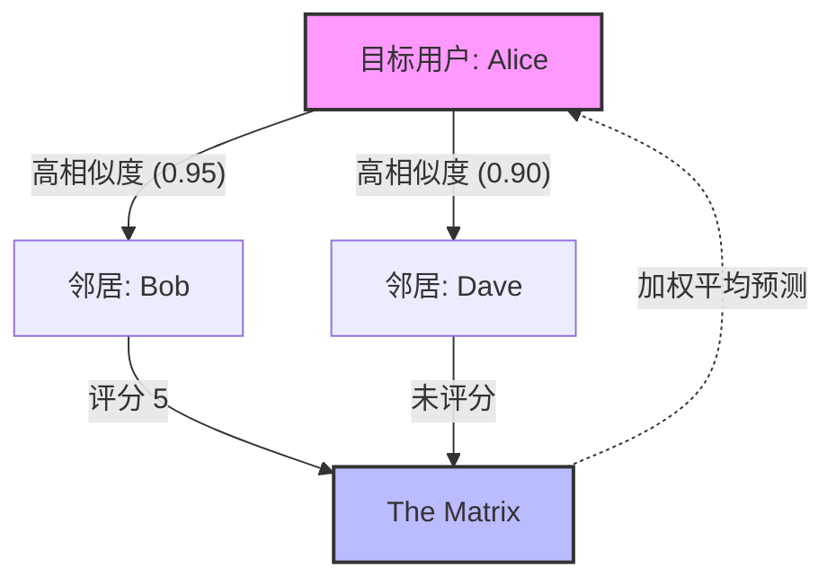

[< 返回上一级](README.md)

<strong>全局导航 (RecSys Guide)</strong>

- [首页](../../../README.md)
- [01. 传统模型](../../../01_Traditional_Models/README.md)
  - [协同过滤](../../../01_Traditional_Models/01_Collaborative_Filtering/README.md)
    - [基于记忆](../../../01_Traditional_Models/01_Collaborative_Filtering/01_Memory_Based/README.md)
    - [基于模型](../../../01_Traditional_Models/01_Collaborative_Filtering/02_Model_Based/README.md)
  - [基于内容的过滤](../../../01_Traditional_Models/02_Content_Based_Filtering/README.md)
- [02. 机器学习时代](../../../02_Machine_Learning_Era/README.md)
- [03. 深度学习时代](../../../03_Deep_Learning_Era/README.md)
  - [MLP 기반](../../../03_Deep_Learning_Era/01_MLP_Based/README.md)
  - [순차/세션 기반](../../../03_Deep_Learning_Era/02_Sequence_Session_Based/README.md)
  - [그래프 기반](../../../03_Deep_Learning_Era/03_Graph_Based/README.md)
  - [오토인코더 기반](../../../03_Deep_Learning_Era/04_AutoEncoder_Based/README.md)
- [04. SOTA 与生成式 AI](../../../04_SOTA_GenAI/README.md) - [基于 LLM](../../../04_SOTA_GenAI/01_LLM_Based/README.md) - [多模态推荐](../../../04_SOTA_GenAI/02_Multimodal_RS.md) - [生成式推荐](../../../04_SOTA_GenAI/03_Generative_RS.md)

# 基于用户的协同过滤 (User-based Collaborative Filtering)

## 1. 详细说明 (Detailed Description)

### 定义 (Definition)

**基于用户的协同过滤** 是一种基于记忆的推荐算法，它根据具有相似评分模式的其他用户的偏好来预测目标用户对项目的兴趣。通常总结为“过去喜欢相似东西的用户在未来也会喜欢相似的东西”。

### 历史与背景 (History & Background)

- **起源**: 它是最早的自动化推荐技术之一，著名地应用于 **GroupLens** 系统（1994 年）中，用于推荐 Usenet 新闻文章。
- **演变**: 虽然理论上简单，但随着用户群的增长，它面临着可扩展性问题（计算 $N \times N$ 的相似度），这导致了基于物品的 CF 和矩阵分解的发展。

### 主要特征 (Key Characteristics)

- **意外发现 (Serendipity)**: 善于推荐用户以前从未见过的完全不同的物品，只要“相似用户”觉得有趣。
- **以用户为中心 (User-Centric)**: 关注社交社区或口味相似的群体。
- **优点**:
  - 易于实现和解释。
  - 不需要内容分析（适用于任何类型的物品：电影、笑话、歌曲）。
  - 可以捕捉难以用特征描述的复杂模式（例如，特定的“邪典”电影品味）。
- **缺点**:
  - **稀疏性 (Sparsity)**: 如果评分矩阵太稀疏，很难找到邻居。
  - **可扩展性 (Scalability)**: 计算数百万用户之间的相似度非常昂贵。
  - **冷启动 (Cold Start)**: 没有评分的新用户无法获得推荐。

---

## 2. 操作原理 (Operating Principle)

核心机制包括三个步骤： **相似度计算**、 **邻居选择** 和 **评分预测** 。

### A. 相似度计算 (Similarity Calculation)

为了找到“邻居”，我们需要计算目标用户 $u$ 与其他所有用户 $v$ 之间的相似度。最常用的指标是：

1.  **皮尔逊相关系数 (Pearson Correlation Coefficient)**

    - 调整了用户具有不同评分尺度的问题（有些人打分范围是 1-5，有些人是 3-5）。
    - $$ \text{sim}(u, v) = \frac{\sum*{i \in I*{uv}} (r*{u,i} - \bar{r}\_u)(r*{v,i} - \bar{r}_v)}{\sqrt{\sum_{i \in I*{uv}} (r*{u,i} - \bar{r}_u)^2} \sqrt{\sum_{i \in I*{uv}} (r*{v,i} - \bar{r}\_v)^2}} $$
    - 其中 $I_{uv}$ 是两个用户都评分过的物品集合。

2.  **余弦相似度 (Cosine Similarity)**
    - 将用户视为物品空间中的向量。
    - $$ \text{sim}(u, v) = \frac{\vec{u} \cdot \vec{v}}{||\vec{u}|| \cdot ||\vec{v}||} = \frac{\sum*{i} r*{u,i} r*{v,i}}{\sqrt{\sum*{i} r*{u,i}^2} \sqrt{\sum*{i} r\_{v,i}^2}} $$

### B. 邻居选择 (Neighbor Selection)

选择相似度得分最高的前 $k$ 个用户。设 $N_u$ 为用户 $u$ 的邻居集合。

### C. 评分预测 (Rating Prediction)

使用邻居评分的加权平均值来预测物品 $i$ 的评分 $\hat{r}_{u,i}$。
$$ \hat{r}_{u,i} = \bar{r}\_u + \frac{\sum_{v \in N*u} \text{sim}(u,v) \times (r*{v,i} - \bar{r}_v)}{\sum_{v \in N_u} |\text{sim}(u,v)|} $$
*（注：加回 $\bar{r}_u$ 是为了将预测值归一化到目标用户的评分尺度。）\*

---

## 3. 流程示例 (Flow Example)

### 场景

我们想预测 **Alice** 是否会喜欢 **"The Matrix" (黑客帝国)** 。 **数据:**
| 用户 | Titanic | Star Wars | The Matrix | Inception | 平均评分 |
| :--- | :---: | :---: | :---: | :---: | :---: |
| **Alice** | 5 | 4 | **?** | ? | 4.5 |
| **Bob** | 5 | 5 | **5** | 4 | 4.75 |
| **Carol** | 2 | 1 | **2** | 1 | 1.5 |
| **Dave** | 4 | 5 | **?** | 5 | 4.6 |

### 逐步过程

1.  **计算相似度 (Pearson)**:

    - **Alice vs Bob**: 都喜欢 Titanic (5,5) 和 Star Wars (4,5)。高相关性。（例如 0.95）
    - **Alice vs Carol**: Alice 喜欢 (5,4)，Carol 不喜欢 (2,1)。意见不合。负相关或低相关。（例如 -0.8）
    - **Alice vs Dave**: 口味相似。高相关性。（例如 0.90），但 Dave 没看过 "The Matrix"，所以他对这个物品没有帮助。

2.  **选择邻居**:

    - "The Matrix" 的最佳邻居是 **Bob** (Sim=0.95)。Carol 不相似，Dave 数据缺失。

3.  **预测**:

    - Bob 给 "The Matrix" 打了 5 分。Bob 的平均分是 4.75。Bob 打的分比他的平均分高 +0.25。
    - Alice 的平均分是 4.5。
    - 预测值 $\approx 4.5 + (0.95 \times 0.25) = 4.73$。

4.  **结果**: 预测 Alice 会给 "The Matrix" 打 4.73 分。 **推荐它！**

### 视觉图表 ('基于用户' 意味着看'行')

