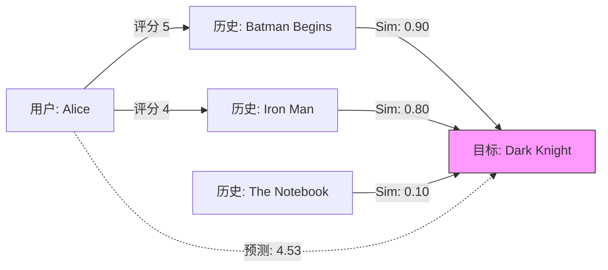

[< 返回上一级](README.md)

<strong>全局导航 (RecSys Guide)</strong>

- [首页](../../../README.md)
- [01. 传统模型](../../../01_Traditional_Models/README.md)
  - [协同过滤](../../../01_Traditional_Models/01_Collaborative_Filtering/README.md)
    - [基于记忆](../../../01_Traditional_Models/01_Collaborative_Filtering/01_Memory_Based/README.md)
    - [基于模型](../../../01_Traditional_Models/01_Collaborative_Filtering/02_Model_Based/README.md)
  - [基于内容的过滤](../../../01_Traditional_Models/02_Content_Based_Filtering/README.md)
- [02. 机器学习时代](../../../02_Machine_Learning_Era/README.md)
- [03. 深度学习时代](../../../03_Deep_Learning_Era/README.md)
  - [基于 MLP](../../../03_Deep_Learning_Era/01_MLP_Based/README.md)
  - [基于序列/会话](../../../03_Deep_Learning_Era/02_Sequence_Session_Based/README.md)
  - [基于图](../../../03_Deep_Learning_Era/03_Graph_Based/README.md)
  - [基于自编码器](../../../03_Deep_Learning_Era/04_AutoEncoder_Based/README.md)
- [04. SOTA 与生成式 AI](../../../04_SOTA_GenAI/README.md) - [基于 LLM](../../../04_SOTA_GenAI/01_LLM_Based/README.md) - [多模态推荐](../../../04_SOTA_GenAI/02_Multimodal_RS.md) - [生成式推荐](../../../04_SOTA_GenAI/03_Generative_RS.md)

# 基于物品的协同过滤 (Item-based Collaborative Filtering)

## 1. 详细说明 (Detailed Description)

### 定义 (Definition)

**基于物品的协同过滤** 通过寻找与活跃用户过去喜欢的物品相似的物品来进行推荐。它不计算用户之间的相似度，而是根据用户对物品的评分来计算*物品*之间的相似度。

### 历史与背景 (History & Background)

- **起源**: 1998 年由亚马逊（Amazon）推广，旨在解决基于用户的 CF 的可扩展性问题。
- **为何取代基于用户**: 在大多数电商系统中，物品数量（百万级）通常比用户数量（数亿级）少，或者更稳定。此外，物品-物品关系（“买过 X 的用户也买了 Y”）比用户口味更静态。

### 主要特征 (Key Characteristics)

- **稳定性 (Stability)**: 物品相似度不会迅速变化，允许预计算。
- **可扩展性 (Scalability)**: 对于海量用户群，计算通常比基于用户的方法更快。
- **可解释性 (Explainability)**: 比基于用户的方法更易解释（“因为你喜欢蝙蝠侠，我们推荐超人” vs “因为像你的人喜欢超人”）。
- **优点**:
  - 对大型数据集有更好的可扩展性和性能。
  - 推荐更一致。
- **缺点**:
  - **新颖性 (Novelty)**: 倾向于推荐明显的替代品（例如，如果你买了烤面包机，它会推荐另一个烤面包机），而不是意外的发现。
  - **数据稀疏性 (Data Sparsity)**: 如果物品评分很少，效果仍然不佳。

---

## 2. 操作原理 (Operating Principle)

### A. 相似度计算 (Similarity Calculation)

我们通过查看对*两个*物品都评分过的用户来计算物品 $i$ 和物品 $j$ 之间的相似度。

1.  **余弦相似度 (Cosine Similarity)**:
    $$ \text{sim}(i, j) = \frac{\sum*{u \in U} r*{u,i} r*{u,j}}{\sqrt{\sum*{u \in U} r*{u,i}^2} \sqrt{\sum*{u \in U} r\_{u,j}^2}} $$

2.  **调整余弦相似度 (Adjusted Cosine Similarity)** (更好！):
    减去用户的平均评分 $\bar{r}_u$ 以处理评分偏差（有些用户宽容，有些挑剔）。
    $$ \text{sim}(i, j) = \frac{\sum*{u \in U} (r*{u,i} - \bar{r}_u)(r_{u,j} - \bar{r}_u)}{\sqrt{\sum_{u \in U} (r*{u,i} - \bar{r}\_u)^2} \sqrt{\sum*{u \in U} (r\_{u,j} - \bar{r}\_u)^2}} $$

### B. 预测 (Prediction)

为了预测用户 $u$ 对目标物品 $i$ 的评分：

1.  找到用户 $u$ 评价过的且与 $i$ 相似的物品 $j \in J$。
2.  计算加权和：
    $$ \hat{r}_{u,i} = \frac{\sum_{j \in J} \text{sim}(i,j) \times r*{u,j}}{\sum*{j \in J} |\text{sim}(i,j)|} $$

---

## 3. 流程示例 (Flow Example)

### 场景

我们想预测 **Alice** 是否会喜欢 **"The Dark Knight" (黑暗骑士)** 。
她看过 **"Batman Begins" (蝙蝠侠：侠影之谜)** 和 **"Iron Man" (钢铁侠)** 。

### 数据矩阵 (物品相关性)

| 相似度 (Similarities) | Batman Begins | Iron Man | Notebook |
| :-------------------- | :-----------: | :------: | :------: |
| **The Dark Knight** | **0.90** | **0.80** |   0.10   |

_注: 与 Batman Begins 和 Iron Man 相似度高。与 Notebook 相似度低。_

### 逐步过程

1.  **识别用户历史**:

    - Alice 评分 "Batman Begins": **5 星** 。
    - Alice 评分 "Iron Man": **4 星** 。

2.  **检索目标 ("The Dark Knight") 的相似度**:

    - Sim(Dark Knight, Batman Begins) = 0.90
    - Sim(Dark Knight, Iron Man) = 0.80

3.  **计算预测**:
    $$ \text{Pred} = \frac{(0.90 \times 5) + (0.80 \times 4)}{0.90 + 0.80} $$
    $$ \text{Pred} = \frac{4.5 + 3.2}{1.7} = \frac{7.7}{1.7} \approx 4.53 $$

4.  **结果**: 推荐 "The Dark Knight"，预测分数为 4.53。

### 视觉图表 ('基于物品' 意味着看'列')

