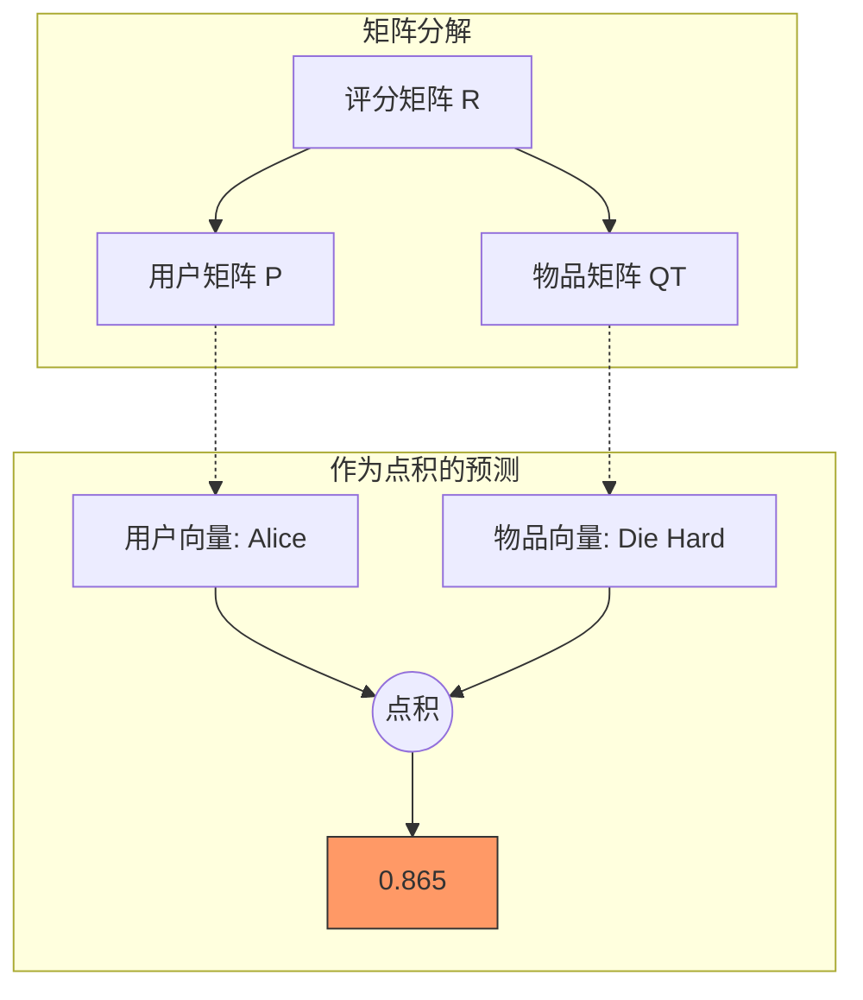

[< 返回上一级](README.md)

<strong>全局导航 (RecSys Guide)</strong>

- [首页](../../../README.md)
- [01. 传统模型](../../../01_Traditional_Models/README.md)
  - [协同过滤](../../../01_Traditional_Models/01_Collaborative_Filtering/README.md)
    - [基于记忆](../../../01_Traditional_Models/01_Collaborative_Filtering/01_Memory_Based/README.md)
    - [基于模型](../../../01_Traditional_Models/01_Collaborative_Filtering/02_Model_Based/README.md)
  - [基于内容的过滤](../../../01_Traditional_Models/02_Content_Based_Filtering/README.md)
- [02. 机器学习时代](../../../02_Machine_Learning_Era/README.md)
- [03. 深度学习时代](../../../03_Deep_Learning_Era/README.md)
  - [基于 MLP](../../../03_Deep_Learning_Era/01_MLP_Based/README.md)
  - [基于序列/会话](../../../03_Deep_Learning_Era/02_Sequence_Session_Based/README.md)
  - [基于图](../../../03_Deep_Learning_Era/03_Graph_Based/README.md)
  - [基于自编码器](../../../03_Deep_Learning_Era/04_AutoEncoder_Based/README.md)
- [04. SOTA 与生成式 AI](../../../04_SOTA_GenAI/README.md) - [基于 LLM](../../../04_SOTA_GenAI/01_LLM_Based/README.md) - [多模态推荐](../../../04_SOTA_GenAI/02_Multimodal_RS.md) - [生成式推荐](../../../04_SOTA_GenAI/03_Generative_RS.md)

# 矩阵分解 (Matrix Factorization - SVD, ALS)

## 1. 详细说明 (Detailed Description)

### 定义 (Definition)

**矩阵分解 (Matrix Factorization, MF)** 通过从物品评分模式推断出的因子向量来刻画物品和用户。物品因子和用户因子之间的高度对应关系会导致推荐。它的工作原理不仅是将稀疏的用户-物品交互矩阵分解为两个低维矩阵的乘积。

### 历史与背景 (History & Background)

- **Netflix Prize (2006-2009)**: MF 技术在 Netflix Prize 竞赛期间获得了极大的普及，获胜者 (BellKor's Pragmatic Chaos) 的 "SVD++" 算法证明了隐因子模型优于传统的基于邻域的方法。

### 主要特征 (Key Characteristics)

- **降维 (Dimensionality Reduction)**: 将巨大的用户-物品空间压缩到一个小的“潜在空间”（例如，50-100 维）。
- **潜在特征 (Latent Features)**: 自动学习诸如“严肃 vs 搞笑”或“动作 vs 剧情”之类的概念，无需显式标记。
- **优点**:
  - **准确性 (Accuracy)**: 通常比基于记忆的 CF 更准确。
  - **可扩展性 (Scalability)**: 一旦模型训练完成，预测速度很快 ($O(K)$)。
  - **存储 (Storage)**: 高效存储 $O(M+N)$ 个参数，而不是 $O(M^2)$ 或 $O(N^2)$ 的相似度。
- **缺点**:
  - **可解释性 (Interpretability)**: 很难解释*为什么*某个用户对应于潜在因子 #7。
  - **冷启动 (Cold Start)**: 仍然需要交互数据来学习向量。
  - **线性 (Linearity)**: 无法自然地建模复杂的非线性关系（后来由深度学习解决）。

---

## 2. 操作原理 (Operating Principle)

### 假设 (The Assumption)

我们假设评分矩阵 $R$（大小 $M \times N$）可以近似为：
$$ R \approx P \times Q^T $$

- $P$: 用户矩阵 ($M \times K$)
- $Q$: 物品矩阵 ($N \times K$)
- $K$: 潜在维度 (超参数)

### 优化 (Objective Function)

我们希望最小化*观测到的*评分上的误差 (RMSE)，同时寻找 $P$ 和 $Q$。
$$ L = \sum*{(u,i) \in R*{obs}} (r\_{u,i} - p_u \cdot q_i)^2 + \lambda(||p_u||^2 + ||q_i||^2) $$

- **第一项**: 预测误差（平方）。
- **第二项**: 正则化 (L2 范数) 以防止过拟合。$\lambda$ 控制强度。

### 训练算法 (Training Algorithms)

1.  **SGD (随机梯度下降)**:

    - 遍历每个评分。
    - 计算误差 $e_{ui} = r_{ui} - p_u \cdot q_i$.
    - 更新向量:
      $$ p*u \leftarrow p_u + \gamma (e*{ui} q*i - \lambda p_u) $$
        $$ q_i \leftarrow q_i + \gamma (e*{ui} p_u - \lambda q_i) $$
    - 优点: 简单，能很好地处理大数据。

2.  **ALS (交替最小二乘法)**:
    - 固定 $P$，求解最优 $Q$（这变成一个凸线性/岭回归问题）。
    - 固定 $Q$，求解最优 $P$。
    - 重复直到收敛。
    - 优点: 可并行化，更适合隐式反馈数据。

---

## 3. 流程示例 (Flow Example)

### 场景

特征 $K=2$。
**潜在因子**: 因子 1 ("喜剧"), 因子 2 ("动作")。 **训练好的模型**:

- **用户 Alice**: $[0.1, 0.9]$ (喜欢动作，不喜欢喜剧)
- **电影 A (Die Hard 虎胆龙威)**: $[0.1, 0.95]$ (纯动作)
- **电影 B (Toy Story 玩具总动员)**: $[0.9, 0.2]$ (主要是喜剧)

### 预测过程

1.  **Alice 对 电影 A 的预测**:
    $$ \text{Pred} = (0.1 \times 0.1) + (0.9 \times 0.95) = 0.01 + 0.855 = 0.865 $$
    Alice 喜欢动作，电影 A 是动作片。 **分数高** 。

2.  **Alice 对 电影 B 的预测**:
    $$ \text{Pred} = (0.1 \times 0.9) + (0.9 \times 0.2) = 0.09 + 0.18 = 0.27 $$
    Alice 不喜欢喜剧，电影 B 是喜剧片。 **分数低** 。

### 视觉图表

