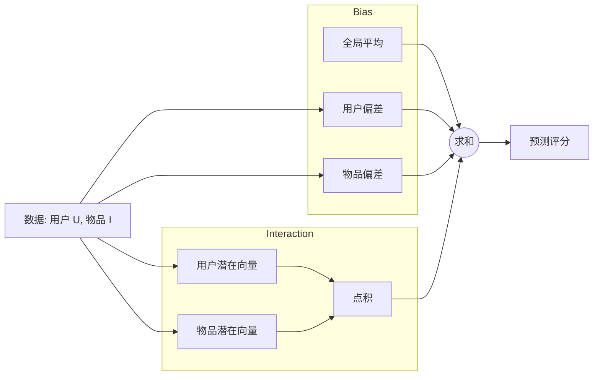

[< 返回上一级](README.md)

<strong>全局导航 (RecSys Guide)</strong>

- [首页](../../../README.md)
- [01. 传统模型](../../../01_Traditional_Models/README.md)
  - [协同过滤](../../../01_Traditional_Models/01_Collaborative_Filtering/README.md)
    - [基于记忆](../../../01_Traditional_Models/01_Collaborative_Filtering/01_Memory_Based/README.md)
    - [基于模型](../../../01_Traditional_Models/01_Collaborative_Filtering/02_Model_Based/README.md)
  - [基于内容的过滤](../../../01_Traditional_Models/02_Content_Based_Filtering/README.md)
- [02. 机器学习时代](../../../02_Machine_Learning_Era/README.md)
- [03. 深度学习时代](../../../03_Deep_Learning_Era/README.md)
  - [基于 MLP](../../../03_Deep_Learning_Era/01_MLP_Based/README.md)
  - [基于序列/会话](../../../03_Deep_Learning_Era/02_Sequence_Session_Based/README.md)
  - [基于图](../../../03_Deep_Learning_Era/03_Graph_Based/README.md)
  - [基于自编码器](../../../03_Deep_Learning_Era/04_AutoEncoder_Based/README.md)
- [04. SOTA 与生成式 AI](../../../04_SOTA_GenAI/README.md) - [基于 LLM](../../../04_SOTA_GenAI/01_LLM_Based/README.md) - [多模态推荐](../../../04_SOTA_GenAI/02_Multimodal_RS.md) - [生成式推荐](../../../04_SOTA_GenAI/03_Generative_RS.md)

# 隐因子模型 (Latent Factor Models)

## 1. 详细说明 (Detailed Description)

### 定义 (Definition)

**隐因子模型** 是矩阵分解所属的更广泛的模型家族。它们通过从评分模式中推断出的 20-100 个因子来刻画物品和用户，从而解释评分。

### 为什么叫“潜在” (Why "Latent"?)

"Latent" 意味着隐藏。这些因子在数据中没有明确定义（如“喜剧”、“惊悚”），但被模型学习出来以最好地解释数据。

- 因子 1 可能最终与“对白量”相关。
- 因子 2 可能与“暴力程度”相关。
- 因子 3 可能是无法解释但有用的。

---

## 2. 操作原理 (Operating Principle)

### 概念 (The Concept)

它将用户和物品映射到一个维度为 $f$ 的联合潜在因子空间，使得用户-物品交互被建模为该空间中的内积。

### 超越简单的 MF (Beyond Simple MF)

虽然标准 MF 使用纯点积：
$$ \hat{r}\_{ui} = p_u \cdot q_i $$

通用的隐因子模型通常包括 **偏差 (Biases)**：
$$ \hat{r}\_{ui} = \mu + b_u + b_i + p_u \cdot q_i $$

- $\mu$: 全局平均评分 (例如：3.5 星)。
- $b_u$: 用户偏差 (Alice 很挑剔，通常比平均分低 -0.5)。
- $b_i$: 物品偏差 (Titanic 很受欢迎，通常比平均分高 +0.5)。
- $p_u \cdot q_i$: 个性化交互。

### 优化 (Optimization)

通常通过随机梯度下降 (SGD) 进行优化，以最小化正则化的平方误差：
$$ \min*{b, p, q} \sum*{(u,i) \in R} (r\_{ui} - \mu - b_u - b_i - p_u \cdot q_i)^2 + \lambda(...) $$

---

## 3. 流程示例 (Flow Example)

### 场景: 预测对 "Inception" (盗梦空间) 的评分

- **全局平均 ($\mu$)**: 3.0
- **用户 (Bob)**: 打分通常偏高 (+0.5 偏差)。
- **物品 (Inception)**: 通常受欢迎 (+1.0 偏差)。
- **交互**: Bob 喜欢 "聪明的科幻片"，Inception 是 "聪明的科幻片" (匹配分 +0.3)。

### 计算 (Calculation)

1.  **基线预测**:
    $$ 3.0 (\text{平均}) + 0.5 (\text{Bob}) + 1.0 (\text{电影}) = 4.5 $$
2.  **交互调整**:
    $$ 4.5 + 0.3 (\text{点积}) = 4.8 $$
3.  **最终预测**: 4.8 星。

这种方法比简单的矩阵分解准确得多，因为它将“受欢迎程度”和“用户慷慨度”与真正的“口味匹配”分开了。

### 概念图表

