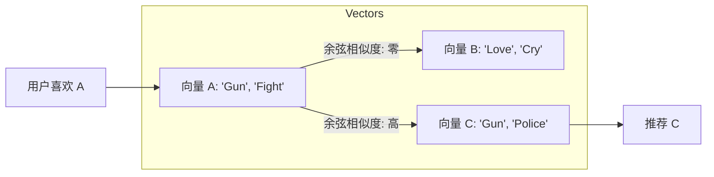

[< 返回上一级](README.md)

<strong>全局导航 (RecSys Guide)</strong>

- [首页](../../README.md)
- [01. 传统模型](../../01_Traditional_Models/README.md)
  - [协同过滤](../../01_Traditional_Models/01_Collaborative_Filtering/README.md)
    - [基于记忆](../../01_Traditional_Models/01_Collaborative_Filtering/01_Memory_Based/README.md)
    - [基于模型](../../01_Traditional_Models/01_Collaborative_Filtering/02_Model_Based/README.md)
  - [基于内容的过滤](../../01_Traditional_Models/02_Content_Based_Filtering/README.md)
- [02. 机器学习时代](../../02_Machine_Learning_Era/README.md)
- [03. 深度学习时代](../../03_Deep_Learning_Era/README.md)
  - [基于 MLP](../../03_Deep_Learning_Era/01_MLP_Based/README.md)
  - [基于序列/会话](../../03_Deep_Learning_Era/02_Sequence_Session_Based/README.md)
  - [基于图](../../03_Deep_Learning_Era/03_Graph_Based/README.md)
  - [基于自编码器](../../03_Deep_Learning_Era/04_AutoEncoder_Based/README.md)
- [04. SOTA 与生成式 AI](../../04_SOTA_GenAI/README.md) - [基于 LLM](../../04_SOTA_GenAI/01_LLM_Based/README.md) - [多模态推荐](../../04_SOTA_GenAI/02_Multimodal_RS.md) - [生成式推荐](../../04_SOTA_GenAI/03_Generative_RS.md)

# TF-IDF / 余弦相似度 (Cosine Similarity)

## 1. 详细说明 (Detailed Description)

### 定义 (Definition)

**TF-IDF (词频-逆文档频率)** 是一种来自信息检索 (IR) 的技术，用于为文本项目创建鲁棒的特征向量。 **余弦相似度** 是用于测量这些向量之间角度（相似度）的指标。它们共同构成了许多基于内容的推荐系统的骨架。

### 为什么不直接计算词数？ (Why not just count words?)

如果我们只计算词频，像 "the", "movie", "story" 这样的常见词将主导相似度得分。

- **TF-IDF** 降低了在*每个*文档中都出现的词（低信息量）的权重，并提升了特定文档独有的词（高信息量）的权重。

### 缺点 (Cons)

- **无语义 (No Semantics)**: 它匹配确切的单词。"Auto" 和 "Car" 被视为完全不同的单词（正交向量），即使它们意思相同。
- **冷启动 (Cold Start)**: 没有！（只要物品有元数据）。

---

## 2. 操作原理 (Operating Principle)

### A. TF-IDF 计算 (Calculation)

对于语料库 $D$ 中文档 $d$ 中的术语 $t$。

1.  **TF (词频)**: 术语 $t$ 在文档 $d$ 中出现的频率？
    $$ tf(t, d) = \frac{\text{count}(t, d)}{\text{total words in } d} $$
2.  **IDF (逆文档频率)**: 术语 $t$ 在所有文档中有多罕见？
    $$ idf(t, D) = \log \frac{|D|}{|\{d \in D : t \in d\}|} $$
3.  **TF-IDF 得分**:
    $$ w\_{t,d} = tf(t, d) \times idf(t, D) $$

### B. 用户画像创建 (User Profile Creation)

如果用户 A 喜欢文档 $D_1$ 和 $D_2$，则用户画像向量 $\vec{U}$ 可以是 $D_1$ 和 $D_2$ 向量的平均值。

### C. 相似度 (余弦) (Similarity - Cosine)

$$ \text{sim}(\vec{U}, \vec{I}) = \cos(\theta) = \frac{\vec{U} \cdot \vec{I}}{||\vec{U}|| \cdot ||\vec{I}||} $$

- 范围: [0, 1] (对于像 TF-IDF 这样的非负向量)。1 表示方向相同。

---

## 3. 流程示例 (Flow Example)

### 场景

**语料库**:

1.  文档 A (动作): "Gun, Fight, Run"
2.  文档 B (剧情): "Love, Cry, Sad"
3.  文档 C (目标): "Gun, Run, Police"

**用户历史**: 喜欢文档 A。

### 逐步过程

1.  **计算 TF-IDF**:
    - 术语 "Gun": 出现在 A 和 C 中。在语料库中罕见。高分。
    - 术语 "Love": 仅出现在 B 中。B 的高分。
2.  **向量化**:
    - $\vec{A} = [1, 1, 1, 0, 0, 0]$ (Gun, Fight, Run, Love...)
    - $\vec{B} = [0, 0, 0, 1, 1, 1]$
    - $\vec{C} = [1, 0, 1, 0, 0, 0]$ (注意: "Fight" 是 0, "Police" 是新的)
3.  **用户画像**:
    - 因为用户喜欢 A，所以 $\vec{U} \approx \vec{A}$。
4.  **计算相似度**:
    - Sim(U, C): 在 "Gun" 和 "Run" 上重叠。高相似度。
    - Sim(U, B): 无重叠。零相似度。
5.  **结果**: 推荐文档 C。

### 视觉图表

