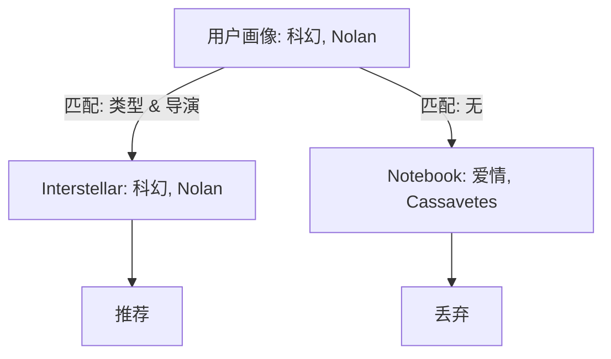

[< 返回上一级](README.md)

<strong>全局导航 (RecSys Guide)</strong>

- [首页](../../README.md)
- [01. 传统模型](../../01_Traditional_Models/README.md)
  - [协同过滤](../../01_Traditional_Models/01_Collaborative_Filtering/README.md)
    - [基于记忆](../../01_Traditional_Models/01_Collaborative_Filtering/01_Memory_Based/README.md)
    - [基于模型](../../01_Traditional_Models/01_Collaborative_Filtering/02_Model_Based/README.md)
  - [基于内容的过滤](../../01_Traditional_Models/02_Content_Based_Filtering/README.md)
- [02. 机器学习时代](../../02_Machine_Learning_Era/README.md)
- [03. 深度学习时代](../../03_Deep_Learning_Era/README.md)
  - [基于 MLP](../../03_Deep_Learning_Era/01_MLP_Based/README.md)
  - [基于序列/会话](../../03_Deep_Learning_Era/02_Sequence_Session_Based/README.md)
  - [基于图](../../03_Deep_Learning_Era/03_Graph_Based/README.md)
  - [基于自编码器](../../03_Deep_Learning_Era/04_AutoEncoder_Based/README.md)
- [04. SOTA 与生成式 AI](../../04_SOTA_GenAI/README.md) - [基于 LLM](../../04_SOTA_GenAI/01_LLM_Based/README.md) - [多模态推荐](../../04_SOTA_GenAI/02_Multimodal_RS.md) - [生成式推荐](../../04_SOTA_GenAI/03_Generative_RS.md)

# 基于画像的匹配 (Profile-based Matching)

## 1. 详细说明 (Detailed Description)

### 定义 (Definition)

**基于画像的匹配** 为用户和物品创建显式的“画像”（结构化记录），然后基于特定属性的规则或相似度指标进行匹配。它与 TF-IDF 不同，主要利用 **结构化数据** （分类、数值）而非非结构化文本。

### 用例 (Use Cases)

- **约会应用**: 匹配用户 {年龄: 25, 地点: 首尔} 与 用户 {年龄: 24-26, 地点: 首尔}。
- **求职推荐**: 匹配简历 {技能: Python, 经验: 3 年} 与 职位 {要求: Python, 最小经验: 2 年}。
- **冷启动**: 当我们有显式用户数据（例如入职调查）但没有交互历史时非常有效。

### 主要特征 (Key Characteristics)

- **显式 (Explicit)**: 依赖假设有意义的数据（例如，“类型 = 动作”是一个硬性事实）。
- **过滤气泡 (Filter Bubble)**: 可能过于死板。理想情况下与 CF 结合使用。
- **优点**:
  - 透明度：用户确切知道为什么匹配（“你们都说英语”）。
  - 无“新物品”问题：一旦物品列出属性，就可以推荐。
- **缺点**:
  - **特征工程**: 需要高质量、结构化的元数据。
  - **有限发现**: 无法发现隐藏模式。

---

## 2. 操作原理 (Operating Principle)

### A. 画像构建 (Profile Construction)

1.  **物品画像**: {类型: [动作, 科幻], 年份: 2020, 演员: [Tom Cruise]}.
2.  **用户画像**: {偏好类型: [动作], 偏好年份: >2000}.

### B. 匹配算法 (Matching Algorithms)

1.  **精确/基于规则的匹配**:
    - `IF (Item.Genre IN User.Preferred) AND (Item.Year > 2000) THEN Recommend`.
2.  **加权属性相似度**:
    - 独立计算每个属性字段的相似度并求和。
      $$ \text{Score}(u, i) = w*1 \cdot \text{Sim}*{\text{genre}}(u, i) + w*2 \cdot \text{Sim}*{\text{year}}(u, i) + ... $$
    - **杰卡德相似度 (Jaccard Similarity)** (用于集合):
      $$ J(A, B) = \frac{|A \cap B|}{|A \cup B|} $$
      (用于比较标签/类型集合)。

---

## 3. 流程示例 (Flow Example)

### 场景: 电影推荐

**用户画像**:

- **类型**: {科幻, 惊悚}
- **导演**: {Christopher Nolan} **候选**:

1.  **Interstellar (星际穿越)**: {科幻, 冒险}, {Christopher Nolan}
2.  **Notebook (恋恋笔记本)**: {爱情, 剧情}, {Nick Cassavetes}
3.  **Inception (盗梦空间)**: {科幻, 动作}, {Christopher Nolan}

### 匹配过程 (Jaccard + Boolean)

1.  **检查候选 1 (Interstellar)**:

    - 类型重叠: {科幻} / {科幻, 惊悚, 冒险} = 1/3 = 0.33
    - 导演匹配: 是 (1.0)
    - 分数: $0.33 + 1.0 = 1.33$

2.  **检查候选 2 (Notebook)**:

    - 类型重叠: 0
    - 导演匹配: 否
    - 分数: 0

3.  **检查候选 3 (Inception)**:
    - 类型重叠: {科幻} / {科幻, 惊悚, 动作} = 0.33
    - 导演匹配: 是 (1.0)
    - 分数: 1.33

### 结果

推荐 **Interstellar** 和 **Inception** 。

### 视觉图表

