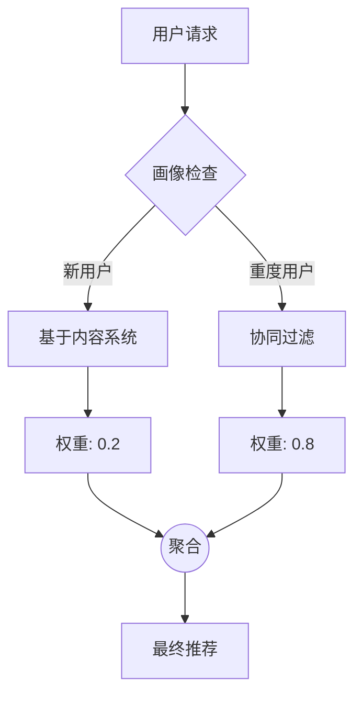

[< 返回上一级](README.md)

<strong>全局导航 (RecSys Guide)</strong>

- [首页](../README.md)
- [01. 传统模型](../01_Traditional_Models/README.md)
  - [协同过滤](../01_Traditional_Models/01_Collaborative_Filtering/README.md)
    - [基于记忆](../01_Traditional_Models/01_Collaborative_Filtering/01_Memory_Based/README.md)
    - [基于模型](../01_Traditional_Models/01_Collaborative_Filtering/02_Model_Based/README.md)
  - [基于内容的过滤](../01_Traditional_Models/02_Content_Based_Filtering/README.md)
- [02. 机器学习时代](../02_Machine_Learning_Era/README.md)
- [03. 深度学习时代](../03_Deep_Learning_Era/README.md)
  - [基于 MLP](../03_Deep_Learning_Era/01_MLP_Based/README.md)
  - [基于序列/会话](../03_Deep_Learning_Era/02_Sequence_Session_Based/README.md)
  - [基于图](../03_Deep_Learning_Era/03_Graph_Based/README.md)
  - [基于自编码器](../03_Deep_Learning_Era/04_AutoEncoder_Based/README.md)
- [04. SOTA 与生成式 AI](../04_SOTA_GenAI/README.md) - [基于 LLM](../04_SOTA_GenAI/01_LLM_Based/README.md) - [多模态推荐](../04_SOTA_GenAI/02_Multimodal_RS.md) - [生成式推荐](../04_SOTA_GenAI/03_Generative_RS.md)

# 混合模型 (Hybrid Models)

## 1. 详细说明 (Detailed Description)

### 定义 (Definition)

**混合模型** 结合两种或多种推荐技术（例如，协同过滤 + 基于内容），利用各自的优势，同时抵消它们各自的劣势。

### 为什么要混合？ (Why Hybrid?)

- **协同过滤 (CF)** 擅长发现意外惊喜，但在新用户（ **冷启动**）和稀疏性方面表现不佳。
- **基于内容 (CB)** 很好地处理新物品，但缺乏多样性（“过度专业化”）。
- **混合**: 使用 CB 处理新用户/物品，随着数据增多过渡到 CF。

### 历史 (History)

随着商业系统（Netflix, Amazon）的成熟，他们意识到单一算法是不够的。Netflix Prize 的获胜者是一个由 100 多个不同模型组成的庞大集成（混合）。

---

## 2. 操作原理 (Operating Principle)

Burke (2002) 将混合策略分为几种类型：

### A. 加权混合 (Weighted Hybrid)

计算多个推荐器的分数并取加权平均值。
$$ \text{Score}_{\text{final}} = \alpha \cdot \text{Score}_{\text{CF}} + (1-\alpha) \cdot \text{Score}\_{\text{CB}} $$

- $\alpha$ 可以通过学习获得或手动调整。

### B. 切换混合 (Switching Hybrid)

根据情况选择单个推荐器。

- **规则**: `IF user.ratings_count < 5 THEN use Content-Based ELSE use CF`.

### C. 级联混合 (Cascade Hybrid) (精炼)

一个推荐器精炼另一个推荐器的候选结果。

- **步骤 1**: 使用基于内容的方法过滤出 100 部“动作片”（粗略）。
- **步骤 2**: 使用 CF 为特定用户对这 100 部电影进行排序（精细）。

### D. 特征增强 (Feature Augmentation)

- 使用一个模型的输出作为另一个模型的*特征*。
- 示例：使用基于用户的 CF 预测评分，然后将预测评分作为特征输入到基于内容的模型中。

---

## 3. 流程示例 (Flow Example)

### 场景: 电影网站的“切换 + 加权”策略

- **用户 A**: 全新用户。
- **用户 B**: 资深用户 (500 次评分)。

### 过程 (Process)

1.  **用户 A 进入**:

    - 系统检查画像: 评分 = 0。
    - **动作 (切换)**: 切换到“热门 / 基于内容”。
    - **结果**: 显示“十大热门大片”。

2.  **用户 A 评价了 3 部电影**:

    - 现在评分 = 3。对于 CF 来说仍然很低。
    - **动作**: 加权混合 ($\alpha = 0.2$ 给 CF)。
    - 分数 = $0.2 \times \text{CF}(x) + 0.8 \times \text{Content}(x)$。

3.  **用户 B 进入**:
    - 系统检查画像: 评分 = 500。
    - **动作**: 加权混合 ($\alpha = 0.9$ 给 CF)。
    - **结果**: 高度个性化、充满惊喜的推荐。

### 视觉图表

