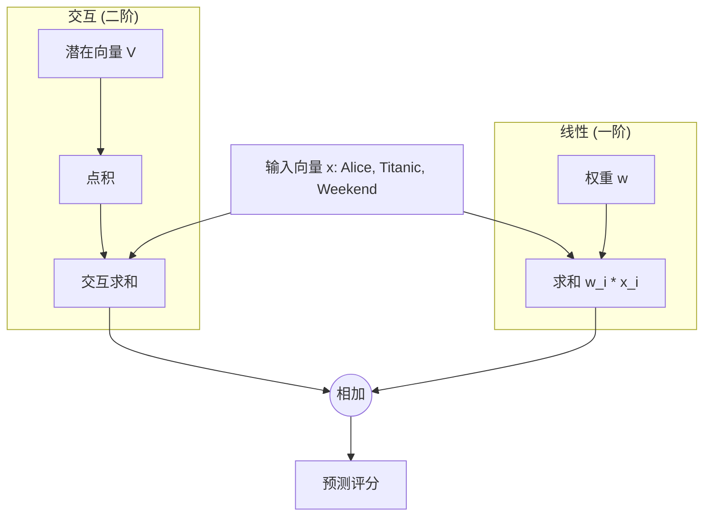

[< 返回上一级](README.md)

<strong>全局导航 (RecSys Guide)</strong>

- [首页](../../README.md)
- [01. 传统模型](../../01_Traditional_Models/README.md)
  - [协同过滤](../../01_Traditional_Models/01_Collaborative_Filtering/README.md)
    - [基于记忆](../../01_Traditional_Models/01_Collaborative_Filtering/01_Memory_Based/README.md)
    - [基于模型](../../01_Traditional_Models/01_Collaborative_Filtering/02_Model_Based/README.md)
  - [基于内容的过滤](../../01_Traditional_Models/02_Content_Based_Filtering/README.md)
- [02. 机器学习时代](../../02_Machine_Learning_Era/README.md)
- [03. 深度学习时代](../../03_Deep_Learning_Era/README.md)
  - [基于 MLP](../../03_Deep_Learning_Era/01_MLP_Based/README.md)
  - [基于序列/会话](../../03_Deep_Learning_Era/02_Sequence_Session_Based/README.md)
  - [基于图](../../03_Deep_Learning_Era/03_Graph_Based/README.md)
  - [基于自编码器](../../03_Deep_Learning_Era/04_AutoEncoder_Based/README.md)
- [04. SOTA 与生成式 AI](../../04_SOTA_GenAI/README.md) - [基于 LLM](../../04_SOTA_GenAI/01_LLM_Based/README.md) - [多模态推荐](../../04_SOTA_GenAI/02_Multimodal_RS.md) - [生成式推荐](../../04_SOTA_GenAI/03_Generative_RS.md)

# 因子分解机 (Factorization Machines - FM)

## 1. 详细说明 (Detailed Description)

### 定义 (Definition)

**因子分解机 (Factorization Machines, FM)** 由 Steffen Rendle 于 2010 年提出，是一种通用的监督学习算法，结合了支持向量机 (SVM) 和因子分解模型的优点。它模仿矩阵分解，但可以处理任何实值特征向量，因此非常适合整合“辅助信息”（上下文、时间、广泛的用户属性）。

### 解决的问题 (The Problem it Solves)

- **SVM** 在稀疏数据上失败，因为它们试图为每一对交互特征 ($w_{ij} x_i x_j$) 学习直接权重。如果在训练中 $x_i$ 和 $x_j$ 从未一起出现，$w_{ij}$ 就是 0。
- **MF** 只能处理用户 ID 和物品 ID。
- **FM** 通过将交互权重 $w_{ij}$ 建模为两个向量的点积 $\langle v_i, v_j \rangle$ 来处理稀疏数据。即使 $x_i$ 和 $x_j$ 从未一起出现，如果 $x_i$ 与 $x_k$ 一起出现过，且 $x_j$ 与 $x_k$ 一起出现过，它们的向量 $v_i, v_j$ 就会被训练，从而可以预测 $i-j$ 的交互。

### 主要特征 (Key Characteristics)

- **通用 (General)**: 适用于回归、分类和排序。
- **快速 (Fast)**: 线性训练和预测时间 $O(k \cdot n)$。
- **优点**:
  - 极好地处理极端稀疏性。
  - 允许添加任意数量的辅助特征（上下文感知）。
- **缺点**:
  - 需要固定潜在维度 $k$。

---

## 2. 操作原理 (Operating Principle)

### 模型方程 (Degree = 2)

对于特征向量 $x \in \mathbb{R}^n$，预测目标 $\hat{y}$ 为：

$$ \hat{y}(x) = w*0 + \sum*{i=1}^n w*i x_i + \sum*{i=1}^n \sum\_{j=i+1}^n \langle v_i, v_j \rangle x_i x_j $$

- **全局偏差 ($w_0$)**: 平均基线。
- **线性项 ($\sum w_i x_i$)**: 每个特征的独立效应（例如，“该用户倾向于打高分”）。
- **交互项 ($\sum \langle v_i, v_j \rangle x_i x_j$)**: 成对交互。
  - 我们不使用大小为 $n \times n$ 的矩阵 $W$，而是使用大小为 $n \times k$ 的矩阵 $V$。
  - $\langle v_i, v_j \rangle$ 替代 $w_{ij}$。

### 优化 (Optimization)

- 可以使用 **SGD**, **ALS**, 或 **MCMC** 进行优化。
- 交互部分可以使用以下技巧在线性时间 $O(kn)$ 内计算：
  $$ \sum*{i=1}^n \sum*{j=i+1}^n \langle v*i, v_j \rangle x_i x_j = \frac{1}{2} \sum*{f=1}^k \left( \left( \sum*{i=1}^n v*{i,f} x*i \right)^2 - \sum*{i=1}^n v\_{i,f}^2 x_i^2 \right) $$

---

## 3. 流程示例 (Flow Example)

### 场景: 带上下文的电影评分

数据: **用户=Alice**, **电影=Titanic**, **时间=周末** 。
特征 (One-hot):
$x = [\underbrace{1}_{\text{Alice}}, 0, ..., \underbrace{1}_{\text{Titanic}}, 0, ..., \underbrace{1}_{\text{Weekend}}]$

### 计算 (Computation)

1.  **线性部分**:
    $w_{Alice} + w_{Titanic} + w_{Weekend}$
    (例如，Alice 大方 +0.2，Titanic 很受欢迎 +0.5，人们周末很高兴 +0.1)。

2.  **交互部分**:

    - **Alice-Titanic**: $\langle v_{Alice}, v_{Titanic} \rangle$。Alice 喜欢这种*类型*的电影吗？
    - **Alice-Weekend**: $\langle v_{Alice}, v_{Weekend} \rangle$。Alice 周末看电影吗？
    - **Titanic-Weekend**: $\langle v_{Titanic}, v_{Weekend} \rangle$。Titanic 是周末电影吗？

3.  **求和**:
    总分 = 线性 + 交互。
    如果 Alice 喜欢 Titanic（高交互）并且通常在周末大量观看（高交互），分数就会飙升。

### 视觉图表

