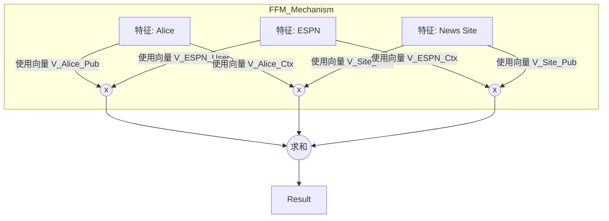

[< 返回上一级](README.md)

<strong>全局导航 (RecSys Guide)</strong>

- [首页](../../README.md)
- [01. 传统模型](../../01_Traditional_Models/README.md)
  - [协同过滤](../../01_Traditional_Models/01_Collaborative_Filtering/README.md)
    - [基于记忆](../../01_Traditional_Models/01_Collaborative_Filtering/01_Memory_Based/README.md)
    - [基于模型](../../01_Traditional_Models/01_Collaborative_Filtering/02_Model_Based/README.md)
  - [基于内容的过滤](../../01_Traditional_Models/02_Content_Based_Filtering/README.md)
- [02. 机器学习时代](../../02_Machine_Learning_Era/README.md)
- [03. 深度学习时代](../../03_Deep_Learning_Era/README.md)
  - [基于 MLP](../../03_Deep_Learning_Era/01_MLP_Based/README.md)
  - [基于序列/会话](../../03_Deep_Learning_Era/02_Sequence_Session_Based/README.md)
  - [基于图](../../03_Deep_Learning_Era/03_Graph_Based/README.md)
  - [基于自编码器](../../03_Deep_Learning_Era/04_AutoEncoder_Based/README.md)
- [04. SOTA 与生成式 AI](../../04_SOTA_GenAI/README.md) - [基于 LLM](../../04_SOTA_GenAI/01_LLM_Based/README.md) - [多模态推荐](../../04_SOTA_GenAI/02_Multimodal_RS.md) - [生成式推荐](../../04_SOTA_GenAI/03_Generative_RS.md)

# 域感知因子分解机 (Field-aware Factorization Machines - FFM)

## 1. 详细说明 (Detailed Description)

### 定义 (Definition)

**FFM (Field-aware Factorization Machines)** 是 FM 的一个变体，主要用于点击率 (CTR) 预测。它引入了 **域 (Fields)** 的概念。FM 为每个特征 $x_i$ 学习一个潜在向量 $v_i$，而 FFM 学习多个潜在向量 $v_{i,f_j}$，针对它交互的每一个域 $f_j$ 都有一个不同的向量。

### 历史 (History)

- **获胜方案**: 在赢得 Criteo 和 Avazu CTR 预测比赛 (Kaggle) 后声名鹊起。
- **为什么更好**: 在 FM 中，用户向量用于与电影交互的向量与用于与类型交互的向量是*同一个*。在 FFM 中，用户可以有一个特定的“电影交互角色”和一个不同的“类型交互角色”。

### 主要特征 (Key Characteristics)

- **复杂度**: $O(kn^2)$ (比 FM 的线性时间昂贵)。
- **细粒度**: 捕捉特征交互的更具体细微差别。
- **优点**:
  - 在深度学习接管之前，是 CTR/表格数据的 SOTA 性能。
- **缺点**:
  - 内存消耗高 (需要存储 $n \times f \times k$ 个参数)。
  - 训练较慢。

---

## 2. 操作原理 (Operating Principle)

### 域的概念 (The Field Concept)

特征被归类为域。

- **用户域**: {用户=Alice, 用户=Bob}
- **电影域**: {电影=Titanic, 电影=Avatar}
- **类型域**: {类型=剧情, 类型=动作}

### 模型方程 (Model Equation)

$$ \hat{y}(x) = w*0 + \sum*{i=1}^n w*i x_i + \sum*{i=1}^n \sum*{j=i+1}^n \langle v*{i, f*j}, v*{j, f_i} \rangle x_i x_j $$

- $f_i$: 特征 $i$ 所属的域。
- $f_j$: 特征 $j$ 所属的域。
- $v_{i, f_j}$: 特征 $i$ 的潜在向量，专门为与域 $f_j$ 交互而学习。

### 与 FM 对比 (Contrast with FM)

- **FM**: $\langle v_i, v_j \rangle$. (Alice 使用她通用的一个向量).
- **FFM**: $\langle v_{i, \text{Movie}}, v_{j, \text{User}} \rangle$. (Alice 使用她的“电影交互”向量，Titanic 使用它的“用户交互”向量).

---

## 3. 流程示例 (Flow Example)

### 场景

预测 **Alice** 是否会在某 **新闻网站** 点击 **ESPN** 的广告。 **域 (Fields)**:

1.  **用户**: Alice
2.  **发布商**: ESPN
3.  **上下文**: News Site

### 交互 (Interactions)

1.  **用户 x 发布商 (Alice x ESPN)**:

    - Alice 使用 $v_{\text{Alice}, \text{Publisher}}$。
    - ESPN 使用 $v_{\text{ESPN}, \text{User}}$。
    - 含义: “Alice 有多喜欢像 ESPN 这样的发布商？”

2.  **用户 x 上下文 (Alice x News Site)**:

    - Alice 使用 $v_{\text{Alice}, \text{Context}}$。
    - News Site 使用 $v_{\text{News}, \text{User}}$。
    - 含义: “Alice 通常会在新闻网站上点击广告吗？”（也许她在那里忽略广告，但在博客上会点）。
    - _注: 在 FM 中，Alice 会对两者使用相同的向量，这可能会混淆信号。_

3.  **发布商 x 上下文 (ESPN x News Site)**:
    - ESPN 使用 $v_{\text{ESPN}, \text{Context}}$。
    - News Site 使用 $v_{\text{News}, \text{Publisher}}$。
    - 含义: “ESPN 适合新闻网站吗？”

### 视觉图表

