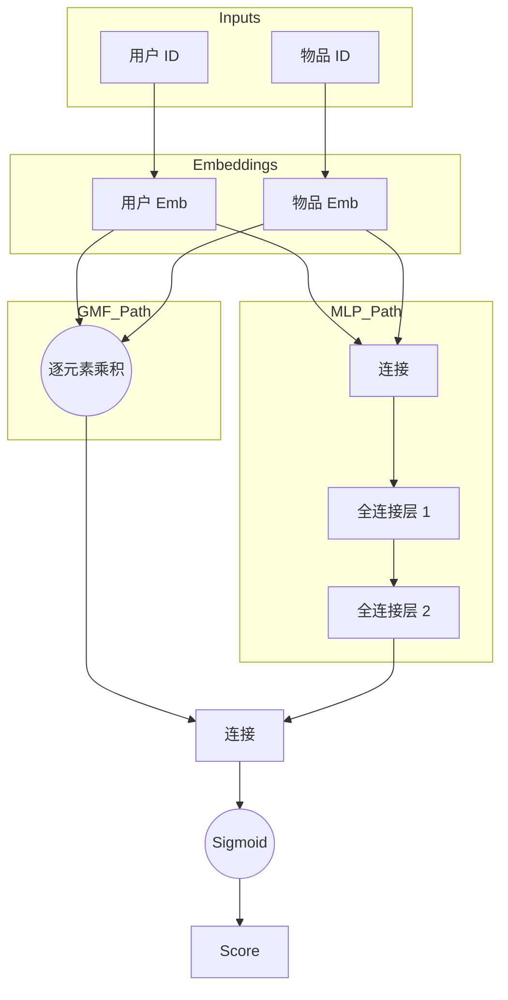

[< 返回上一级](README.md)

<strong>全局导航 (RecSys Guide)</strong>

- [首页](../../README.md)
- [01. 传统模型](../../01_Traditional_Models/README.md)
  - [协同过滤](../../01_Traditional_Models/01_Collaborative_Filtering/README.md)
    - [基于记忆](../../01_Traditional_Models/01_Collaborative_Filtering/01_Memory_Based/README.md)
    - [基于模型](../../01_Traditional_Models/01_Collaborative_Filtering/02_Model_Based/README.md)
  - [基于内容的过滤](../../01_Traditional_Models/02_Content_Based_Filtering/README.md)
- [02. 机器学习时代](../../02_Machine_Learning_Era/README.md)
- [03. 深度学习时代](../../03_Deep_Learning_Era/README.md)
  - [基于 MLP](../../03_Deep_Learning_Era/01_MLP_Based/README.md)
  - [基于序列/会话](../../03_Deep_Learning_Era/02_Sequence_Session_Based/README.md)
  - [基于图](../../03_Deep_Learning_Era/03_Graph_Based/README.md)
  - [基于自编码器](../../03_Deep_Learning_Era/04_AutoEncoder_Based/README.md)
- [04. SOTA 与生成式 AI](../../04_SOTA_GenAI/README.md) - [基于 LLM](../../04_SOTA_GenAI/01_LLM_Based/README.md) - [多模态推荐](../../04_SOTA_GenAI/02_Multimodal_RS.md) - [生成式推荐](../../04_SOTA_GenAI/03_Generative_RS.md)

# 神经协同过滤 (Neural Collaborative Filtering - NCF)

## 1. 详细说明 (Detailed Description)

### 定义 (Definition)

**NCF** 是一个利用神经网络对用户和物品之间的交互进行建模的框架。它本质上用一个可学习的非线性函数（多层感知器）取代了矩阵分解的固定点积，认为点积太简单，无法捕捉复杂的用户-物品关系。

### 历史 (History)

- **论文**: "Neural Collaborative Filtering" (He et al., WWW 2017).
- **影响**: 标志着 RecSys 社区从矩阵分解向深度学习的这种转变。

### 主要特征 (Key Characteristics)

- **非线性 (Non-linearity)**: 可以建模复杂的交互函数。
- **泛化 (Generalization)**: 概括了 MF；如果使用线性激活函数和特定权重，NCF 就会变成 MF。
- **优点**:
  - 高表达能力。
  - 灵活的架构（可以添加层、Dropout）。
- **缺点**:
  - 优化景观是非凸的（比 MF 更难训练）。
  - 最近的论文（例如，"Are We Really Making Much Progress?"）认为，经过良好调整的 MF 往往能击败 NCF，引发了争论。

---

## 2. 操作原理 (Operating Principle)

NCF 通常由两条并在最后融合的路径组成：

### A. GMF (广义矩阵分解)

- 实现标准的矩阵分解，但使用神经层（逐元素乘积 + 线性层）代替固定的点积。
- $$ \phi^{GMF} = p_u \odot q_i $$

### B. MLP (多层感知器)

- 连接用户和物品嵌入，并通过前馈神经网络来学习非线性交互。
- $$ \phi^{MLP} = \text{ReLU}(W_2(\text{ReLU}(W_1([p_u, q_i]) + b_1)) + b_2) ... $$

### C. NeuMF (神经矩阵分解)

- 融合两个分支。
- $$ \hat{y}\_{ui} = \sigma(h^T [\phi^{GMF} || \phi^{MLP}]) $$
- **优化**: 标准二元交叉熵 (Log Loss)，因为它将推荐视为分类问题（隐式反馈：交互 vs 无交互）。

---

## 3. 流程示例 (Flow Example)

### 场景

预测 **用户 ID 1** 和 **物品 ID 50** 的分数。

### 架构流程

1.  **输入层**:

    - One-hot 用户向量 $\to$ 嵌入查找 $\to$ 用户向量 $P_u$.
    - One-hot 物品向量 $\to$ 嵌入查找 $\to$ 物品向量 $Q_i$.

2.  **GMF 路径**:

    - 获取 $P_u$ 和 $Q_i$.
    - 逐元素相乘: $[0.1, 0.5] \times [0.2, 0.4] = [0.02, 0.2]$.

3.  **MLP 路径**:

    - 连接 $P_u, Q_i$: $[0.1, 0.5, 0.2, 0.4]$.
    - 第 1 层 (全连接): 映射到 $[0.8, -0.1] \to \text{ReLU} \to [0.8, 0]$.
    - 第 2 层 (全连接): 映射到 $[0.5]$.

4.  **融合**:

    - 连接 GMF 输出 $[0.02, 0.2]$ 和 MLP 输出 $[0.5]$.
    - 结果: $[0.02, 0.2, 0.5]$.
    - 最终全连接层 (预测): 映射到标量 $0.9$.

5.  **输出**:
    - Sigmoid(0.9) $\approx 0.71$. (71% 的交互概率).

### 视觉图表

