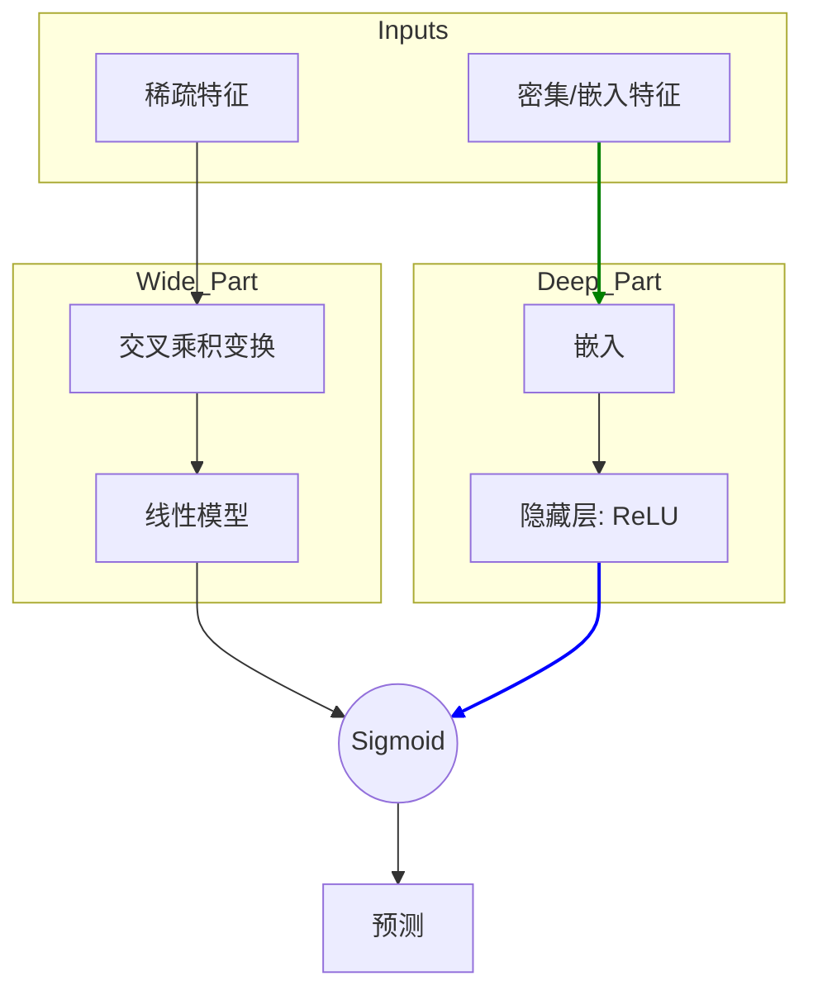

[< 返回上一级](README.md)

<strong>全局导航 (RecSys Guide)</strong>

- [首页](../../README.md)
- [01. 传统模型](../../01_Traditional_Models/README.md)
  - [协同过滤](../../01_Traditional_Models/01_Collaborative_Filtering/README.md)
    - [基于记忆](../../01_Traditional_Models/01_Collaborative_Filtering/01_Memory_Based/README.md)
    - [基于模型](../../01_Traditional_Models/01_Collaborative_Filtering/02_Model_Based/README.md)
  - [基于内容的过滤](../../01_Traditional_Models/02_Content_Based_Filtering/README.md)
- [02. 机器学习时代](../../02_Machine_Learning_Era/README.md)
- [03. 深度学习时代](../../03_Deep_Learning_Era/README.md)
  - [基于 MLP](../../03_Deep_Learning_Era/01_MLP_Based/README.md)
  - [基于序列/会话](../../03_Deep_Learning_Era/02_Sequence_Session_Based/README.md)
  - [基于图](../../03_Deep_Learning_Era/03_Graph_Based/README.md)
  - [基于自编码器](../../03_Deep_Learning_Era/04_AutoEncoder_Based/README.md)
- [04. SOTA 与生成式 AI](../../04_SOTA_GenAI/README.md) - [基于 LLM](../../04_SOTA_GenAI/01_LLM_Based/README.md) - [多模态推荐](../../04_SOTA_GenAI/02_Multimodal_RS.md) - [生成式推荐](../../04_SOTA_GenAI/03_Generative_RS.md)

# Wide & Deep Learning

## 1. 详细说明 (Detailed Description)

### 定义 (Definition)

**Wide & Deep Learning** 由 Google 于 2016 年为 Google Play 商店推荐系统提出，是一种结合了两种模型优势的模型架构：

1.  **Wide 模型 (线性模型)**: 擅长 **记忆 (Memorization)** （学习频繁共现模式）。
2.  **Deep 模型 (深度神经网络)**: 擅长 **泛化 (Generalization)** （学习抽象表示并探索新组合）。

### 解决的问题 (The Problem it Solves)

- **线性模型** 擅长特定规则（例如，“购买了物品 A 的用户购买了物品 B”），但无法推荐未出现在训练数据中的内容（泛化能力差）。
- **深度模型** （基于嵌入）擅长寻找相似物品即使没有直接共现，但可能会“过度泛化”并做出不相关的推荐（例如，仅因为向量接近就向大片迷推荐小众纪录片）。
- **Wide & Deep** 平衡了这种权衡。

### 主要特征 (Key Characteristics)

- **联合训练 (Joint Training)**: Wide 组件和 Deep 组件同时训练。
- **优点**:
  - 平衡了精确率（记忆）和召回率（泛化）。
  - 生产级就绪且高度可扩展。
- **缺点**:
  - 需要为“Wide”部分进行特征工程（决定使用哪些“交叉乘积”特征）。

---

## 2. 操作原理 (Operating Principle)

### A. Wide 组件 (记忆)

理想情况下充当广义线性模型。

- **输入**: 原始稀疏特征和交叉乘积变换。
- **交叉乘积**: 捕捉两个二元特征之间的交互。
  - 示例: `AND(User_Language=English, App_Language=English)` -> 1.
  - 这允许模型学习规则：“如果两者都是英语，下载的可能性很大。”
- **公式**: $y = w^T x + b$.

### B. Deep 组件 (泛化)

理想情况下充当前馈神经网络。

- **输入**: 分类特征的密集嵌入。
- **过程**: 嵌入 $\to$ 隐藏层 $\to$ 输出。
- **好处**: 学习到了“炸鸡”和“汉堡”是相似的（快餐），即使用户从未同时购买过两者。

### C. 联合训练 (Joint Training)

$$ P(Y=1|x) = \sigma( \underbrace{w*{wide}^T [x, \phi(x)]}*{\text{Wide}} + \underbrace{w*{deep}^T a^{(lf)}}*{\text{Deep}} + b) $$

- 梯度同时反向传播到两个部分。

---

## 3. 流程示例 (Flow Example)

### 场景: App 推荐

**用户**: 喜欢 "Pokémon" 游戏。 **候选 A**: "Pokémon GO" (直接关系)。 **候选 B**: "Digimon Adventure" (相似类型)。

### 处理 (Processing)

1.  **Wide 组件 (记忆)**:

    - 发现规则: `User_Installed("Pokémon Red") AND App="Pokémon GO"`.
    - 这个规则在统计中权重很高。
    - **对候选 A 的强信号** 。

2.  **Deep 组件 (泛化)**:

    - 嵌入: "Pokémon" 向量 $\approx$ "Digimon" 向量 (都是怪兽 RPG)。
    - **对候选 B (和 A) 的强信号** 。

3.  **最终预测**:
    - **候选 A**: 高 Wide 分 + 高 Deep 分 = 极高概率。
    - **候选 B**: 低 Wide 分 (无直接规则) + 高 Deep 分 = 中等概率。
    - **结果**: 先推荐 "Pokémon GO" (安全)，然后推荐 "Digimon" (发现)。

### 视觉图表

