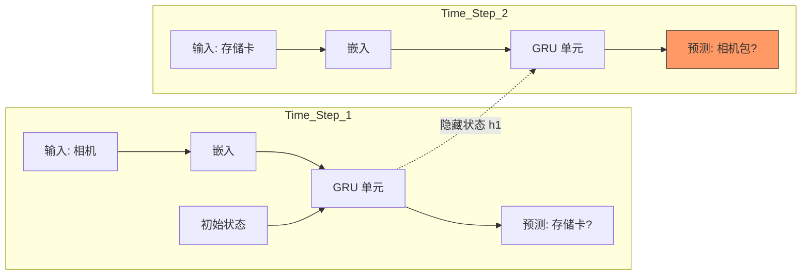

[< 返回上一级](README.md)

<strong>全局导航 (RecSys Guide)</strong>

- [首页](../../README.md)
- [01. 传统模型](../../01_Traditional_Models/README.md)
  - [协同过滤](../../01_Traditional_Models/01_Collaborative_Filtering/README.md)
    - [基于记忆](../../01_Traditional_Models/01_Collaborative_Filtering/01_Memory_Based/README.md)
    - [基于模型](../../01_Traditional_Models/01_Collaborative_Filtering/02_Model_Based/README.md)
  - [基于内容的过滤](../../01_Traditional_Models/02_Content_Based_Filtering/README.md)
- [02. 机器学习时代](../../02_Machine_Learning_Era/README.md)
- [03. 深度学习时代](../../03_Deep_Learning_Era/README.md)
  - [基于 MLP](../../03_Deep_Learning_Era/01_MLP_Based/README.md)
  - [基于序列/会话](../../03_Deep_Learning_Era/02_Sequence_Session_Based/README.md)
  - [基于图](../../03_Deep_Learning_Era/03_Graph_Based/README.md)
  - [基于自编码器](../../03_Deep_Learning_Era/04_AutoEncoder_Based/README.md)
- [04. SOTA 与生成式 AI](../../04_SOTA_GenAI/README.md) - [基于 LLM](../../04_SOTA_GenAI/01_LLM_Based/README.md) - [多模态推荐](../../04_SOTA_GenAI/02_Multimodal_RS.md) - [生成式推荐](../../04_SOTA_GenAI/03_Generative_RS.md)

# GRU4Rec (基于 RNN)

## 1. 详细说明 (Detailed Description)

### 定义 (Definition)

**GRU4Rec** 是将门控循环单元 (GRU)（一种循环神经网络 RNN）应用于基于会话的推荐问题的开创性模型。与将用户历史视为静态“物品袋”的传统方法不同，GRU4Rec 将其视为顺序非常重要的 **动态序列** 。

### 解决的问题 (The Problem it Solves)

- **基于会话的上下文 (Session-based Context)**: 在许多场景（电商、新闻）中，用户是匿名的（无用户 ID）。我们只有当前会话中的短点击序列。
- **序列依赖性 (Sequence Dependency)**: "手机 -> 手机壳" 是一个强模式。"手机壳 -> 手机" 则很少见。标准的矩阵分解无法捕捉这种有向顺序。

### 主要特征 (Key Characteristics)

- **会话并行 Mini-batches (Session-Parallel Mini-batches)**: 一种专门的训练技术，可有效处理不同长度的会话。
- **成对损失 (BPR)**: 优化以将正确的下一个物品的排名高于负样本。
- **优点**:
  - 有效捕捉短期兴趣。
  - 非常适合匿名会话。
- **缺点**:
  - 难以处理非常长期的依赖关系（RNN 中的梯度消失问题，尽管 GRU 缓解了这一问题）。
  - 顺序处理比 Transformer 的并行处理慢。

---

## 2. 操作原理 (Operating Principle)

### 架构 (Architecture)

1.  **输入层**:
    - 当前点击的物品 $i_t$ 进行 One-hot 编码（或嵌入）。
2.  **GRU 层 (门控循环单元)**:
    - 维护一个隐藏状态 $h_t$，作为目前为止会话的“记忆”。
    - $$ h*t = \text{GRU}(h*{t-1}, i_t) $$
    - GRU 门控制保留多少旧记忆（更新门）以及遗忘多少（重置门）。
3.  **输出层**:
    - 基于 $h_t$ 预测*下一个*物品 $i_{t+1}$ 的概率分布。
    - $$ \hat{y} = \text{Softmax}(W\_{out} h_t) $$

### 损失函数 (Loss Function)

通常使用 **TOP1 Loss** 或 **BPR (贝叶斯个性化排序) Loss** 。
$$ L = - \sum \log(\sigma(\hat{r}_{pos} - \hat{r}_{neg})) $$
当地面实况下一个物品的分数显著高于随机负物品时，该值最大化。

---

## 3. 流程示例 (Flow Example)

### 场景: 在线购物

**会话**: 用户浏览 [**相机**, **存储卡**, **?**]

### 逐步处理 (Step-by-Step Processing)

1.  **步骤 1: 输入 "相机"** ($t=1$)

    - 相机的嵌入进入 GRU。
    - 隐藏状态 $h_1$ 更新: “上下文: 关注相机”。
    - 预测: 镜头, 三脚架, 存储卡。

2.  **步骤 2: 输入 "存储卡"** ($t=2$)

    - 存储卡的嵌入进入 GRU，连同之前的状态 $h_1$。
    - 隐藏状态 $h_2$ 更新: “上下文: 相机 + 存储卡 (准备拍摄?)”。
    - 预测: 模型意识到用户拥有主设备和存储。下一个逻辑步骤是保护或电源。
    - **最高预测**: **相机包** 。

3.  **结果**:
    - 如果我们使用非序列 MF，“相机”和“存储卡”可能只会推荐类似的电子产品。GRU4Rec 理解通往“配件”的*流*。

### 视觉图表

