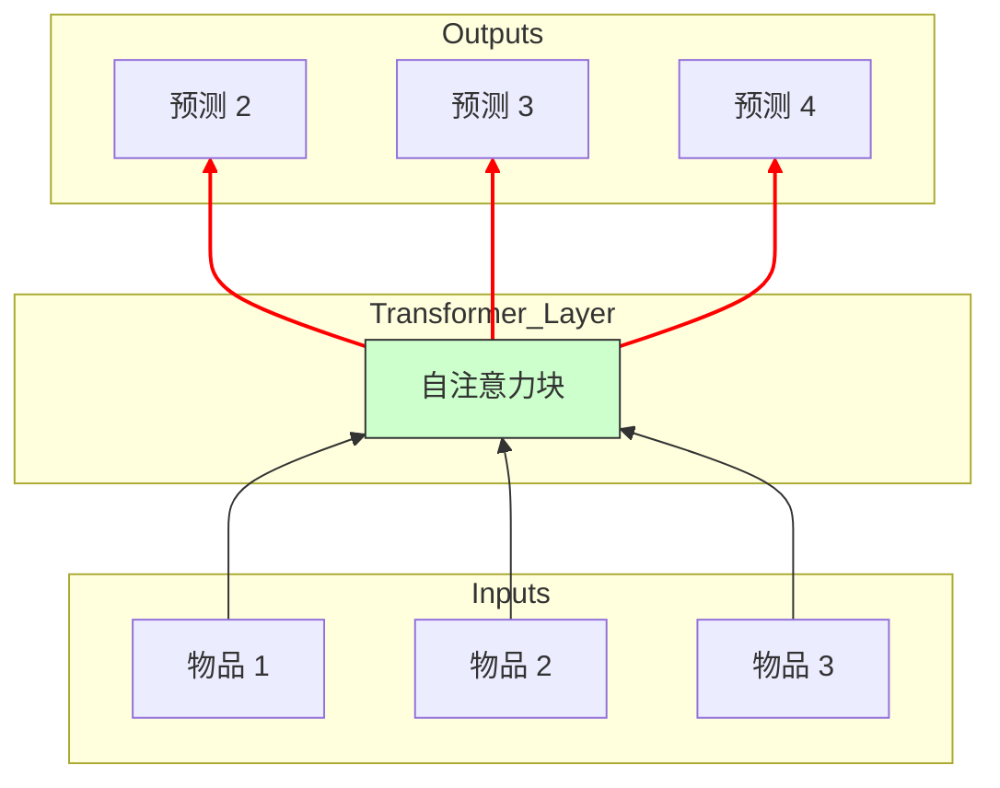

[< 返回上一级](README.md)

<strong>全局导航 (RecSys Guide)</strong>

- [首页](../../README.md)
- [01. 传统模型](../../01_Traditional_Models/README.md)
  - [协同过滤](../../01_Traditional_Models/01_Collaborative_Filtering/README.md)
    - [基于记忆](../../01_Traditional_Models/01_Collaborative_Filtering/01_Memory_Based/README.md)
    - [基于模型](../../01_Traditional_Models/01_Collaborative_Filtering/02_Model_Based/README.md)
  - [基于内容的过滤](../../01_Traditional_Models/02_Content_Based_Filtering/README.md)
- [02. 机器学习时代](../../02_Machine_Learning_Era/README.md)
- [03. 深度学习时代](../../03_Deep_Learning_Era/README.md)
  - [基于 MLP](../../03_Deep_Learning_Era/01_MLP_Based/README.md)
  - [基于序列/会话](../../03_Deep_Learning_Era/02_Sequence_Session_Based/README.md)
  - [基于图](../../03_Deep_Learning_Era/03_Graph_Based/README.md)
  - [基于自编码器](../../03_Deep_Learning_Era/04_AutoEncoder_Based/README.md)
- [04. SOTA 与生成式 AI](../../04_SOTA_GenAI/README.md) - [基于 LLM](../../04_SOTA_GenAI/01_LLM_Based/README.md) - [多模态推荐](../../04_SOTA_GenAI/02_Multimodal_RS.md) - [生成式推荐](../../04_SOTA_GenAI/03_Generative_RS.md)

# SASRec / BERT4Rec (基于 Transformer)

## 1. 详细说明 (Detailed Description)

### 定义 (Definition)

这些模型将 **Transformer** 架构（在 NLP 中很有名，例如 "Attention Is All You Need"）应用于序列推荐。

- **SASRec (Self-Attentive Sequential Recommendation)**: 使用单向 Transformer（像 GPT）基于*过去*的物品预测下一个物品。
- **BERT4Rec**: 使用双向 Transformer（像 BERT）通过利用过去和未来的上下文（训练期间）来预测*被掩盖*的物品，学习鲁棒的表示。

### 解决的问题 (The Problem it Solves)

- **RNN 的局限性**: RNN (GRU/LSTM) 顺序处理物品 ($1 \to 2 \to 3$)，这阻碍了并行化，并且难以记住非常久远的物品（“梯度消失”）。
- **注意力机制**: Transformer 可以直接“关注”*任何*以前的物品，无论它在多久以前，从而完美地捕捉长期依赖关系。

### 主要特征 (Key Characteristics)

- **自注意力 (Self-Attention)**: “哪些过去的物品与当前的预测相关？”
- **优点**:
  - 序列推荐中的 SOTA 性能。
  - 并行训练（不像 RNN）。
- **缺点**:
  - 对于长序列计算复杂度高 ($O(L^2)$ 或 $O(L \log L)$)。
  - 需要大量数据。

---

## 2. 操作原理 (Operating Principle)

### A. 自注意力机制 (Self-Attention Mechanism)

核心引擎。它基于查询 $Q$ 和键 $K$ 的兼容性计算所有值 $V$ 的加权和。
$$ \text{Attention}(Q, K, V) = \text{softmax}(\frac{QK^T}{\sqrt{d_k}})V $$

- 在 RecSys 中：“我 5 步前买的‘游戏机’（键）与我现在正在看的‘游戏光盘’（查询）相关吗？” -> 是，高注意力权重。

### B. SASRec (从左到右)

- **输入**: 序列 $[i_1, i_2, ... i_t]$。
- **目标**: 预测 $i_{t+1}$。
- **掩码**: 确保位置 $t$ 只能关注位置 $1...t$（因果掩码），防止通过查看未来作弊。

### C. BERT4Rec (完形填空任务)

- **训练**: 随机掩盖序列中的物品: $[i_1, \text{[MASK]}, i_3, i_4]$。
- **目标**: 使用 $i_1$（左上下文）和 $i_3, i_4$（右上下文）预测 [MASK] 的身份。
- **推理**: 在末尾附加 [MASK] 以预测下一个物品。

---

## 3. 流程示例 (Flow Example)

### 场景: 用户历史

序列: [**手机**, **手机壳**, **充电器**, **耳机**]

### SASRec 过程 (预测下一个)

1.  **嵌入**: 将物品转换为向量 + 添加 **位置嵌入** （序列顺序信息）。
2.  **注意力层**:
    - 目标: 位置 4 (耳机)。
    - 它回顾位置 1 (手机)。“高度相关”。
    - 它回顾位置 2 (手机壳)。“较少相关”。
3.  **聚合**: 模型创建一个上下文向量，混合了手机 (50%), 充电器 (30%), 手机壳 (20%)。
4.  **预测**: “手机” + “耳机”上下文 $\to$ 下一个物品可能是 **“音乐订阅”** 或 **“手机支架”** 。

### BERT4Rec 过程 (训练)

1.  **输入**: [手机, [MASK], 充电器, 耳机]。
2.  **注意力**: [MASK] 关注“手机”（过去）和“充电器”（未来）。
3.  **推理**:
    - “手机”暗示“手机壳”。
    - “充电器”暗示“电子设备”。
    - **预测**: 缺失的物品很有可能是 **“手机壳”** 。

### 视觉图表 (SASRec)

