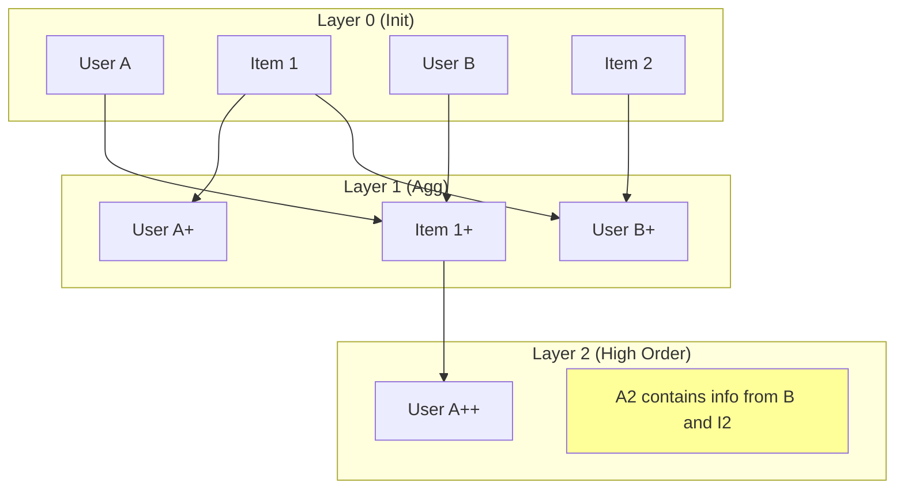

[< 返回上一级](README.md)

<strong>全局导航 (RecSys Guide)</strong>

- [首页](../../README.md)
- [01. 传统模型](../../01_Traditional_Models/README.md)
  - [协同过滤](../../01_Traditional_Models/01_Collaborative_Filtering/README.md)
    - [基于记忆](../../01_Traditional_Models/01_Collaborative_Filtering/01_Memory_Based/README.md)
    - [基于模型](../../01_Traditional_Models/01_Collaborative_Filtering/02_Model_Based/README.md)
  - [基于内容的过滤](../../01_Traditional_Models/02_Content_Based_Filtering/README.md)
- [02. 机器学习时代](../../02_Machine_Learning_Era/README.md)
- [03. 深度学习时代](../../03_Deep_Learning_Era/README.md)
  - [基于 MLP](../../03_Deep_Learning_Era/01_MLP_Based/README.md)
  - [基于序列/会话](../../03_Deep_Learning_Era/02_Sequence_Session_Based/README.md)
  - [基于图](../../03_Deep_Learning_Era/03_Graph_Based/README.md)
  - [基于自编码器](../../03_Deep_Learning_Era/04_AutoEncoder_Based/README.md)
- [04. SOTA 与生成式 AI](../../04_SOTA_GenAI/README.md) - [基于 LLM](../../04_SOTA_GenAI/01_LLM_Based/README.md) - [多模态推荐](../../04_SOTA_GenAI/02_Multimodal_RS.md) - [生成式推荐](../../04_SOTA_GenAI/03_Generative_RS.md)

# 神经图协同过滤 (Neural Graph Collaborative Filtering - NGCF)

## 1. 详细说明 (Detailed Description)

### 定义 (Definition)

**NGCF** (SIGIR 2019) 是一种为协同过滤定制的图神经网络 (GNN) 框架。它明确地对用户-物品集成图中的高阶连接性进行建模，将其嵌入到用户和物品的表示中。

### 解决的问题 (The Problem it Solves)

- **传统的 MF** 仅在最终预测阶段依赖于“交互”($u \cdot i$)。它不对协作信号进行编码*进入*嵌入本身。
- **NGCF** 认为嵌入 $e_u$ 应该固有地包含关于 $u$ 类喜欢物品的信息，以及喜欢这些物品的其他用户的信息。
- **连接性 (Connectivity)**: $User_1 \to Item_A \to User_2 \to Item_B$。此路径表明 $User_1$ 可能与 $User_2$ 相似，因此喜欢 $Item_B$。NGCF 捕捉这种 $L$-hop 信号。

### 主要特征 (Key Characteristics)

- **嵌入传播 (Embedding Propagation)**: 通过递归聚合邻居信息来改进嵌入。
- **优点**:
  - 通过利用图结构，显著改进了 MF。
- **缺点**:
  - 由于密集矩阵和每层的非线性，计算量大。
  - 后来证明（通过 LightGCN），非线性实际上是不必要的且有害的。

---

## 2. 操作原理 (Operating Principle)

### A. 图结构 (Graph Structure)

二部图：一边是用户，另一边是物品。边代表潜在的交互（喜欢、点击）。

### B. 嵌入传播层 (Embedding Propagation Layer)

对于用户 $u$ 和邻居物品 $i$:

1.  **消息构建**:
    $$ m\_{u \leftarrow i} = \frac{1}{\sqrt{|N_u||N_i|}} (W_1 e_i + W_2 (e_i \odot e_u)) $$

    - 传统的 GCN 仅使用 $W_1 e_i$。
    - NGCF 添加 $e_i \odot e_u$ 以强烈捕捉特征交互（如 FM）。

2.  **聚合**:
    $$ e*u^{(l)} = \text{LeakyReLU}(m*{u \leftarrow u} + \sum*{i \in N_u} m*{u \leftarrow i}) $$

    - 结合自身信息和邻居信息。

3.  **高阶传播**:
    堆叠 $L$ 层允许捕捉 $L$-hop 邻居。

### C. 预测 (Prediction)

连接所有层的嵌入以形成最终表示：
$$ e_u^\* = [e_u^{(0)}, e_u^{(1)}, ..., e_u^{(L)}] $$
然后进行点积。

---

## 3. 流程示例 (Flow Example)

### 场景

**图**: 用户 A --(连接)--> 物品 1 --(连接)--> 用户 B --(连接)--> 物品 2。 **目标**: 为用户 A 推荐。

### 传播步骤

1.  **第 1 层 (直接邻居)**:

    - 用户 A 聚合来自 **物品 1** 的信息。
    - 用户 A 的向量现在“知道”物品 1。

2.  **第 2 层 (邻居的邻居)**:

    - 用户 A 聚合来自其邻居的新向量的信息。
    - 物品 1 的向量（来自第 1 层）包含有关 **用户 B** 的信息。
    - 因此，用户 A 现在间接吸收了有关 **用户 B** 的信息。

3.  **第 3 层 (3-hop)**:
    - 用户 B 的向量（来自第 2 层）包含有关 **物品 2** 的信息。
    - 用户 A 有效地通过路径 $A \to 1 \to B \to 2$ “看到”了 **物品 2** 。
    - 模型学习到物品 2 与用户 A 相关。

### 视觉图表

