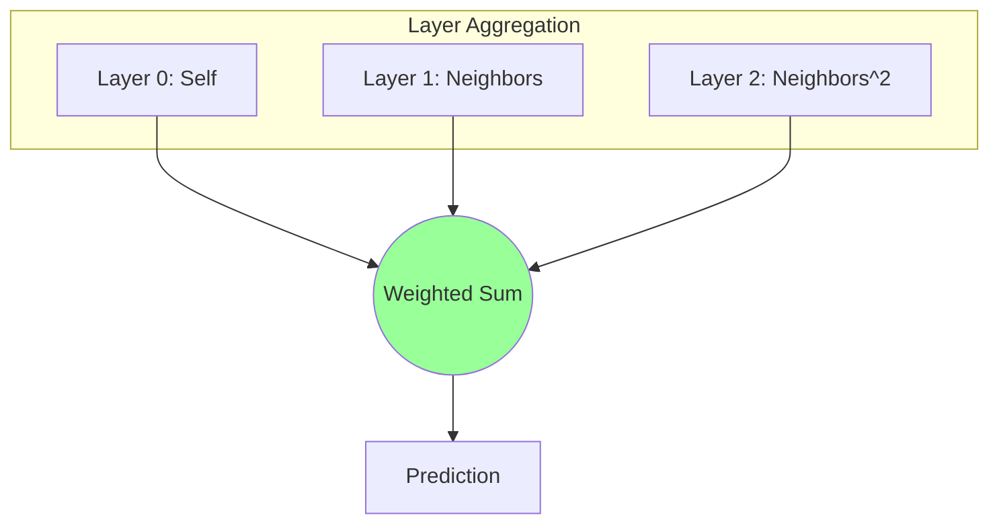

[< 返回上一级](README.md)

<strong>全局导航 (RecSys Guide)</strong>

- [首页](../../README.md)
- [01. 传统模型](../../01_Traditional_Models/README.md)
  - [协同过滤](../../01_Traditional_Models/01_Collaborative_Filtering/README.md)
    - [基于记忆](../../01_Traditional_Models/01_Collaborative_Filtering/01_Memory_Based/README.md)
    - [基于模型](../../01_Traditional_Models/01_Collaborative_Filtering/02_Model_Based/README.md)
  - [基于内容的过滤](../../01_Traditional_Models/02_Content_Based_Filtering/README.md)
- [02. 机器学习时代](../../02_Machine_Learning_Era/README.md)
- [03. 深度学习时代](../../03_Deep_Learning_Era/README.md)
  - [基于 MLP](../../03_Deep_Learning_Era/01_MLP_Based/README.md)
  - [基于序列/会话](../../03_Deep_Learning_Era/02_Sequence_Session_Based/README.md)
  - [基于图](../../03_Deep_Learning_Era/03_Graph_Based/README.md)
  - [基于自编码器](../../03_Deep_Learning_Era/04_AutoEncoder_Based/README.md)
- [04. SOTA 与生成式 AI](../../04_SOTA_GenAI/README.md) - [基于 LLM](../../04_SOTA_GenAI/01_LLM_Based/README.md) - [多模态推荐](../../04_SOTA_GenAI/02_Multimodal_RS.md) - [生成式推荐](../../04_SOTA_GenAI/03_Generative_RS.md)

# LightGCN

## 1. 详细说明 (Detailed Description)

### 定义 (Definition)

**LightGCN** (SIGIR 2020) 是 NGCF 的简化版本，去除了非线性激活函数和特征变换矩阵。作者证明了这两种在用于分类的 GNN 中标准的组件，对于协同过滤实际上是 **有害的** 。

### 为什么叫 "Light"? (Why "Light"?)

- 移除: $W_1, W_2$ 矩阵 (可训练权重)。
- 移除: $\sigma$ (ReLU/LeakyReLU)。
- 保留: 仅保留 **图卷积** (邻居聚合)。
- 结果: 训练更快，需要调整的参数更少，性能显著更好。基于图的 CF 的标准。

### 主要特征 (Key Characteristics)

- **线性传播 (Linear Propagation)**: 唯一的可训练参数是初始嵌入 $e_u^{(0)}$ 和 $e_i^{(0)}$。
- **优点**:
  - 极其高效。
  - 易于实现。
  - 持续优于 NGCF。
- **缺点**:
  - 像所有图模型一样，在非常大的图上进行推理可能会占用大量内存。

---

## 2. 操作原理 (Operating Principle)

### A. 简化的传播规则 (Simplified Propagation Rule)

因为没有权重或激活：
$$ e*u^{(k+1)} = \sum*{i \in N_u} \frac{1}{\sqrt{|N_u||N_i|}} e_i^{(k)} $$

- 这基本上是说：“第 $k+1$ 层用户的向量是他们在第 $k$ 层喜欢的物品的加权平均值。”
- 归一化项 $\frac{1}{\sqrt{|N_u||N_i|}}$ 防止高阶节点在幅度上爆炸。

### B. 层组合 (Layer Combination)

与 NGCF 连接不同，LightGCN 对所有层的嵌入进行加权求和，以形成最终表示。
$$ e*u = \sum*{k=0}^K \alpha_k e_u^{(k)} $$

- 通常 $\alpha_k$ 是均匀的 ($1/(K+1)$)。
- 为什么要在这里求和？第 0 层代表自我。第 1 层代表物品。第 2 层代表“与我相似的用户”。我们想要所有这些信号的混合。

### C. 预测 (Prediction)

$$ \hat{y}\_{ui} = e_u^T e_i $$

---

## 3. 流程示例 (Flow Example)

### 场景

用户 A 连接到 物品 1。物品 1 连接到 用户 B。
初始嵌入: A=[1,0], 1=[0,1], B=[-1,0].

### 处理 (简化，忽略范数)

1.  **第 0 层**:

    - $A^{(0)} = [1, 0]$
    - $1^{(0)} = [0, 1]$

2.  **第 1 层 (1-hop 聚合)**:

    - 用户 A 从物品 1 获取。
    - $A^{(1)} \approx 1^{(0)} = [0, 1]$。(A 变得像物品)
    - 物品 1 从 A 和 B 获取。
    - $1^{(1)} \approx A^{(0)} + B^{(0)} = [1, 0] + [-1, 0] = [0, 0]$。

3.  **第 2 层 (2-hop 聚合)**:

    - 用户 A 从物品 1 的第 1 层向量获取。
    - $A^{(2)} \approx 1^{(1)} = [0, 0]$。(信号平滑)。

4.  **A 的最终向量**:
    - $A_{final} = \alpha_0 A^{(0)} + \alpha_1 A^{(1)} + ...$
    - $A_{final} = \frac{1}{2}([1,0] + [0,1]) = [0.5, 0.5]$。

### 视觉图表

