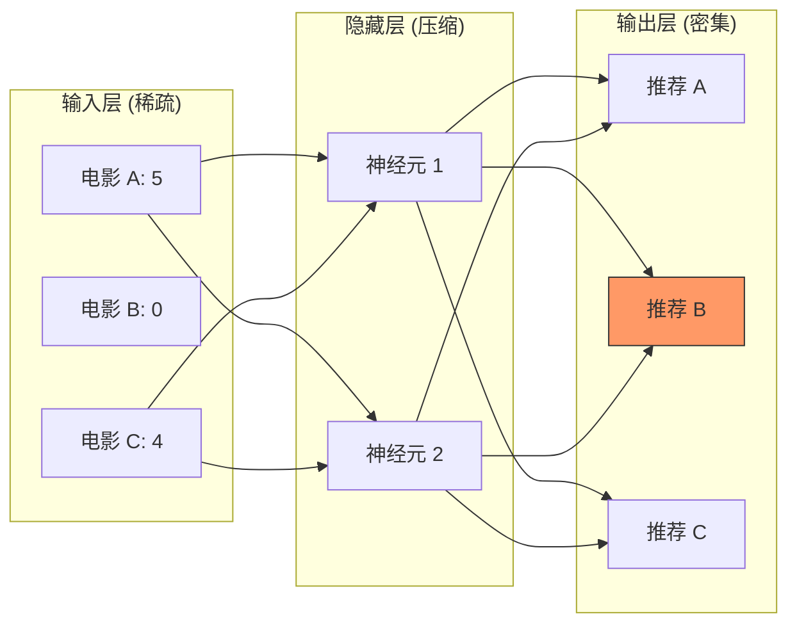

[< 返回上一级](README.md)

<strong>全局导航 (RecSys Guide)</strong>

- [首页](../../README.md)
- [01. 传统模型](../../01_Traditional_Models/README.md)
  - [协同过滤](../../01_Traditional_Models/01_Collaborative_Filtering/README.md)
    - [基于记忆](../../01_Traditional_Models/01_Collaborative_Filtering/01_Memory_Based/README.md)
    - [基于模型](../../01_Traditional_Models/01_Collaborative_Filtering/02_Model_Based/README.md)
  - [基于内容的过滤](../../01_Traditional_Models/02_Content_Based_Filtering/README.md)
- [02. 机器学习时代](../../02_Machine_Learning_Era/README.md)
- [03. 深度学习时代](../../03_Deep_Learning_Era/README.md)
  - [基于 MLP](../../03_Deep_Learning_Era/01_MLP_Based/README.md)
  - [基于序列/会话](../../03_Deep_Learning_Era/02_Sequence_Session_Based/README.md)
  - [基于图](../../03_Deep_Learning_Era/03_Graph_Based/README.md)
  - [基于自编码器](../../03_Deep_Learning_Era/04_AutoEncoder_Based/README.md)
- [04. SOTA 与生成式 AI](../../04_SOTA_GenAI/README.md) - [基于 LLM](../../04_SOTA_GenAI/01_LLM_Based/README.md) - [多模态推荐](../../04_SOTA_GenAI/02_Multimodal_RS.md) - [生成式推荐](../../04_SOTA_GenAI/03_Generative_RS.md)

# AutoRec & CDAE

## 1. 详细说明 (Detailed Description)

### 定义 (Definition)

**自编码器 (AutoEncoders)** 是旨在通过瓶颈将输入复制到输出的神经网络。

- **AutoRec** (2015): 将其应用于用户的评分向量。它获取稀疏向量 $r^{(u)}$，将其压缩为潜在代码，并非重建完整的密集向量 $\hat{r}^{(u)}$。
- **CDAE (协同降噪自编码器)** (2016): 专为隐式反馈设计。它引入了“降噪”（随机丢弃输入）以迫使模型学习鲁棒特征，并添加特定于用户的节点以捕捉偏差。

### 主要特征 (Key Characteristics)

- **重建 (Reconstruction)**: 核心思想是“填补空白”。
- **非线性 (Non-linearity)**: 与 PCA/SVD 不同，自编码器使用激活函数 (Sigmoid, ReLU) 来捕捉非线性模式。
- **优点**:
  - 优雅地处理稀疏数据。
  - CDAE 对于“Top-N”排序任务非常稳健。
- **缺点**:
  - AutoRec 本质上是单层 NCF；不如序列模型深或强大。

---

## 2. 操作原理 (Operating Principle)

### AutoRec 架构

1.  **输入**: 用户评分向量 $r^{(u)} \in \mathbb{R}^N$ (物品)。大多数条目为 0（未知）。
2.  **编码器**:
    $$ h = f(V r^{(u)} + \mu) $$
    - 将巨大的物品空间映射到小的潜在空间。
3.  **解码器**:
    $$ \hat{r}^{(u)} = g(W h + b) $$
    - 重建完整的物品空间。
4.  **训练**: 仅反向传播 **已观测** 评分的误差。
    $$ \min \sum*{u} \sum*{i \in I*u} || r*{ui} - \hat{r}\_{ui} ||^2 + \lambda ... $$

### CDAE 改进

- **降噪**: 随机将输入中的一些 1 覆盖为 0。“问：即使我隐藏了它，你还能猜出我喜欢星球大战吗？”
- **用户节点**: 向隐藏层的输入添加唯一的特定可训练权重向量 $v_u$。
  $$ h = \sigma(W \cdot \text{corrupt}(r_u) + V_u + b) $$
    这个 $V_u$ 就像矩阵分解中的用户偏差/向量。

---

## 3. 流程示例 (Flow Example)

### 场景

用户评价了 **电影 A** (5) 和 **电影 C** (4)。 **电影 B** 未知 (0)。

### 过程

1.  **输入向量**: `[5, 0, 4]` (归一化: `[1.0, 0, 0.8]`).
2.  **编码器**:
    - 权重乘以 1.0 (A) 和 0.8 (C)。
    - 隐藏代码: `[0.9, 0.1]` (潜在内容画像)。
3.  **解码器**:
    - 将 `[0.9, 0.1]` 扩展回 3 维。
    - 输出: `[0.98, 0.7, 0.82]`.
4.  **预测**:
    - 电影 A: 0.98 $\approx$ 1.0 (良好的重建)。
    - 电影 C: 0.82 $\approx$ 0.8 (良好的重建)。
    - **电影 B**: **0.7**. (模型填补了空白!).
    - 推荐电影 B (高分)。

### 视觉图表

