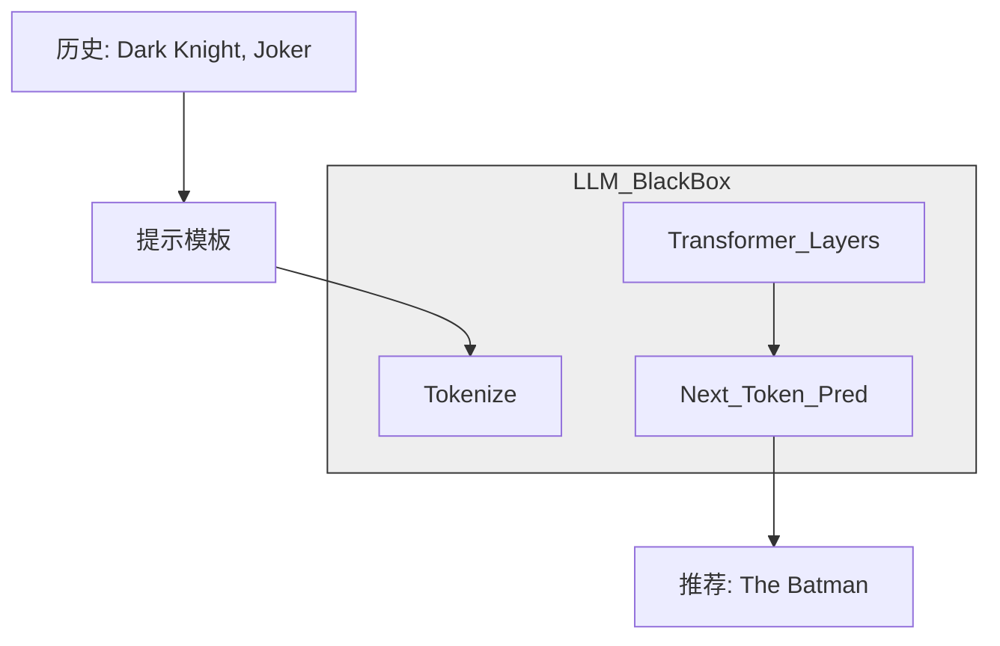

[< 返回上一级](README.md)

<details>
<summary><strong>全局导航 (RecSys Guide)</strong></summary>

- [首页](../../README.md)
- [01. 传统模型](../../01_Traditional_Models/README.md)
  - [协同过滤](../../01_Traditional_Models/01_Collaborative_Filtering/README.md)
    - [基于记忆](../../01_Traditional_Models/01_Collaborative_Filtering/01_Memory_Based/README.md)
    - [基于模型](../../01_Traditional_Models/01_Collaborative_Filtering/02_Model_Based/README.md)
  - [基于内容的过滤](../../01_Traditional_Models/02_Content_Based_Filtering/README.md)
- [02. 机器学习时代](../../02_Machine_Learning_Era/README.md)
- [03. 深度学习时代](../../03_Deep_Learning_Era/README.md)
  - [基于 MLP](../../03_Deep_Learning_Era/01_MLP_Based/README.md)
  - [基于序列/会话](../../03_Deep_Learning_Era/02_Sequence_Session_Based/README.md)
  - [基于图](../../03_Deep_Learning_Era/03_Graph_Based/README.md)
  - [基于自编码器](../../03_Deep_Learning_Era/04_AutoEncoder_Based/README.md)
- [04. SOTA 与生成式 AI](../../04_SOTA_GenAI/README.md) - [基于 LLM](../../04_SOTA_GenAI/01_LLM_Based/README.md) - [多模态推荐](../../04_SOTA_GenAI/02_Multimodal_RS.md) - [生成式推荐](../../04_SOTA_GenAI/03_Generative_RS.md)
</details>

# LLM4Rec

## 1. 详细说明 (Detailed Description)

### 定义 (Definition)

**LLM4Rec** 是使用大语言模型 (GPT-4, LLaMA, PaLM) 来增强或执行推荐任务的总称。与在 ID-交互矩阵上训练的传统模型不同，LLM 是在互联网上海量的语义世界知识上进行预训练的。

### 范式 (Paradigms)

1.  **LLM 作为推荐器 (Direct)**: “给定用户历史 A,B,C，他们接下来应该买什么？”
2.  **LLM 作为特征编码器 (Embedding)**: “将此电影情节转换为向量，然后将其馈送到传统模型。”
3.  **LLM 作为数据生成器 (Augmentation)**: “模拟用户并生成人工交互数据以解决冷启动问题。”

### 主要特征 (Key Characteristics)

- **零样本 / 少样本 (Zero-Shot / Few-Shot)**: 无需在特定数据集上进行微调即可提供合理的推荐。
- **推理能力 (Reasoning Capability)**: 可以解释*为什么*推荐某样东西（“因为你喜欢反乌托邦科幻小说...”）。
- **优点**:
  - 无与伦比的“冷启动”性能。
  - 自然语言接口 (Chat-Rec)。
- **缺点**:
  - **幻觉 (Hallucination)**: 推荐虚构的电影。
  - **延迟 (Latency)**: 与点积相比，生成文本很慢。
  - **位置偏差 (Position Bias)**: LLM 倾向于推荐提示序列开头/结尾的物品。

---

## 2. 操作原理 (Operating Principle)

### A. 提示工程 (Prompt Engineering)

核心算法是设计正确的提示。

- **指令 (Instruction)**: “你是电影专家...”
- **上下文 (Context)**: “用户历史: [黑客帝国, 盗梦空间, 信条]”
- **候选集 (Candidate Set)**: “候选: [芭比, 奥本海默, 星际穿越]” (可选 - “排序模式”)
- **任务 (Task)**: “对候选进行排序。”

### B. 上下文学习 (In-Context Learning - ICL)

在提示中提供示例，以教导模型所需的格式和逻辑。

- 提示: “用户 A 喜欢 X,Y -> 推荐 Z。用户 B 喜欢 P,Q -> 推荐 R。现在对于用户 C...”

### C. 微调 (指令微调)

采用 LLaMA 模型并强制它解决数千个 RecSys 任务（评分预测、解释），使其与推荐逻辑保持一致，而不仅仅是文本补全。

---

## 3. 流程示例 (Flow Example)

### 场景: 通过 API 直接推荐

**用户历史**: "The Dark Knight" (蝙蝠侠：黑暗骑士), "Joker" (小丑)。

### 步骤 1: 提示构建

```text
System: Act as a movie recommender.
User: I have watched "The Dark Knight" (5/5) and "Joker" (4/5).
I like dark superhero movies with psychological depth.
Suggest 1 movie I haven't seen.
```

### 步骤 2: LLM 推理 (内部)

1.  **分析历史**: 黑暗骑士 & 小丑 -> DC 宇宙, 哥谭, 坚韧不拔, 心理惊悚。
2.  **搜索知识库**: 什么是相似的？"The Batman (2022)" (新蝙蝠侠), "Watchmen" (守望者), "V for Vendetta" (V 字仇杀队)。
3.  **过滤**: "The Batman" 是最近的且风格相似。

### 步骤 3: 生成

```text
Response: I recommend "The Batman- (2022).
Reason: Like your previous favorites, it features a gritty, noir-detective take on Gotham City and delves deep into the psychology of Bruce Wayne, similar to how 'Joker' explored Arthur Fleck.
```

### 视觉图表


