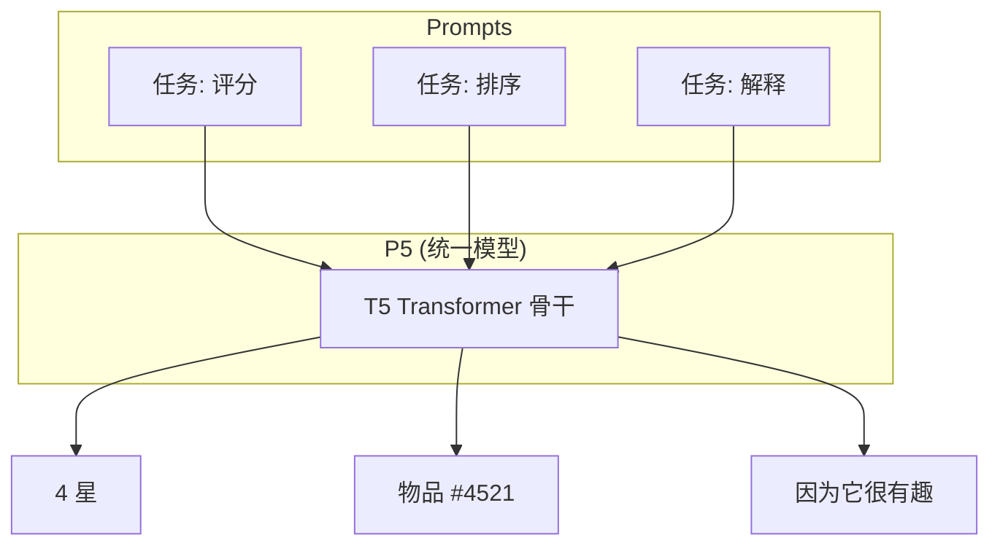

[< 返回上一级](README.md)

<strong>全局导航 (RecSys Guide)</strong>

- [首页](../../README.md)
- [01. 传统模型](../../01_Traditional_Models/README.md)
  - [协同过滤](../../01_Traditional_Models/01_Collaborative_Filtering/README.md)
    - [基于记忆](../../01_Traditional_Models/01_Collaborative_Filtering/01_Memory_Based/README.md)
    - [基于模型](../../01_Traditional_Models/01_Collaborative_Filtering/02_Model_Based/README.md)
  - [基于内容的过滤](../../01_Traditional_Models/02_Content_Based_Filtering/README.md)
- [02. 机器学习时代](../../02_Machine_Learning_Era/README.md)
- [03. 深度学习时代](../../03_Deep_Learning_Era/README.md)
  - [基于 MLP](../../03_Deep_Learning_Era/01_MLP_Based/README.md)
  - [基于序列/会话](../../03_Deep_Learning_Era/02_Sequence_Session_Based/README.md)
  - [基于图](../../03_Deep_Learning_Era/03_Graph_Based/README.md)
  - [基于自编码器](../../03_Deep_Learning_Era/04_AutoEncoder_Based/README.md)
- [04. SOTA 与生成式 AI](../../04_SOTA_GenAI/README.md) - [基于 LLM](../../04_SOTA_GenAI/01_LLM_Based/README.md) - [多模态推荐](../../04_SOTA_GenAI/02_Multimodal_RS.md) - [生成式推荐](../../04_SOTA_GenAI/03_Generative_RS.md)

# P5 (Pretrain, Personalized, Prompt, Predict, Recommendation)

## 1. 详细说明 (Detailed Description)

### 定义 (Definition)

**P5** (Generic Foundation Model for Recommendation) 是一个统一的框架，使用单个序列到序列 (Seq2Seq) 模型（具体来说是 T5 Transformer）解决多种推荐任务。P5 不再为评分预测（回归）和 Top-N 推荐（排序）使用单独的模型，而是将 **所有** 任务转换为自然语言提示。

### 解决的问题 (The Problem it Solves)

- **碎片化 (Fragmentation)**: 传统的 RS 需要针对不同任务使用不同的架构（例如，可解释性需要单独的 NLG 模型）。
- **迁移 (Transfer)**: 很难将知识从评分任务迁移到解释任务。
- **P5 解决方案**: 将一切视为文本生成。

### 主要特征 (Key Characteristics)

- **个性化提示 (Personalized Prompt)**: 提示包含用户 ID 和物品 ID（作为 Token）以进行个性化生成。
- **基础性 (Foundational)**: 迈向“RecSys 版 GPT”的一步。
- **优点**:
  - 统一的架构。
  - 在新任务上具有出色的零样本/少样本能力。
- **缺点**:
  - Token ID 冲突（用户 "123" 可能会与数字 "123" 混淆）。
  - 可扩展性：逐个 Token 生成 ID 比检索慢。

---

## 2. 操作原理 (Operating Principle)

### 5 类提示模板 (5 Families of Prompt Templates)

P5 为 5 个核心任务定义了模板：

1.  **直接推荐**: “预测用户 A 的下一个物品。”
2.  **评分预测**: “用户 A 会给物品 B 打几颗星？”
3.  **解释生成**: “解释为什么用户 A 喜欢物品 B。”
4.  **评论摘要**: “总结用户 A 为物品 B 写的评论。”
5.  **顺序预测**: “给定历史 [...]，接下来是什么？”

### 训练 (Training)

- **基础模型**: T5 (Text-to-Text Transfer Transformer)。
- **提示微调**: 模型在海量的 (提示, 标签) 对数据集上进行微调。
- **输入**: `User_101 watched Movie_55. Will he like it?`
- **目标**: `yes`
- **输入**: `Why did User_101 like Movie_55?`
- **目标**: `Because it is a comedy.`

---

## 3. 流程示例 (Flow Example)

### 场景

用户 77 想要一个推荐和一个解释。

### 任务 1: 推荐

1.  **提示**: "I am User_77. I have seen Movie_1, Movie_2. What should I watch next?"
2.  **模型生成**: "Movie_99" (模型学习到 User_77 的序列导致 Movie_99 的模式)。

### 任务 2: 解释

1.  **提示**: "Write a justification for recommending Movie_99 to User_77."
2.  **模型生成**: "Since User_77 enjoyed the action sequences in Movie_1, Movie_99 offers a similar thrill."

### 视觉图表

