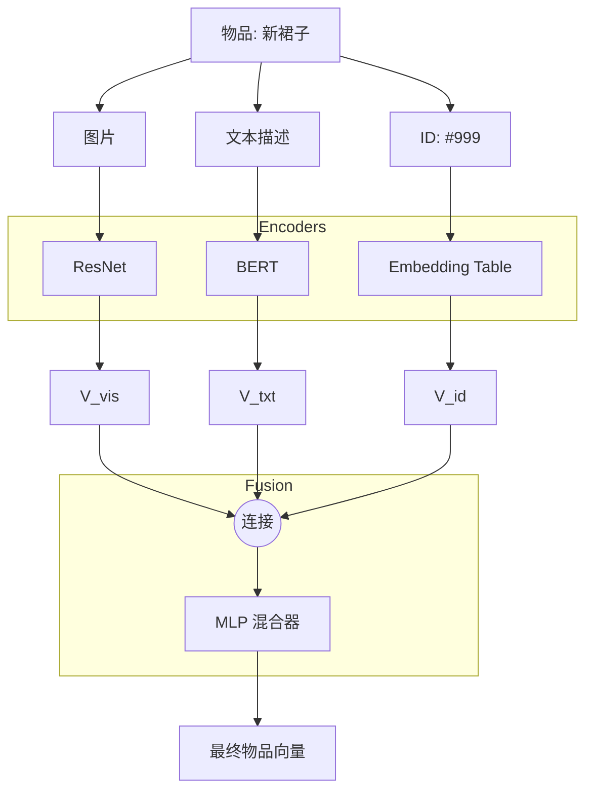

[< 返回上一级](README.md)

<strong>全局导航 (RecSys Guide)</strong>

- [首页](../../README.md)
- [01. 传统模型](../../01_Traditional_Models/README.md)
  - [协同过滤](../../01_Traditional_Models/01_Collaborative_Filtering/README.md)
    - [基于记忆](../../01_Traditional_Models/01_Collaborative_Filtering/01_Memory_Based/README.md)
    - [基于模型](../../01_Traditional_Models/01_Collaborative_Filtering/02_Model_Based/README.md)
  - [基于内容的过滤](../../01_Traditional_Models/02_Content_Based_Filtering/README.md)
- [02. 机器学习时代](../../02_Machine_Learning_Era/README.md)
- [03. 深度学习时代](../../03_Deep_Learning_Era/README.md)
  - [基于 MLP](../../03_Deep_Learning_Era/01_MLP_Based/README.md)
  - [基于序列/会话](../../03_Deep_Learning_Era/02_Sequence_Session_Based/README.md)
  - [基于图](../../03_Deep_Learning_Era/03_Graph_Based/README.md)
  - [基于自编码器](../../03_Deep_Learning_Era/04_AutoEncoder_Based/README.md)
- [04. SOTA 与生成式 AI](../../04_SOTA_GenAI/README.md) - [基于 LLM](../../04_SOTA_GenAI/01_LLM_Based/README.md) - [多模态推荐](../../04_SOTA_GenAI/02_Multimodal_RS.md) - [生成式推荐](../../04_SOTA_GenAI/03_Generative_RS.md)

# 多模态推荐系统 (Multimodal RS)

## 1. 详细说明 (Detailed Description)

### 定义 (Definition)

**多模态推荐系统** 利用辅助数据模态（图像、音频、视频、文本）以及标准的用户-物品交互矩阵。他们认为物品的内容与其 ID 一样重要，尤其是在视觉或听觉丰富的领域。

### 解决的问题 (The Problem it Solves)

- **冷启动 (Cold Start)**: 一件新衣服没有评分（ID 没用），但它有图片（视觉模态很丰富）。模型可以将它推荐给喜欢“视觉相似”衣服的用户。
- **细粒度偏好 (Fine-grained Preference)**: 用户可能会喜欢一部电影，不是因为类型（文本），而是因为摄影（视觉）。

### 主要特征 (Key Characteristics)

- **编码器 (Encoders)**: 由深度编码器驱动（图像用 ResNet/ViT，文本用 BERT，音频用 VGGish）。
- **融合 (Fusion)**: 将 ID 嵌入与内容嵌入相结合的艺术。
- **优点**:
  - 极大提高了新物品的性能。
  - 对于时尚、艺术、音乐和类似 TikTok 的短视频应用至关重要。
- **缺点**:
  - 计算成本高（处理图像/视频）。
  - 存储繁重（存储特征向量）。

---

## 2. 操作原理 (Operating Principle)

### 架构 (Architecture)

1.  **特征提取 (离线/在线)**:

    - **视觉**: 将物品图像 $I_i$ 通过预训练的 CNN（例如 ResNet50）以获得向量 $v_i$。
    - **文本**: 将描述 $T_i$ 通过 BERT 以获得向量 $t_i$。
    - **ID**: 查找 ID 嵌入 $e_{id}$。

2.  **融合策略 (Fusion Strategies)**:

    - **连接 (早期融合)**:
      $$ e*{final} = \text{MLP}([e*{id}, v_i, t_i]) $$
    - **基于注意力的融合**: 让模型决定哪个模态对*此*物品重要。
      $$ e*{final} = \alpha_1 e*{id} + \alpha_2 v_i + \alpha_3 t_i $$
    - **图融合 (MMGCN)**: 使用图神经网络，其中每个模态都有自己的图，然后聚合。

3.  **预测**:
    - 用户向量和物品最终向量之间的标准点积或 MLP。

---

## 3. 流程示例 (Flow Example)

### 场景: 时尚应用 (用户喜欢红色碎花裙)

**候选**: "新款夏日连衣裙" (尚无评分)。 **数据**: 图片 (红色, 花朵图案), 文本 ("清风拂面的夏日穿搭")。

### 过程 (Process)

1.  **视觉编码器**:
    - 输入: 图片。
    - 输出: 向量 $v_{img}$ (对 '红色', '图案' 有高信号)。
2.  **用户表示**:
    - 用户历史包含许多具有相似 $v_{img}$ 的物品。
    - 模型学习到用户向量 $P_u$ 接近 '红色/图案' 视觉空间。
3.  **匹配**:
    - 即使 ID 嵌入是随机的（冷启动），$P_u \cdot v_{img}$ 也很高。
    - **预测**: 高概率。

### 视觉图表

