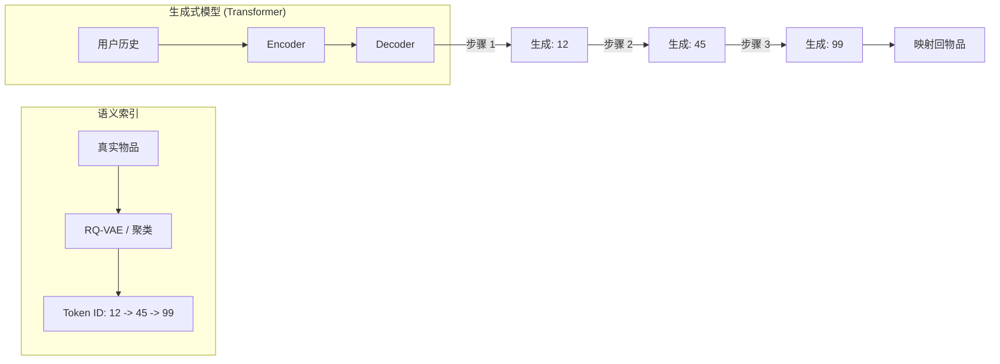

[< 返回上一级](README.md)

<strong>全局导航 (RecSys Guide)</strong>

- [首页](../../README.md)
- [01. 传统模型](../../01_Traditional_Models/README.md)
  - [协同过滤](../../01_Traditional_Models/01_Collaborative_Filtering/README.md)
    - [基于记忆](../../01_Traditional_Models/01_Collaborative_Filtering/01_Memory_Based/README.md)
    - [基于模型](../../01_Traditional_Models/01_Collaborative_Filtering/02_Model_Based/README.md)
  - [基于内容的过滤](../../01_Traditional_Models/02_Content_Based_Filtering/README.md)
- [02. 机器学习时代](../../02_Machine_Learning_Era/README.md)
- [03. 深度学习时代](../../03_Deep_Learning_Era/README.md)
  - [基于 MLP](../../03_Deep_Learning_Era/01_MLP_Based/README.md)
  - [基于序列/会话](../../03_Deep_Learning_Era/02_Sequence_Session_Based/README.md)
  - [基于图](../../03_Deep_Learning_Era/03_Graph_Based/README.md)
  - [基于自编码器](../../03_Deep_Learning_Era/04_AutoEncoder_Based/README.md)
- [04. SOTA 与生成式 AI](../../04_SOTA_GenAI/README.md) - [基于 LLM](../../04_SOTA_GenAI/01_LLM_Based/README.md) - [多模态推荐](../../04_SOTA_GenAI/02_Multimodal_RS.md) - [生成式推荐](../../04_SOTA_GenAI/03_Generative_RS.md)

# 生成式推荐系统 (Generative RS)

## 1. 详细说明 (Detailed Description)

### 定义 (Definition)

**生成式推荐系统 (GenRec)** 是从“排序”到“生成”的范式转变。传统模型从固定的候选池中选择最佳物品（分类/检索）。生成式模型直接从上下文中 **生成** 目标物品的标识符（或内容）。

### 解决的问题 (The Problem it Solves)

- **大规模 Softmax**: 在传统深度学习中，在 1 亿个物品上计算 Softmax 在计算上是不可能的。我们改用近似最近邻 (ANN)。
- **生成式检索**: 这种方法消除了繁重的索引（FAISS, HNSW）。“索引”隐含地存储在模型权重中。你只需问“下一个是什么？”，它就会打出 "Item_ID_123"。

### 主要特征 (Key Characteristics)

- **检索即生成 (Retrieval is Generation)**: 模型学习映射 用户上下文 $\to$ 物品 Token 序列。
- **语义 ID (Semantic IDs)**: 通常需要巧妙的索引方案（例如 RQ-VAE）将无聊的整数 ID 转换为可以分层生成的有意义的语义代码。
- **优点**:
  - 统一的简单架构（只是一个 Transformer）。
  - 可能更快的推理（无需外部 ANN 搜索）。
- **缺点**:
  - **幻觉**: 可能会生成不存在的 ID。
  - **新物品**: 在不重新训练分词器的情况下很难添加新物品。

---

## 2. 操作原理 (Operating Principle)

### A. 语义 ID 创建 (索引)

在训练之前，我们必须将物品转换为可生成的 Token。

1.  **基于聚类**: 层次聚类。
    - 物品 A $\to$ 聚类 1 $\to$ 子聚类 5 $\to$ 物品 A。
    - ID: "1-5-A"。
2.  **基于语义**: 使用物品标题。
    - 物品 "Iron Man" $\to$ Token ["Iron", "Man"]。

### B. 训练 (Seq2Seq)

- **输入**: "用户历史: [物品 A, 物品 B]"
- **目标**: "物品 C" (表示为 Token "3-2-C")。
- **损失**: 标准语言建模损失（下一个 Token 的交叉熵）。

### C. 推理 (束搜索 Beam Search)

- 模型逐个 Token 生成 ID。
- 束搜索允许它同时探索多个可能的物品 ID。
- 约束：强制生成仅输出有效的物品 ID（基于 Trie 的约束解码）。

---

## 3. 流程示例 (Flow Example)

### 场景: 层次索引

想象一个图书馆。

- 第 1 层: 类型 (小说, 非小说)
- 第 2 层: 作者 (J.K.罗琳, S.金)
- 第 3 层: 书

**书 "哈利波特"** ID: `小说` -> `罗琳` -> `HP1`。

### 过程

1.  **上下文**: 用户刚读完 "霍比特人"。
2.  **生成步骤 1**:
    - 输入: "上下文: 霍比特人"。
    - 输出: `小说` (高概率)。
3.  **生成步骤 2**:
    - 输入: "上下文: 霍比特人, 小说"。
    - 输出: `罗琳` (高概率 - 通过奇幻逻辑连接)。
4.  **生成步骤 3**:
    - 输入: "上下文: 霍比特人, 小说, 罗琳"。
    - 输出: `HP1` (哈利波特 1)。
5.  **结果**: 推荐 "哈利波特 1"。

_注意这与人类图书管理员的思考方式有多相似：“奇幻区... 也许是罗琳... 对，哈利波特。”_

### 视觉图表

