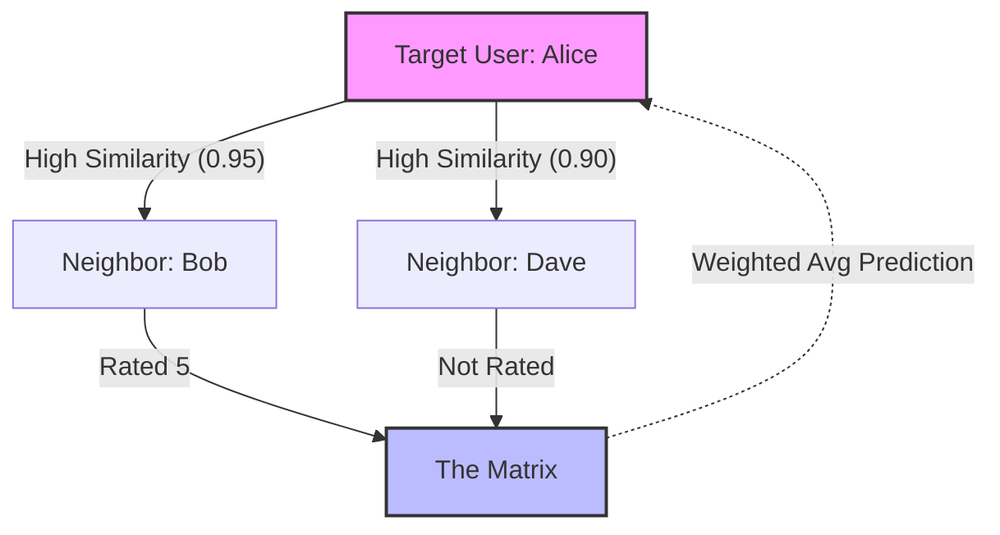

[< Up to Parent](README.md)

<strong>Global Navigation</strong>

- [Home](../../../README.md)
- [01. Traditional Models](../../../01_Traditional_Models/README.md)
    - [Collaborative Filtering](../../../01_Traditional_Models/01_Collaborative_Filtering/README.md)
        - [Memory-based](../../../01_Traditional_Models/01_Collaborative_Filtering/01_Memory_Based/README.md)
        - [Model-based](../../../01_Traditional_Models/01_Collaborative_Filtering/02_Model_Based/README.md)
    - [Content-based Filtering](../../../01_Traditional_Models/02_Content_Based_Filtering/README.md)
- [02. Machine Learning Era](../../../02_Machine_Learning_Era/README.md)
- [03. Deep Learning Era](../../../03_Deep_Learning_Era/README.md)
    - [MLP-based](../../../03_Deep_Learning_Era/01_MLP_Based/README.md)
    - [Sequence/Session-based](../../../03_Deep_Learning_Era/02_Sequence_Session_Based/README.md)
    - [Graph-based](../../../03_Deep_Learning_Era/03_Graph_Based/README.md)
    - [AutoEncoder-based](../../../03_Deep_Learning_Era/04_AutoEncoder_Based/README.md)
- [04. SOTA & GenAI](../../../04_SOTA_GenAI/README.md)
    - [LLM-based](../../../04_SOTA_GenAI/01_LLM_Based/README.md)
    - [Multimodal RS](../../../04_SOTA_GenAI/02_Multimodal_RS.md)
    - [Generative RS](../../../04_SOTA_GenAI/03_Generative_RS.md)

# User-based Collaborative Filtering (User-based CF)

## 1. Detailed Description

### Definition

**User-based Collaborative Filtering** is a memory-based recommendation algorithm that predicts a target user's interest in an item based on the preferences of other users who have similar rating patterns. It is often summarized as "Users who liked similar things in the past will like similar things in the future."

### History & Background

- **Origins**: It was one of the first automated recommendation techniques, famously implemented in the **GroupLens** system (1994) for Usenet news articles.
- **Evolution**: While theoretically simple, it faced scalability challenges as user bases grew (calculating $N \times N$ similarity), leading to the development of Item-based CF and Matrix Factorization.

### Key Characteristics

- **Serendipity**: Good at recommending items that are completely different from what the user has seen before, as long as "similar users" found them interesting.
- **User-Centric**: Focuses on social communities or groups of similar tastes.
- **Pros**:
  - Easy to implement and explain.
  - No need for content analysis (works with any type of item: movies, jokes, songs).
  - Can capture complex patterns that are hard to describe with features (e.g., specific "cult" movie taste).
- **Cons**:
  - **Sparsity**: If the rating matrix is too sparse, it's hard to find neighbors.
  - **Scalability**: Computing similarity between millions of users is expensive.
  - **Cold Start**: New users with no ratings cannot get recommendations.

---

## 2. Operating Principle

The core mechanism involves three steps: **Similarity Calculation**, **Neighbor Selection**, and **Rating Prediction**.

### A. Similarity Calculation

To find "neighbors," we calculate the similarity between the target user $u$ and every other user $v$. The most common metrics are:

1.  **Pearson Correlation Coefficient (PCC)**

    - Adjusts for users having different rating scales (some rate 1-5, others 3-5).
    - $$ \text{sim}(u, v) = \frac{\sum*{i \in I*{uv}} (r*{u,i} - \bar{r}\_u)(r*{v,i} - \bar{r}_v)}{\sqrt{\sum_{i \in I*{uv}} (r*{u,i} - \bar{r}_u)^2} \sqrt{\sum_{i \in I*{uv}} (r*{v,i} - \bar{r}\_v)^2}} $$
    - Where $I_{uv}$ is the set of items rated by both users.

2.  **Cosine Similarity**
    - Treats users as vectors in the item-space.
    - $$ \text{sim}(u, v) = \frac{\vec{u} \cdot \vec{v}}{||\vec{u}|| \cdot ||\vec{v}||} = \frac{\sum*{i} r*{u,i} r*{v,i}}{\sqrt{\sum*{i} r*{u,i}^2} \sqrt{\sum*{i} r\_{v,i}^2}} $$

### B. Neighbor Selection (k-Nearest Neighbors)

Select the top-$k$ users with the highest similarity scores. Let $N_u$ be the set of neighbors for user $u$.

### C. Rating Prediction

Predict the rating $\hat{r}_{u,i}$ for item $i$ using the weighted average of neighbors' ratings.
$$ \hat{r}_{u,i} = \bar{r}\_u + \frac{\sum_{v \in N*u} \text{sim}(u,v) \times (r*{v,i} - \bar{r}_v)}{\sum_{v \in N_u} |\text{sim}(u,v)|} $$
*(Note: Adding $\bar{r}_u$ back normalizes the prediction to the target user's rating scale.)*

---

## 3. Flow Example

### Scenario

We want to predict if **Alice** will like **"The Matrix"**.

**Data:**
| User | Titanic | Star Wars | The Matrix | Inception | Avg Rating |
| :--- | :---: | :---: | :---: | :---: | :---: |
| **Alice** | 5 | 4 | **?** | ? | 4.5 |
| **Bob** | 5 | 5 | **5** | 4 | 4.75 |
| **Carol** | 2 | 1 | **2** | 1 | 1.5 |
| **Dave** | 4 | 5 | **?** | 5 | 4.6 |

### Step-by-Step Process

1.  **Calculate Similarity (Pearson)**:

    - **Alice vs Bob**: Both like Titanic (5,5) and Star Wars (4,5). High correlation. (e.g., 0.95)
    - **Alice vs Carol**: Alice likes (5,4), Carol likes (2,1). They disagree. Correlation might be negative or low. (e.g., -0.8)
    - **Alice vs Dave**: Similar tastes. High correlation. (e.g., 0.90), but Dave hasn't seen "The Matrix" so he can't help with this item.

2.  **Select Neighbors**:

    - Best neighbor for "The Matrix" is **Bob** (Sim=0.95). Carol is dissimilar, Dave has missing data.

3.  **Predict**:

    - Bob rated "The Matrix" 5. Bob's average is 4.75. Bob rated it +0.25 above his average.
    - Alice's average is 4.5.
    - Prediction $\approx 4.5 + (0.95 \times 0.25) = 4.73$.

4.  **Result**: Alice is predicted to rate "The Matrix" 4.73 stars. **Recommend it!**

### Visual Diagram ('User-based' means looking at Rows)

