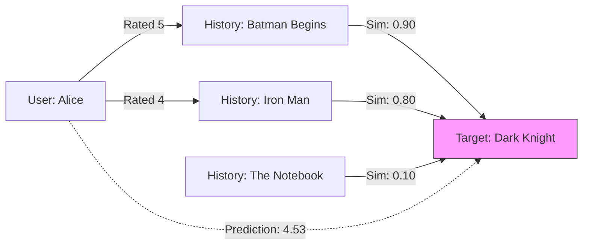

[< Up to Parent](README.md)

<strong>Global Navigation</strong>

- [Home](../../../README.md)
- [01. Traditional Models](../../../01_Traditional_Models/README.md)
    - [Collaborative Filtering](../../../01_Traditional_Models/01_Collaborative_Filtering/README.md)
        - [Memory-based](../../../01_Traditional_Models/01_Collaborative_Filtering/01_Memory_Based/README.md)
        - [Model-based](../../../01_Traditional_Models/01_Collaborative_Filtering/02_Model_Based/README.md)
    - [Content-based Filtering](../../../01_Traditional_Models/02_Content_Based_Filtering/README.md)
- [02. Machine Learning Era](../../../02_Machine_Learning_Era/README.md)
- [03. Deep Learning Era](../../../03_Deep_Learning_Era/README.md)
    - [MLP-based](../../../03_Deep_Learning_Era/01_MLP_Based/README.md)
    - [Sequence/Session-based](../../../03_Deep_Learning_Era/02_Sequence_Session_Based/README.md)
    - [Graph-based](../../../03_Deep_Learning_Era/03_Graph_Based/README.md)
    - [AutoEncoder-based](../../../03_Deep_Learning_Era/04_AutoEncoder_Based/README.md)
- [04. SOTA & GenAI](../../../04_SOTA_GenAI/README.md)
    - [LLM-based](../../../04_SOTA_GenAI/01_LLM_Based/README.md)
    - [Multimodal RS](../../../04_SOTA_GenAI/02_Multimodal_RS.md)
    - [Generative RS](../../../04_SOTA_GenAI/03_Generative_RS.md)

# Item-based Collaborative Filtering (Item-based CF)

## 1. Detailed Description

### Definition

**Item-based Collaborative Filtering** recommends items by finding items that are similar to the ones the active user has liked in the past. Instead of calculating similarity between users, it calculates similarity between _items_ based on the ratings users have given them.

### History & Background

- **Origins**: Popularized by Amazon in 1998 to solve the scalability issues of User-based CF.
- **Why it replaced User-based**: In most e-commerce systems, the number of items (millions) is often smaller or more stable than the number of users (hundreds of millions). Also, item-item relationships ("Users who bought X also bought Y") are more static than user tastes.

### Key Characteristics

- **Stability**: Item similarities do not change rapidly, allowing for pre-computation.
- **Scalability**: Computation is often faster than User-based methods for massive user bases.
- **Explainability**: Easier to explain ("Because you liked Batman, we recommend Superman") than User-based ("Because people similar to you liked Superman").
- **Pros**:
  - Better scalability and performance for large datasets.
  - More consistent recommendations.
- **Cons**:
  - **Novelty**: Tends to recommend obvious substitutes (e.g., if you bought a toaster, it recommends another toaster) rather than serendipitous discoveries.
  - **Data Sparsity**: Still suffers if items have very few ratings.

---

## 2. Operating Principle

### A. Similarity Calculation

We calculate the similarity between Item $i$ and Item $j$ by looking at users who rated _both_ items.

1.  **Cosine Similarity**:
    $$ \text{sim}(i, j) = \frac{\sum*{u \in U} r*{u,i} r*{u,j}}{\sqrt{\sum*{u \in U} r*{u,i}^2} \sqrt{\sum*{u \in U} r\_{u,j}^2}} $$

2.  **Adjusted Cosine Similarity** (Better!):
    Subtracts the user's average rating $\bar{r}_u$ to handle rating bias (some users are generous, others critical).
    $$ \text{sim}(i, j) = \frac{\sum*{u \in U} (r*{u,i} - \bar{r}_u)(r_{u,j} - \bar{r}_u)}{\sqrt{\sum_{u \in U} (r*{u,i} - \bar{r}\_u)^2} \sqrt{\sum*{u \in U} (r\_{u,j} - \bar{r}\_u)^2}} $$

### B. Prediction

To predict the rating of user $u$ for a target item $i$:

1.  Find items $j \in J$ that user $u$ has rated _and_ are similar to $i$.
2.  Calculate the weighted sum:
    $$ \hat{r}_{u,i} = \frac{\sum_{j \in J} \text{sim}(i,j) \times r*{u,j}}{\sum*{j \in J} |\text{sim}(i,j)|} $$

---

## 3. Flow Example

### Scenario

We want to predict if **Alice** will like **"The Dark Knight"**.
She has watched **"Batman Begins"** and **"Iron Man"**.

### Data Matrix (Item Correlation)

| Similarities        | Batman Begins | Iron Man | Notebook |
| :------------------ | :-----------: | :------: | :------: |
| **The Dark Knight** |   **0.90**    | **0.80** |   0.10   |

_Note: High similarity with Batman Begins and Iron Man. Low with Notebook._

### Step-by-Step Process

1.  **Identify User History**:

    - Alice rated "Batman Begins": **5 stars**.
    - Alice rated "Iron Man": **4 stars**.

2.  **Retrieve Similarities for Target ("The Dark Knight")**:

    - Sim(Dark Knight, Batman Begins) = 0.90
    - Sim(Dark Knight, Iron Man) = 0.80

3.  **Compute Prediction**:
    $$ \text{Pred} = \frac{(0.90 \times 5) + (0.80 \times 4)}{0.90 + 0.80} $$
    $$ \text{Pred} = \frac{4.5 + 3.2}{1.7} = \frac{7.7}{1.7} \approx 4.53 $$

4.  **Result**: Recommend "The Dark Knight" with a predicted score of 4.53.

### Visual Diagram ('Item-based' means looking at Columns)

