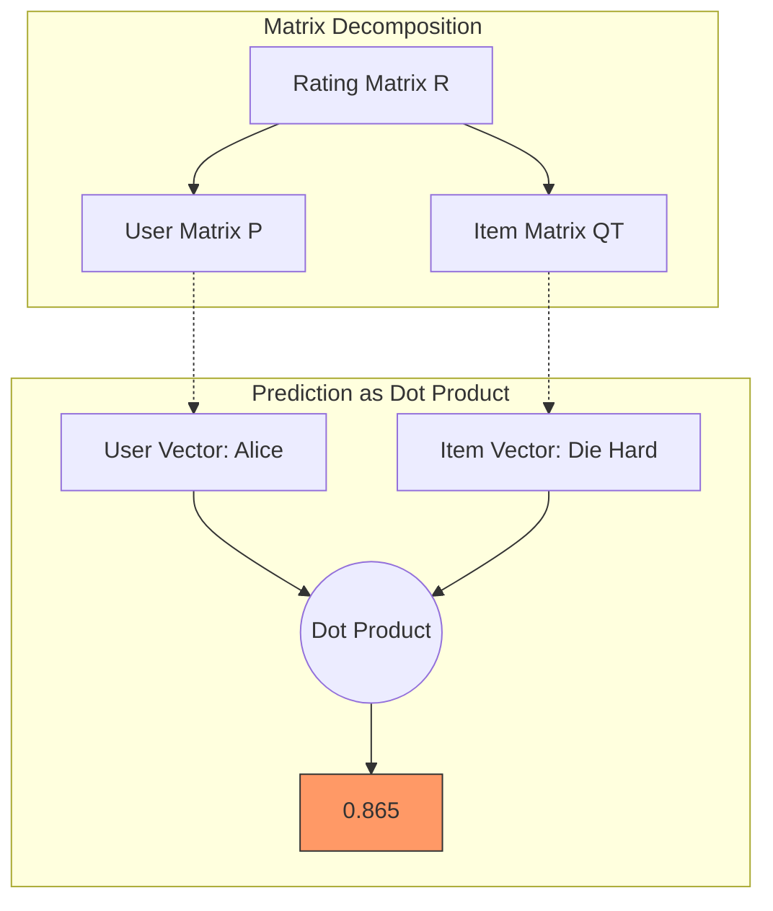

[< Up to Parent](README.md)

<strong>Global Navigation</strong>

- [Home](../../../README.md)
- [01. Traditional Models](../../../01_Traditional_Models/README.md)
    - [Collaborative Filtering](../../../01_Traditional_Models/01_Collaborative_Filtering/README.md)
        - [Memory-based](../../../01_Traditional_Models/01_Collaborative_Filtering/01_Memory_Based/README.md)
        - [Model-based](../../../01_Traditional_Models/01_Collaborative_Filtering/02_Model_Based/README.md)
    - [Content-based Filtering](../../../01_Traditional_Models/02_Content_Based_Filtering/README.md)
- [02. Machine Learning Era](../../../02_Machine_Learning_Era/README.md)
- [03. Deep Learning Era](../../../03_Deep_Learning_Era/README.md)
    - [MLP-based](../../../03_Deep_Learning_Era/01_MLP_Based/README.md)
    - [Sequence/Session-based](../../../03_Deep_Learning_Era/02_Sequence_Session_Based/README.md)
    - [Graph-based](../../../03_Deep_Learning_Era/03_Graph_Based/README.md)
    - [AutoEncoder-based](../../../03_Deep_Learning_Era/04_AutoEncoder_Based/README.md)
- [04. SOTA & GenAI](../../../04_SOTA_GenAI/README.md)
    - [LLM-based](../../../04_SOTA_GenAI/01_LLM_Based/README.md)
    - [Multimodal RS](../../../04_SOTA_GenAI/02_Multimodal_RS.md)
    - [Generative RS](../../../04_SOTA_GenAI/03_Generative_RS.md)

# Matrix Factorization (SVD, ALS)

## 1. Detailed Description

### Definition

**Matrix Factorization (MF)** characterizes both items and users by vectors of factors inferred from item rating patterns. High correspondence between item and user factors leads to a recommendation. It operates by decomposing the sparse user-item interaction matrix into the product of two lower-dimensional matrices.

### History & Background

- **Netflix Prize (2006-2009)**: MF techniques gained massive popularity during the Netflix Prize competition, where the "SVD++" algorithm by the winner (BellKor's Pragmatic Chaos) proved that latent factor models outperformed traditional neighbor-based methods.

### Key Characteristics

- **Dimensionality Reduction**: Compresses the massive user-item space into a small "Latent Space" (e.g., 50-100 dimensions).
- **Latent Features**: Automatically learns concepts like "seriousness vs. funny" or "action vs. drama" without explicit tagging.
- **Pros**:
  - **Accuracy**: Generally more accurate than Memory-based CF.
  - **Scalability**: Prediction is fast ($O(K)$) once the model is trained.
  - **Storage**: Efficiently stores $O(M+N)$ parameters instead of $O(M^2)$ or $O(N^2)$ similarities.
- **Cons**:
  - **Interpretability**: Hard to explain _why_ a user corresponds to Latent Factor #7.
  - **Cold Start**: Still needs interactions to learn the vectors.
  - **Linearity**: Cannot naturally model complex non-linear relationships (addressed by Deep Learning later).

---

## 2. Operating Principle

### The Assumption

We assume the Rating Matrix $R$ (size $M \times N$) can be approximated by:
$$ R \approx P \times Q^T $$

- $P$: User Matrix ($M \times K$)
- $Q$: Item Matrix ($N \times K$)
- $K$: Latent Dimension (Hyperparameter)

### Optimization (Objective Function)

We want to minimize the error (RMSE) on the _observed_ ratings, while finding $P$ and $Q$.
$$ L = \sum*{(u,i) \in R*{obs}} (r\_{u,i} - p_u \cdot q_i)^2 + \lambda(||p_u||^2 + ||q_i||^2) $$

- **First Term**: Prediction Error (Squared).
- **Second Term**: Regularization (L2 norm) to prevent overfitting. $\lambda$ controls the strength.

### Training Algorithms

1.  **SGD (Stochastic Gradient Descent)**:
    - Iterate through each rating.
    - Calculate error $e_{ui} = r_{ui} - p_u \cdot q_i$.
    - Update vectors:
      $$ p*u \leftarrow p_u + \gamma (e*{ui} q*i - \lambda p_u) $$
        $$ q_i \leftarrow q_i + \gamma (e*{ui} p_u - \lambda q_i) $$
    - Pros: Simple, handles large data well.
2.  **ALS (Alternating Least Squares)**:
    - Fix $P$, solve for optimal $Q$ (it becomes a convex Linear/Ridge Regression problem).
    - Fix $Q$, solve for optimal $P$.
    - Repeat until convergence.
    - Pros: Parallelizable, better for Implicit Feedback data.

---

## 3. Flow Example

### Scenario

Feature $K=2$.
**Latent Factors**: Factor 1 ("Comedy"), Factor 2 ("Action").

**Trained Models**:

- **User Alice**: $[0.1, 0.9]$ (Loves Action, dislikes Comedy)
- **Movie A (Die Hard)**: $[0.1, 0.95]$ (Pure Action)
- **Movie B (Toy Story)**: $[0.9, 0.2]$ (Mostly Comedy)

### Prediction Process

1.  **Prediction for Alice - Movie A**:
    $$ \text{Pred} = (0.1 \times 0.1) + (0.9 \times 0.95) = 0.01 + 0.855 = 0.865 $$
    Alice likes Action, Movie A is Action. **High Score**.

2.  **Prediction for Alice - Movie B**:
    $$ \text{Pred} = (0.1 \times 0.9) + (0.9 \times 0.2) = 0.09 + 0.18 = 0.27 $$
    Alice dislikes Comedy, Movie B is Comedy. **Low Score**.

### Visual Diagram

