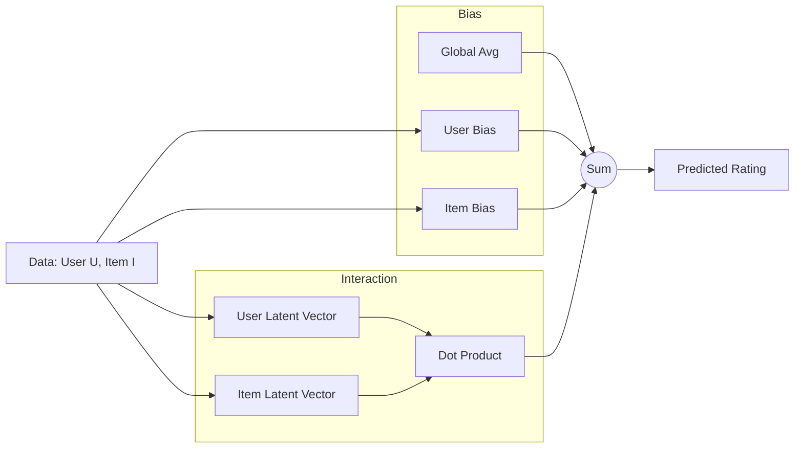

[< Up to Parent](README.md)

<strong>Global Navigation</strong>

- [Home](../../../README.md)
- [01. Traditional Models](../../../01_Traditional_Models/README.md)
    - [Collaborative Filtering](../../../01_Traditional_Models/01_Collaborative_Filtering/README.md)
        - [Memory-based](../../../01_Traditional_Models/01_Collaborative_Filtering/01_Memory_Based/README.md)
        - [Model-based](../../../01_Traditional_Models/01_Collaborative_Filtering/02_Model_Based/README.md)
    - [Content-based Filtering](../../../01_Traditional_Models/02_Content_Based_Filtering/README.md)
- [02. Machine Learning Era](../../../02_Machine_Learning_Era/README.md)
- [03. Deep Learning Era](../../../03_Deep_Learning_Era/README.md)
    - [MLP-based](../../../03_Deep_Learning_Era/01_MLP_Based/README.md)
    - [Sequence/Session-based](../../../03_Deep_Learning_Era/02_Sequence_Session_Based/README.md)
    - [Graph-based](../../../03_Deep_Learning_Era/03_Graph_Based/README.md)
    - [AutoEncoder-based](../../../03_Deep_Learning_Era/04_AutoEncoder_Based/README.md)
- [04. SOTA & GenAI](../../../04_SOTA_GenAI/README.md)
    - [LLM-based](../../../04_SOTA_GenAI/01_LLM_Based/README.md)
    - [Multimodal RS](../../../04_SOTA_GenAI/02_Multimodal_RS.md)
    - [Generative RS](../../../04_SOTA_GenAI/03_Generative_RS.md)

# Latent Factor Models

## 1. Detailed Description

### Definition

**Latent Factor Models** are the generalized family of models that Matrix Factorization belongs to. They explain the ratings by characterizing both items and users on 20-100 factors inferred from the ratings patterns.

### Why "Latent"?

"Latent" means hidden. These are factors that are not explicitly defined in the data (like "Comedy", "Thriller") but are learned by the model to best explain the data.

- Factor 1 might end up correlating with "amount of dialogue".
- Factor 2 might correlate with "violence level".
- Factor 3 might be uninterpretable but useful.

---

## 2. Operating Principle

### The Concept

It maps users and items to a joint latent factor space of dimensionality $f$, such that user-item interactions are modeled as inner products in that space.

### Beyond Simple MF

While standard MF uses a pure dot product:
$$ \hat{r}\_{ui} = p_u \cdot q_i $$

General Latent Factor Models often include **Biases**:
$$ \hat{r}\_{ui} = \mu + b_u + b_i + p_u \cdot q_i $$

- $\mu$: Global average rating (e.g., 3.5 stars).
- $b_u$: User bias (Alice is critical, usually rates -0.5 below average).
- $b_i$: Item bias (Titanic is popular, usually rates +0.5 above average).
- $p_u \cdot q_i$: The personalized interaction.

### Optimization

Usually optimized via Stochastic Gradient Descent (SGD) to minimize the regularized squared error:
$$ \min*{b, p, q} \sum*{(u,i) \in R} (r\_{ui} - \mu - b_u - b_i - p_u \cdot q_i)^2 + \lambda(...) $$

---

## 3. Flow Example

### Scenario: Predicting Rating for "Inception"

- **Global Avg ($\mu$)**: 3.0
- **User (Bob)**: Generally rates high (+0.5 Bias).
- **Item (Inception)**: Generally popular (+1.0 Bias).
- **Interaction**: Bob likes "Smart Sci-Fi", Inception is "Smart Sci-Fi" (Match Score +0.3).

### Calculation

1.  **Baseline Prediction**:
    $$ 3.0 (\text{Avg}) + 0.5 (\text{Bob}) + 1.0 (\text{Movie}) = 4.5 $$
2.  **Interaction Adjustment**:
    $$ 4.5 + 0.3 (\text{Dot Product}) = 4.8 $$
3.  **Final Prediction**: 4.8 Stars.

This approach is far more accurate than simple Matrix Factorization because it separates "popularity" and "user generosity" from true "taste matching."

### Conceptual Diagram

