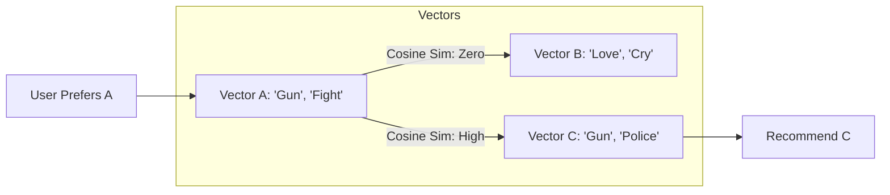

[< Up to Parent](README.md)

<strong>Global Navigation</strong>

- [Home](../../README.md)
- [01. Traditional Models](../../01_Traditional_Models/README.md)
    - [Collaborative Filtering](../../01_Traditional_Models/01_Collaborative_Filtering/README.md)
        - [Memory-based](../../01_Traditional_Models/01_Collaborative_Filtering/01_Memory_Based/README.md)
        - [Model-based](../../01_Traditional_Models/01_Collaborative_Filtering/02_Model_Based/README.md)
    - [Content-based Filtering](../../01_Traditional_Models/02_Content_Based_Filtering/README.md)
- [02. Machine Learning Era](../../02_Machine_Learning_Era/README.md)
- [03. Deep Learning Era](../../03_Deep_Learning_Era/README.md)
    - [MLP-based](../../03_Deep_Learning_Era/01_MLP_Based/README.md)
    - [Sequence/Session-based](../../03_Deep_Learning_Era/02_Sequence_Session_Based/README.md)
    - [Graph-based](../../03_Deep_Learning_Era/03_Graph_Based/README.md)
    - [AutoEncoder-based](../../03_Deep_Learning_Era/04_AutoEncoder_Based/README.md)
- [04. SOTA & GenAI](../../04_SOTA_GenAI/README.md)
    - [LLM-based](../../04_SOTA_GenAI/01_LLM_Based/README.md)
    - [Multimodal RS](../../04_SOTA_GenAI/02_Multimodal_RS.md)
    - [Generative RS](../../04_SOTA_GenAI/03_Generative_RS.md)

# TF-IDF / Cosine Similarity

## 1. Detailed Description

### Definition

**TF-IDF (Term Frequency-Inverse Document Frequency)** is a technique from Information Retrieval (IR) used to create robust feature vectors for textual items. **Cosine Similarity** is the metric used to measure the angle (similarity) between these vectors. Together, they form the backbone of many Content-based Recommendation Systems.

### Why not just count words?

If we just counted word frequency, common words like "the", "movie", or "story" would dominate the similarity score.

- **TF-IDF** down-weights words that appear in _every_ document (low information) and up-weights words that are unique to specific documents (high information).

### Cons

- **No Semantics**: It matches exact words. "Auto" and "Car" are treated as completely different words (Orthogonal vectors), even though they mean the same thing.
- **Cold Start**: None! (As long as item has metadata).

---

## 2. Operating Principle

### A. TF-IDF Calculation

For a term $t$ in a document $d$ within a corpus $D$.

1.  **TF (Term Frequency)**: How often does term $t$ appear in document $d$?
    $$ tf(t, d) = \frac{\text{count}(t, d)}{\text{total words in } d} $$
2.  **IDF (Inverse Document Frequency)**: How rare is term $t$ across all documents?
    $$ idf(t, D) = \log \frac{|D|}{|\{d \in D : t \in d\}|} $$
3.  **TF-IDF Score**:
    $$ w\_{t,d} = tf(t, d) \times idf(t, D) $$

### B. User Profile Creation

If User A likes documents $D_1$ and $D_2$, the User Profile Vector $\vec{U}$ can be the average of the vectors of $D_1$ and $D_2$.

### C. Similarity (Cosine)

$$ \text{sim}(\vec{U}, \vec{I}) = \cos(\theta) = \frac{\vec{U} \cdot \vec{I}}{||\vec{U}|| \cdot ||\vec{I}||} $$

- Range: [0, 1] (for non-negative vectors like TF-IDF). 1 means identical direction.

---

## 3. Flow Example

### Scenario

**Corpus**:

1.  Doc A (Action): "Gun, Fight, Run"
2.  Doc B (Drama): "Love, Cry, Sad"
3.  Doc C (Target): "Gun, Run, Police"

**User History**: Liked Doc A.

### Step-by-Step

1.  **Calculate TF-IDF**:
    - Term "Gun": Appears in A and C. Rare in corpus. High Score.
    - Term "Love": Appears only in B. High Score for B.
2.  **Vectorize**:
    - $\vec{A} = [1, 1, 1, 0, 0, 0]$ (Gun, Fight, Run, Love...)
    - $\vec{B} = [0, 0, 0, 1, 1, 1]$
    - $\vec{C} = [1, 0, 1, 0, 0, 0]$ (Note: "Fight" is 0, "Police" is new)
3.  **User Profile**:
    - Since User liked A, $\vec{U} \approx \vec{A}$.
4.  **Compute Similarity**:
    - Sim(U, C): Overlap on "Gun" and "Run". High similarity.
    - Sim(U, B): No overlap. Zero similarity.
5.  **Result**: Recommend Doc C.

### Visual Diagram

