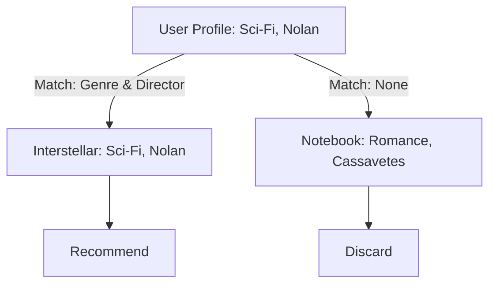

[< Up to Parent](README.md)

<strong>Global Navigation</strong>

- [Home](../../README.md)
- [01. Traditional Models](../../01_Traditional_Models/README.md)
    - [Collaborative Filtering](../../01_Traditional_Models/01_Collaborative_Filtering/README.md)
        - [Memory-based](../../01_Traditional_Models/01_Collaborative_Filtering/01_Memory_Based/README.md)
        - [Model-based](../../01_Traditional_Models/01_Collaborative_Filtering/02_Model_Based/README.md)
    - [Content-based Filtering](../../01_Traditional_Models/02_Content_Based_Filtering/README.md)
- [02. Machine Learning Era](../../02_Machine_Learning_Era/README.md)
- [03. Deep Learning Era](../../03_Deep_Learning_Era/README.md)
    - [MLP-based](../../03_Deep_Learning_Era/01_MLP_Based/README.md)
    - [Sequence/Session-based](../../03_Deep_Learning_Era/02_Sequence_Session_Based/README.md)
    - [Graph-based](../../03_Deep_Learning_Era/03_Graph_Based/README.md)
    - [AutoEncoder-based](../../03_Deep_Learning_Era/04_AutoEncoder_Based/README.md)
- [04. SOTA & GenAI](../../04_SOTA_GenAI/README.md)
    - [LLM-based](../../04_SOTA_GenAI/01_LLM_Based/README.md)
    - [Multimodal RS](../../04_SOTA_GenAI/02_Multimodal_RS.md)
    - [Generative RS](../../04_SOTA_GenAI/03_Generative_RS.md)

# Profile-based Matching

## 1. Detailed Description

### Definition

**Profile-based Matching** creates explicit "profiles" (structured records) for both users and items, and then matches them based on rules or similarity metrics on specific attributes. It differs from TF-IDF in that it typically leverages **structured data** (categorical, numerical) rather than unstructured text.

### Use Cases

- **Dating Apps**: Matching User {Age: 25, Location: Seoul} with User {Age: 24-26, Location: Seoul}.
- **Job Recommendation**: Matching Resume {Skill: Python, Exp: 3yr} with Job {Req: Python, MinExp: 2yr}.
- **Cold Start**: Highly effective when we have explicit user data (e.g., onboarding survey) but no interaction history.

### Key Characteristics

- **Explicit**: Relies on data that assumes meaning (e.g., "Genre = Action" is a hard fact).
- **Filter Bubble**: Can be too rigid. Ideally combined with CF.
- **Pros**:
  - Transparency: Users know exactly why they matched ("You both speak English").
  - No "New Item" problem: As soon as an item is listed with attributes, it can be recommended.
- **Cons**:
  - **Feature Engineering**: Requires high-quality, structured metadata.
  - **Limited Discovery**: Cannot find hidden patterns.

---

## 2. Operating Principle

### A. Profile Construction

1.  **Item Profile**: {Genre: [Action, Sci-Fi], Year: 2020, Actor: [Tom Cruise]}.
2.  **User Profile**: {Preferred_Genre: [Action], Preferred_Year: >2000}.

### B. Matching Algorithms

1.  **Exact/Rule-based Matching**:
    - `IF (Item.Genre IN User.Preferred) AND (Item.Year > 2000) THEN Recommend`.
2.  **Weighted Attribute Similarity**:
    - Calculate similarity for each attribute field independently and sum them up.
      $$ \text{Score}(u, i) = w*1 \cdot \text{Sim}*{\text{genre}}(u, i) + w*2 \cdot \text{Sim}*{\text{year}}(u, i) + ... $$
    - **Jaccard Similarity** (for Sets):
      $$ J(A, B) = \frac{|A \cap B|}{|A \cup B|} $$
      (Used for comparing sets of tags/genres).

---

## 3. Flow Example

### Scenario: Movie Recommendation

**User Profile**:

- **Genres**: {Sci-Fi, Thriller}
- **Director**: {Christopher Nolan}

**Candidates**:

1.  **Interstellar**: {Sci-Fi, Adventure}, {Christopher Nolan}
2.  **Notebook**: {Romance, Drama}, {Nick Cassavetes}
3.  **Inception**: {Sci-Fi, Action}, {Christopher Nolan}

### Matching Process (Jaccard + Boolean)

1.  **Check Candidate 1 (Interstellar)**:

    - Genre Overlap: {Sci-Fi} / {Sci-Fi, Thriller, Adventure} = 1/3 = 0.33
    - Director Match: Yes (1.0)
    - Score: $0.33 + 1.0 = 1.33$

2.  **Check Candidate 2 (Notebook)**:

    - Genre Overlap: 0
    - Director Match: No
    - Score: 0

3.  **Check Candidate 3 (Inception)**:
    - Genre Overlap: {Sci-Fi} / {Sci-Fi, Thriller, Action} = 0.33
    - Director Match: Yes (1.0)
    - Score: 1.33

### Result

Recommend **Interstellar** and **Inception**.

### Visual Diagram

