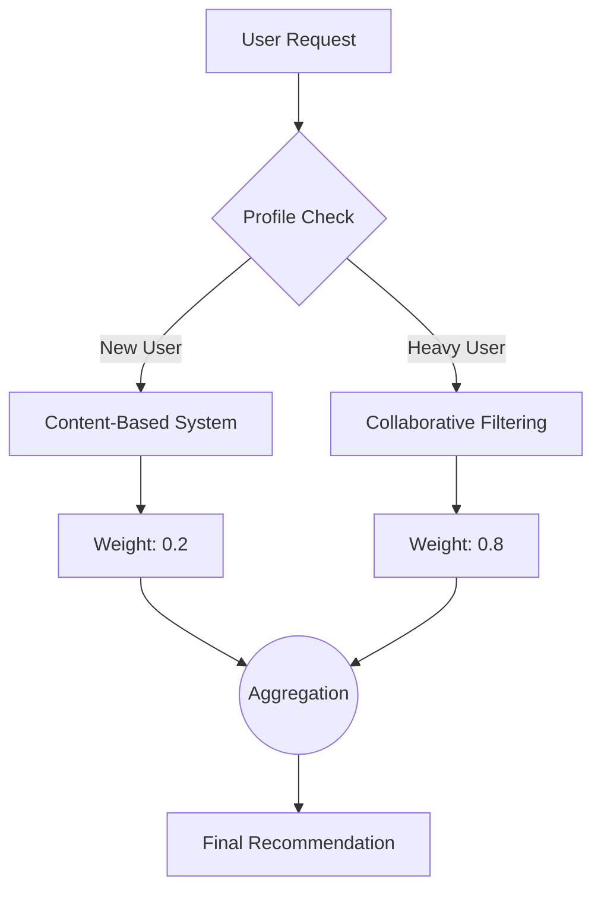

[< Up to Parent](README.md)

<strong>Global Navigation</strong>

- [Home](../README.md)
- [01. Traditional Models](../01_Traditional_Models/README.md)
    - [Collaborative Filtering](../01_Traditional_Models/01_Collaborative_Filtering/README.md)
        - [Memory-based](../01_Traditional_Models/01_Collaborative_Filtering/01_Memory_Based/README.md)
        - [Model-based](../01_Traditional_Models/01_Collaborative_Filtering/02_Model_Based/README.md)
    - [Content-based Filtering](../01_Traditional_Models/02_Content_Based_Filtering/README.md)
- [02. Machine Learning Era](../02_Machine_Learning_Era/README.md)
- [03. Deep Learning Era](../03_Deep_Learning_Era/README.md)
    - [MLP-based](../03_Deep_Learning_Era/01_MLP_Based/README.md)
    - [Sequence/Session-based](../03_Deep_Learning_Era/02_Sequence_Session_Based/README.md)
    - [Graph-based](../03_Deep_Learning_Era/03_Graph_Based/README.md)
    - [AutoEncoder-based](../03_Deep_Learning_Era/04_AutoEncoder_Based/README.md)
- [04. SOTA & GenAI](../04_SOTA_GenAI/README.md)
    - [LLM-based](../04_SOTA_GenAI/01_LLM_Based/README.md)
    - [Multimodal RS](../04_SOTA_GenAI/02_Multimodal_RS.md)
    - [Generative RS](../04_SOTA_GenAI/03_Generative_RS.md)

# Hybrid Models

## 1. Detailed Description

### Definition

**Hybrid Models** combine two or more recommendation techniques (e.g., Collaborative Filtering + Content-based) to leverage the strengths of each while canceling out their respective weaknesses.

### Why Hybrid?

- **Collaborative Filtering (CF)** is great for serendipity but fails with new users (**Cold Start**) and sparsity.
- **Content-based (CB)** handles new items well but lacks diversity ("over-specialization").
- **Hybrid**: Uses CB for new users/items and transitions to CF as more data becomes available.

### History

As commercial systems (Netflix, Amazon) matured, they realized single algorithms weren't enough. The Netflix Prize winner was a massive ensemble (Hybrid) of over 100 distinctive models.

---

## 2. Operating Principle

Burke (2002) classified hybrid strategies into several types:

### A. Weighted Hybrid

Compute the score from multiple recommenders and take a weighted average.
$$ \text{Score}_{\text{final}} = \alpha \cdot \text{Score}_{\text{CF}} + (1-\alpha) \cdot \text{Score}\_{\text{CB}} $$

- $\alpha$ can be learned or manually tuned.

### B. Switching Hybrid

Select a single recommender based on the situation.

- **Rule**: `IF user.ratings_count < 5 THEN use Content-Based ELSE use CF`.

### C. Cascade Hybrid (Refinement)

One recommender refines the candidates of another.

- **Step 1**: Use Content-based to filter 100 "Action Movies" (Coarse).
- **Step 2**: Use CF to rank those 100 movies for the specific user (Fine).

### D. Feature Augmentation

- Use the output of one model as a _feature_ for another.
- Example: Use User-based CF to predict a rating, then feed that predicted rating into a Content-based model as a feature.

---

## 3. Flow Example

### Scenario: "Switching + Weighted" Strategy for a Movie Site

- **User A**: Brand new.
- **User B**: Power user (500 ratings).

### Process

1.  **User A Enters**:

    - System checks profile: Ratings = 0.
    - **Action (Switching)**: Switch to "Trending / Content-based".
    - **Result**: Show "Top 10 Blockbusters".

2.  **User A Rates 3 Movies**:

    - Now Ratings = 3. Still low for CF.
    - **Action**: Weighted Hybrid ($\alpha = 0.2$ for CF).
    - Score = $0.2 \times \text{CF}(x) + 0.8 \times \text{Content}(x)$.

3.  **User B Enters**:
    - System checks profile: Ratings = 500.
    - **Action**: Weighted Hybrid ($\alpha = 0.9$ for CF).
    - **Result**: Highly personalized, serendipitous recommendations.

### Visual Diagram

