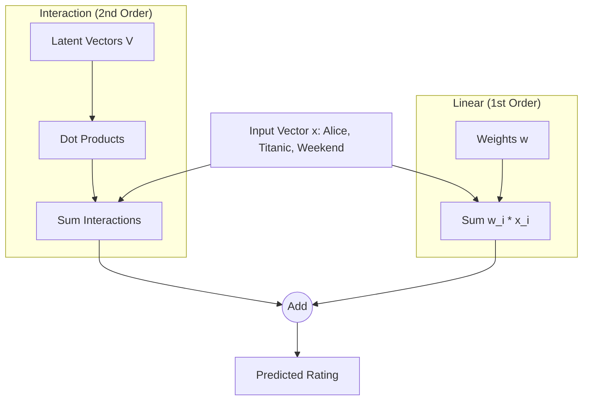

[< Up to Parent](README.md)

<strong>Global Navigation</strong>

- [Home](../../README.md)
- [01. Traditional Models](../../01_Traditional_Models/README.md)
    - [Collaborative Filtering](../../01_Traditional_Models/01_Collaborative_Filtering/README.md)
        - [Memory-based](../../01_Traditional_Models/01_Collaborative_Filtering/01_Memory_Based/README.md)
        - [Model-based](../../01_Traditional_Models/01_Collaborative_Filtering/02_Model_Based/README.md)
    - [Content-based Filtering](../../01_Traditional_Models/02_Content_Based_Filtering/README.md)
- [02. Machine Learning Era](../../02_Machine_Learning_Era/README.md)
- [03. Deep Learning Era](../../03_Deep_Learning_Era/README.md)
    - [MLP-based](../../03_Deep_Learning_Era/01_MLP_Based/README.md)
    - [Sequence/Session-based](../../03_Deep_Learning_Era/02_Sequence_Session_Based/README.md)
    - [Graph-based](../../03_Deep_Learning_Era/03_Graph_Based/README.md)
    - [AutoEncoder-based](../../03_Deep_Learning_Era/04_AutoEncoder_Based/README.md)
- [04. SOTA & GenAI](../../04_SOTA_GenAI/README.md)
    - [LLM-based](../../04_SOTA_GenAI/01_LLM_Based/README.md)
    - [Multimodal RS](../../04_SOTA_GenAI/02_Multimodal_RS.md)
    - [Generative RS](../../04_SOTA_GenAI/03_Generative_RS.md)

# Factorization Machines (FM)

## 1. Detailed Description

### Definition

**Factorization Machines (FM)**, proposed by Steffen Rendle in 2010, are a general-purpose supervised learning algorithm that combines the advantages of Support Vector Machines (SVM) with Factorization Models. It mimics Matrix Factorization but can handle any real-valued feature vector, making it perfect for incorporating "side information" (context, time, extensive user attributes).

### The Problem it Solves

- **SVMs** fail on sparse data because they try to learn a direct weight for every pair of interacting features ($w_{ij} x_i x_j$). If $x_i$ and $x_j$ never appear together in training, $w_{ij}$ is 0.
- **MF** only handles User ID and Item ID.
- **FM** can handle sparse data by modeling the interaction weight $w_{ij}$ as the dot product of two vectors $\langle v_i, v_j \rangle$. Even if $x_i$ and $x_j$ never appeared together, if $x_i$ appeared with $x_k$ and $x_j$ with $x_k$, their vectors $v_i, v_j$ are trained and can predict the $i-j$ interaction.

### Key Characteristics

- **General**: Works for Regression, Classification, and Ranking.
- **Fast**: Linear Training and Prediction time $O(k \cdot n)$.
- **Pros**:
  - Handles extreme sparsity well.
  - Allows adding any number of auxiliary features (Context-aware).
- **Cons**:
  - Need to fix the latent dimension $k$.

---

## 2. Operating Principle

### Model Equation (Degree = 2)

For a feature vector $x \in \mathbb{R}^n$, the predicted target $\hat{y}$ is:

$$ \hat{y}(x) = w*0 + \sum*{i=1}^n w*i x_i + \sum*{i=1}^n \sum\_{j=i+1}^n \langle v_i, v_j \rangle x_i x_j $$

- **Global Bias ($w_0$)**: The average baseline.
- **Linear Terms ($\sum w_i x_i$)**: The independent effect of each feature (e.g., "This user tends to rate high").
- **Interaction Terms ($\sum \langle v_i, v_j \rangle x_i x_j$)**: The pairwise interactions.
  - Instead of a matrix $W$ of size $n \times n$, we use a matrix $V$ of size $n \times k$.
  - $\langle v_i, v_j \rangle$ replaces $w_{ij}$.

### Optimization

- Can be optimized using **SGD**, **ALS**, or **MCMC**.
- The interaction part can be computed in linear time $O(kn)$ using the trick:
  $$ \sum*{i=1}^n \sum*{j=i+1}^n \langle v*i, v_j \rangle x_i x_j = \frac{1}{2} \sum*{f=1}^k \left( \left( \sum*{i=1}^n v*{i,f} x*i \right)^2 - \sum*{i=1}^n v\_{i,f}^2 x_i^2 \right) $$

---

## 3. Flow Example

### Scenario: Movie Rating with Context

Data: **User=Alice**, **Movie=Titanic**, **Time=Weekend**.
Features (One-hot):
$x = [\underbrace{1}_{\text{Alice}}, 0, ..., \underbrace{1}_{\text{Titanic}}, 0, ..., \underbrace{1}_{\text{Weekend}}]$

### Computation

1.  **Linear Part**:
    $w_{Alice} + w_{Titanic} + w_{Weekend}$
    (e.g., Alice is generous +0.2, Titanic is popular +0.5, Weekend people are happy +0.1).

2.  **Interaction Part**:

    - **Alice-Titanic**: $\langle v_{Alice}, v_{Titanic} \rangle$. Does Alice like this _type_ of movie?
    - **Alice-Weekend**: $\langle v_{Alice}, v_{Weekend} \rangle$. Does Alice watch movies on weekends?
    - **Titanic-Weekend**: $\langle v_{Titanic}, v_{Weekend} \rangle$. Is Titanic a weekend movie?

3.  **Sum**:
    Total Score = Linear + Interaction.
    If Alice loves Titanic (High Interaction) AND usually watches significantly on Weekends (High Interaction), the score shoots up.

### Visual Diagram

