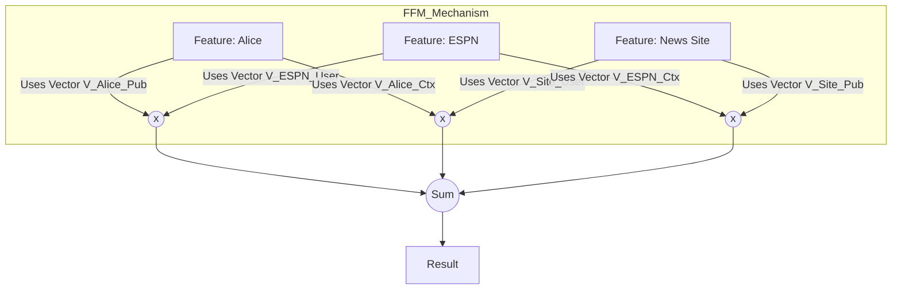

[< Up to Parent](README.md)

<strong>Global Navigation</strong>

- [Home](../../README.md)
- [01. Traditional Models](../../01_Traditional_Models/README.md)
    - [Collaborative Filtering](../../01_Traditional_Models/01_Collaborative_Filtering/README.md)
        - [Memory-based](../../01_Traditional_Models/01_Collaborative_Filtering/01_Memory_Based/README.md)
        - [Model-based](../../01_Traditional_Models/01_Collaborative_Filtering/02_Model_Based/README.md)
    - [Content-based Filtering](../../01_Traditional_Models/02_Content_Based_Filtering/README.md)
- [02. Machine Learning Era](../../02_Machine_Learning_Era/README.md)
- [03. Deep Learning Era](../../03_Deep_Learning_Era/README.md)
    - [MLP-based](../../03_Deep_Learning_Era/01_MLP_Based/README.md)
    - [Sequence/Session-based](../../03_Deep_Learning_Era/02_Sequence_Session_Based/README.md)
    - [Graph-based](../../03_Deep_Learning_Era/03_Graph_Based/README.md)
    - [AutoEncoder-based](../../03_Deep_Learning_Era/04_AutoEncoder_Based/README.md)
- [04. SOTA & GenAI](../../04_SOTA_GenAI/README.md)
    - [LLM-based](../../04_SOTA_GenAI/01_LLM_Based/README.md)
    - [Multimodal RS](../../04_SOTA_GenAI/02_Multimodal_RS.md)
    - [Generative RS](../../04_SOTA_GenAI/03_Generative_RS.md)

# Field-aware Factorization Machines (FFM)

## 1. Detailed Description

### Definition

**FFM (Field-aware Factorization Machines)** is a variant of FM mainly used in Click-Through Rate (CTR) prediction. It introduces the concept of **Fields**. While FM learns one latent vector $v_i$ for each feature $x_i$, FFM learns multiple latent vectors $v_{i,f_j}$, one for every other field $f_j$ it interacts with.

### History

- **Winner Solution**: It became famous after winning the Criteo and Avazu CTR prediction competitions (Kaggle).
- **Why it's better**: In FM, the user vector used to interact with a Movie is the _same_ vector used to interact with a Genre. In FFM, the user can have a specific "Movie-interaction persona" and a different "Genre-interaction persona".

### Key Characteristics

- **Complexity**: $O(kn^2)$ (more expensive than FM's linear time).
- **Fine-grained**: Captures more specific nuances of feature interactions.
- **Pros**:
  - State-of-the-art performance for CTR/Tabular data before Deep Learning took over.
- **Cons**:
  - High memory consumption (needs to store $n \times f \times k$ parameters).
  - Slower training.

---

## 2. Operating Principle

### The Field Concept

Features are grouped into fields.

- **User Field**: {User=Alice, User=Bob}
- **Movie Field**: {Movie=Titanic, Movie=Avatar}
- **Genre Field**: {Genre=Drama, Genre=Action}

### Model Equation

$$ \hat{y}(x) = w*0 + \sum*{i=1}^n w*i x_i + \sum*{i=1}^n \sum*{j=i+1}^n \langle v*{i, f*j}, v*{j, f_i} \rangle x_i x_j $$

- $f_i$: The field that feature $i$ belongs to.
- $f_j$: The field that feature $j$ belongs to.
- $v_{i, f_j}$: The latent vector of feature $i$, specifically learned for interacting with field $f_j$.

### Contrast with FM

- **FM**: $\langle v_i, v_j \rangle$. (Alice uses her one generic vector).
- **FFM**: $\langle v_{i, \text{Movie}}, v_{j, \text{User}} \rangle$. (Alice uses her "Movie-interacting" vector, Titanic uses its "User-interacting" vector).

---

## 3. Flow Example

### Scenario

Predict if **Alice** clicks on an ad for **ESPN** on a **News Site**.

**Fields**:

1.  **User**: Alice
2.  **Publisher**: ESPN
3.  **Context**: News Site

### Interactions

1.  **User x Publisher (Alice x ESPN)**:

    - Alice uses $v_{\text{Alice}, \text{Publisher}}$.
    - ESPN uses $v_{\text{ESPN}, \text{User}}$.
    - Meaning: "How much does Alice like Publishers like ESPN?"

2.  **User x Context (Alice x News Site)**:

    - Alice uses $v_{\text{Alice}, \text{Context}}$.
    - News Site uses $v_{\text{News}, \text{User}}$.
    - Meaning: "Does Alice usually click ads on News Sites?" (Maybe she ignores them there, but clicks on Blogs).
    - _Note: In FM, Alice would use the same vector for both, potentially confusing the signal._

3.  **Publisher x Context (ESPN x News Site)**:
    - ESPN uses $v_{\text{ESPN}, \text{Context}}$.
    - News Site uses $v_{\text{News}, \text{Publisher}}$.
    - Meaning: "Is ESPN a good fit for a News Site?"

### Visual Diagram

