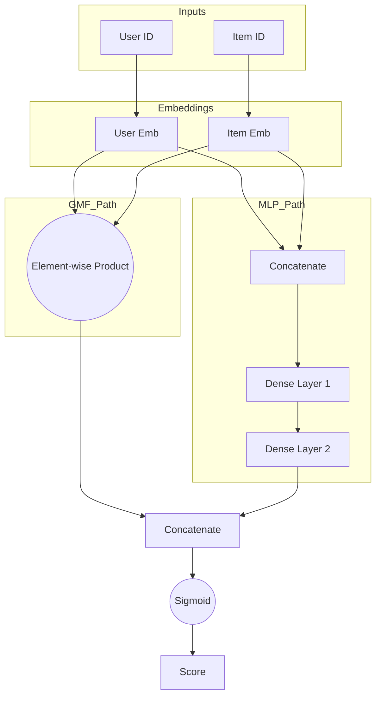

[< Up to Parent](README.md)

<strong>Global Navigation</strong>

- [Home](../../README.md)
- [01. Traditional Models](../../01_Traditional_Models/README.md)
    - [Collaborative Filtering](../../01_Traditional_Models/01_Collaborative_Filtering/README.md)
        - [Memory-based](../../01_Traditional_Models/01_Collaborative_Filtering/01_Memory_Based/README.md)
        - [Model-based](../../01_Traditional_Models/01_Collaborative_Filtering/02_Model_Based/README.md)
    - [Content-based Filtering](../../01_Traditional_Models/02_Content_Based_Filtering/README.md)
- [02. Machine Learning Era](../../02_Machine_Learning_Era/README.md)
- [03. Deep Learning Era](../../03_Deep_Learning_Era/README.md)
    - [MLP-based](../../03_Deep_Learning_Era/01_MLP_Based/README.md)
    - [Sequence/Session-based](../../03_Deep_Learning_Era/02_Sequence_Session_Based/README.md)
    - [Graph-based](../../03_Deep_Learning_Era/03_Graph_Based/README.md)
    - [AutoEncoder-based](../../03_Deep_Learning_Era/04_AutoEncoder_Based/README.md)
- [04. SOTA & GenAI](../../04_SOTA_GenAI/README.md)
    - [LLM-based](../../04_SOTA_GenAI/01_LLM_Based/README.md)
    - [Multimodal RS](../../04_SOTA_GenAI/02_Multimodal_RS.md)
    - [Generative RS](../../04_SOTA_GenAI/03_Generative_RS.md)

# Neural Collaborative Filtering (NCF)

## 1. Detailed Description

### Definition

**NCF** is a framework that leverages a Neural Network to model the interaction between users and items. It essentially replaces the fixed dot product of Matrix Factorization with a learnable non-linear function (a Multi-Layer Perceptron), arguing that the dot product is too simple to capture complex user-item relationships.

### History

- **Paper**: "Neural Collaborative Filtering" (He et al., WWW 2017).
- **Impact**: Marked the definitive shift from Matrix Factorization to Deep Learning in RecSys community.

### Key Characteristics

- **Non-linearity**: Can model complex interaction functions.
- **Generalization**: Generalizes MF; if you use a linear activation function and specific weights, NCF becomes MF.
- **Pros**:
  - High expression power.
  - Flexible architecture (can add layers, dropouts).
- **Cons**:
  - Optimization landscape is non-convex (harder to train than MF).
  - Recent papers (e.g., "Are We Really Making Much Progress?") argued that a well-tuned MF often beats NCF, sparking debate.

---

## 2. Operating Principle

NCF typically consists of two parallel pathways that are fused at the end:

### A. GMF (Generalized Matrix Factorization)

- Implements a standard Matrix Factorization but uses a neural layer (element-wise product + linear layer) instead of a fixed dot product.
- $$ \phi^{GMF} = p_u \odot q_i $$

### B. MLP (Multi-Layer Perceptron)

- Concatenates user and item embeddings and feeds them through a feed-forward neural network to learn non-linear interactions.
- $$ \phi^{MLP} = \text{ReLU}(W_2(\text{ReLU}(W_1([p_u, q_i]) + b_1)) + b_2) ... $$

### C. NeuMF (Neural Matrix Factorization)

- Fuses both branches.
- $$ \hat{y}\_{ui} = \sigma(h^T [\phi^{GMF} || \phi^{MLP}]) $$
- **Optimization**: Standard Binary Cross-Entropy (Log Loss) since it treats recommendation as a classification problem (Implicit Feedback: Interact vs No-Interact).

---

## 3. Flow Example

### Scenario

Predict score for **User ID 1** and **Item ID 50**.

### Architecture Flow

1.  **Input Layer**:

    - One-hot User vector $\to$ Embedding Look-up $\to$ User Vector $P_u$.
    - One-hot Item vector $\to$ Embedding Look-up $\to$ Item Vector $Q_i$.

2.  **GMF Path**:

    - Take $P_u$ and $Q_i$.
    - Multiply element-wise: $[0.1, 0.5] \times [0.2, 0.4] = [0.02, 0.2]$.

3.  **MLP Path**:

    - Concatenate $P_u, Q_i$: $[0.1, 0.5, 0.2, 0.4]$.
    - Layer 1 (Dense): Maps to $[0.8, -0.1] \to \text{ReLU} \to [0.8, 0]$.
    - Layer 2 (Dense): Maps to $[0.5]$.

4.  **Fusion**:

    - Concatenate GMF Output $[0.02, 0.2]$ and MLP Output $[0.5]$.
    - Result: $[0.02, 0.2, 0.5]$.
    - Final Dense Layer (Prediction): Maps to scalar $0.9$.

5.  **Output**:
    - Sigmoid(0.9) $\approx 0.71$. (71% probability of interaction).

### Visual Diagram

