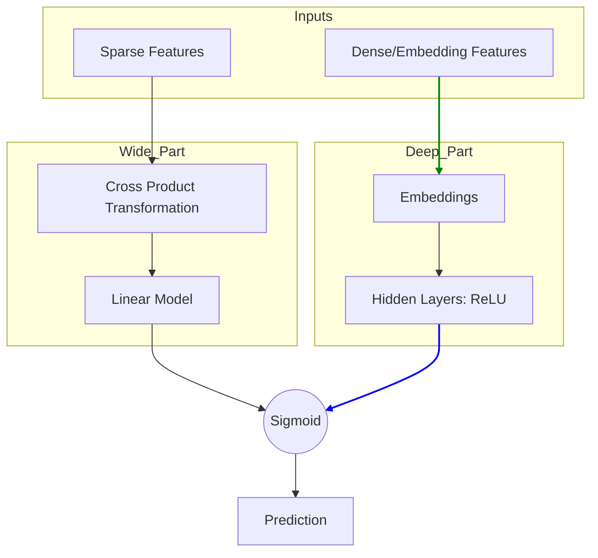

[< Up to Parent](README.md)

<strong>Global Navigation</strong>

- [Home](../../README.md)
- [01. Traditional Models](../../01_Traditional_Models/README.md)
    - [Collaborative Filtering](../../01_Traditional_Models/01_Collaborative_Filtering/README.md)
        - [Memory-based](../../01_Traditional_Models/01_Collaborative_Filtering/01_Memory_Based/README.md)
        - [Model-based](../../01_Traditional_Models/01_Collaborative_Filtering/02_Model_Based/README.md)
    - [Content-based Filtering](../../01_Traditional_Models/02_Content_Based_Filtering/README.md)
- [02. Machine Learning Era](../../02_Machine_Learning_Era/README.md)
- [03. Deep Learning Era](../../03_Deep_Learning_Era/README.md)
    - [MLP-based](../../03_Deep_Learning_Era/01_MLP_Based/README.md)
    - [Sequence/Session-based](../../03_Deep_Learning_Era/02_Sequence_Session_Based/README.md)
    - [Graph-based](../../03_Deep_Learning_Era/03_Graph_Based/README.md)
    - [AutoEncoder-based](../../03_Deep_Learning_Era/04_AutoEncoder_Based/README.md)
- [04. SOTA & GenAI](../../04_SOTA_GenAI/README.md)
    - [LLM-based](../../04_SOTA_GenAI/01_LLM_Based/README.md)
    - [Multimodal RS](../../04_SOTA_GenAI/02_Multimodal_RS.md)
    - [Generative RS](../../04_SOTA_GenAI/03_Generative_RS.md)

# Wide & Deep Learning

## 1. Detailed Description

### Definition

**Wide & Deep Learning**, introduced by Google in 2016 for the Google Play Store recommender system, is a model architecture that combines the strengths of two types of models:

1.  **Wide Models (Linear Models)**: Good at **Memorization** (learning frequent co-occurrence patterns).
2.  **Deep Models (Deep Neural Networks)**: Good at **Generalization** (learning abstract representations and exploring new combinations).

### The Problem it Solves

- **Linear Models** are great at specific rules (e.g., "User who bought item A buys item B") but fail to recommend things that haven't appeared in the training data (bad generalization).
- **Deep Models** (Embedding-based) are great at finding Similar items even without direct co-occurrence, but can "over-generalize" and make irrelevant recommendations (e.g., recommending a niche documentary to a blockbuster fan just because vectors are close).
- **Wide & Deep** balances this trade-off.

### Key Characteristics

- **Joint Training**: The Wide component and Deep component are trained simultaneously.
- **Pros**:
  - Balances precision (memorization) and recall (generalization).
  - Production-ready and highly scalable.
- **Cons**:
  - Requires feature engineering for the "Wide" part (deciding which "Cross-Product" features to use).

---

## 2. Operating Principle

### A. The Wide Component (Memorization)

Ideally acts as a Generalized Linear Model.

- **Input**: Raw sparse features and Cross-product transformations.
- **Cross-Product**: Captures interaction between two binary features.
  - Example: `AND(User_Language=English, App_Language=English)` -> 1.
  - This allows the model to learn the rule: "If both are English, highly likely to download."
- **Formula**: $y = w^T x + b$.

### B. The Deep Component (Generalization)

Ideally acts as a feed-forward neural network.

- **Input**: Dense embeddings of categorical features.
- **Process**: Embeddings $\to$ Hidden Layers $\to$ Output.
- **Benefit**: Learns that "Fried Chicken" and "Burgers" are similar (Fast Food) even if the user never bought both together.

### C. Joint Training

$$ P(Y=1|x) = \sigma( \underbrace{w*{wide}^T [x, \phi(x)]}*{\text{Wide}} + \underbrace{w*{deep}^T a^{(lf)}}*{\text{Deep}} + b) $$

- The gradients are back-propagated to both parts simultaneously.

---

## 3. Flow Example

### Scenario: App Recommendation

**User**: loves "Pokémon" games.
**Candidate A**: "Pokémon GO" (Direct relation).
**Candidate B**: "Digimon Adventure" (Similar genre).

### Processing

1.  **Wide Component (Memorization)**:

    - Finds rule: `User_Installed("Pokémon Red") AND App="Pokémon GO"`.
    - This rule has high weight in stats.
    - **Strong Signal for Candidate A**.

2.  **Deep Component (Generalization)**:

    - Embeddings: "Pokémon" vector $\approx$ "Digimon" vector (Both are Monster RPGs).
    - **Strong Signal for Candidate B** (and A).

3.  **Final Prediction**:
    - **Candidate A**: High Wide Score + High Deep Score = Very High prob.
    - **Candidate B**: Low Wide Score (No direct rule) + High Deep Score = Moderate prob.
    - **Result**: Recommend "Pokémon GO" first (Safe), then "Digimon" (Discovery).

### Visual Diagram

