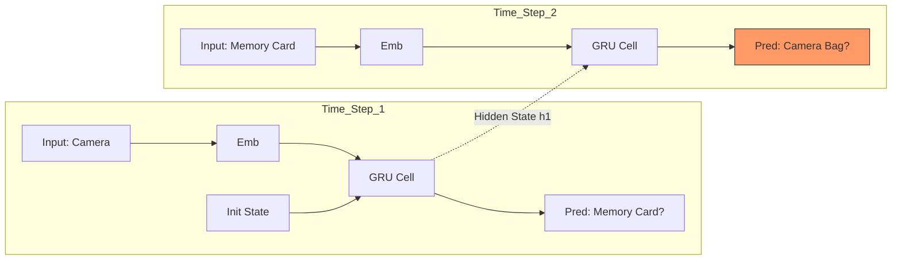

[< Up to Parent](README.md)

<strong>Global Navigation</strong>

- [Home](../../README.md)
- [01. Traditional Models](../../01_Traditional_Models/README.md)
    - [Collaborative Filtering](../../01_Traditional_Models/01_Collaborative_Filtering/README.md)
        - [Memory-based](../../01_Traditional_Models/01_Collaborative_Filtering/01_Memory_Based/README.md)
        - [Model-based](../../01_Traditional_Models/01_Collaborative_Filtering/02_Model_Based/README.md)
    - [Content-based Filtering](../../01_Traditional_Models/02_Content_Based_Filtering/README.md)
- [02. Machine Learning Era](../../02_Machine_Learning_Era/README.md)
- [03. Deep Learning Era](../../03_Deep_Learning_Era/README.md)
    - [MLP-based](../../03_Deep_Learning_Era/01_MLP_Based/README.md)
    - [Sequence/Session-based](../../03_Deep_Learning_Era/02_Sequence_Session_Based/README.md)
    - [Graph-based](../../03_Deep_Learning_Era/03_Graph_Based/README.md)
    - [AutoEncoder-based](../../03_Deep_Learning_Era/04_AutoEncoder_Based/README.md)
- [04. SOTA & GenAI](../../04_SOTA_GenAI/README.md)
    - [LLM-based](../../04_SOTA_GenAI/01_LLM_Based/README.md)
    - [Multimodal RS](../../04_SOTA_GenAI/02_Multimodal_RS.md)
    - [Generative RS](../../04_SOTA_GenAI/03_Generative_RS.md)

# GRU4Rec (RNN-based)

## 1. Detailed Description

### Definition

**GRU4Rec** is the seminal model that applied Gated Recurrent Units (GRU), a type of Recurrent Neural Network (RNN), to the session-based recommendation problem. Unlike traditional methods that treat user history as a static "bag of items", GRU4Rec treats it as a **dynamic sequence** where the order matters significantly.

### The Problem it Solves

- **Session-based Context**: In many scenarios (e-commerce, news), users are anonymous (no User ID). We only have the short sequence of clicks in the current session.
- **Sequence Dependency**: "Phone -> Case" is a strong pattern. "Case -> Phone" is rare. Standard Matrix Factorization cannot capture this directional Order.

### Key Characteristics

- **Session-Parallel Mini-batches**: A specialized training technique to handle varying session lengths efficiently.
- **Pairwise Loss (BPR)**: Optimized to rank the correct next item higher than negative samples.
- **Pros**:
  - Captures short-term interest effectively.
  - Works well for anonymous sessions.
- **Cons**:
  - Struggles with very long-term dependencies (Vanishing Gradient problem in RNNs, though GRU mitigates it).
  - Sequential processing is slower than Transformer's parallel processing.

---

## 2. Operating Principle

### Architecture

1.  **Input Layer**:
    - The current clicked item $i_t$ is one-hot encoded (or embedded).
2.  **GRU Layer (Gated Recurrent Unit)**:
    - Maintains a hidden state $h_t$ that acts as the "Memory" of the session so far.
    - $$ h*t = \text{GRU}(h*{t-1}, i_t) $$
    - The GRU gate controls how much of the old memory to keep (Update Gate) and how much to forget (Reset Gate).
3.  **Output Layer**:
    - Predicts the probability distribution of the _next_ item $i_{t+1}$ based on $h_t$.
    - $$ \hat{y} = \text{Softmax}(W\_{out} h_t) $$

### Loss Function

Often uses **TOP1 Loss** or **BPR (Bayesian Personalized Ranking) Loss**.
$$ L = - \sum \log(\sigma(\hat{r}_{pos} - \hat{r}_{neg})) $$
Maximized when the score of the ground-truth next item is significantly higher than a random negative item.

---

## 3. Flow Example

### Scenario: Online Shopping

**Session**: User views [**Camera**, **Memory Card**, **?**]

### Step-by-Step Processing

1.  **Step 1: Input "Camera"** ($t=1$)

    - Embedding of Camera enters GRU.
    - Hidden State $h_1$ updates: "Context: Camera-focused".
    - Prediction: Lens, Tripod, Memory Card.

2.  **Step 2: Input "Memory Card"** ($t=2$)

    - Embedding of Memory Card enters GRU, along with previous state $h_1$.
    - Hidden State $h_2$ updates: "Context: Camera + Memory Card (Ready to shoot?)".
    - Prediction: The model realizes the user has the main device and storage. Next logical step is protection or power.
    - **Top Prediction**: **Camera Bag**.

3.  **Result**:
    - If we used non-sequential MF, "Camera" and "Memory Card" might just recommend similar electronics. GRU4Rec understands the _flow_ toward "Accessories".

### Visual Diagram

