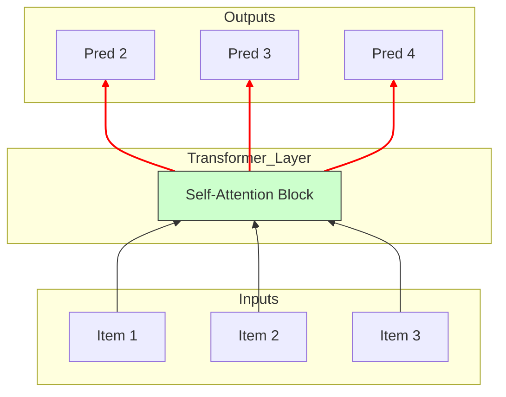

[< Up to Parent](README.md)

<strong>Global Navigation</strong>

- [Home](../../README.md)
- [01. Traditional Models](../../01_Traditional_Models/README.md)
    - [Collaborative Filtering](../../01_Traditional_Models/01_Collaborative_Filtering/README.md)
        - [Memory-based](../../01_Traditional_Models/01_Collaborative_Filtering/01_Memory_Based/README.md)
        - [Model-based](../../01_Traditional_Models/01_Collaborative_Filtering/02_Model_Based/README.md)
    - [Content-based Filtering](../../01_Traditional_Models/02_Content_Based_Filtering/README.md)
- [02. Machine Learning Era](../../02_Machine_Learning_Era/README.md)
- [03. Deep Learning Era](../../03_Deep_Learning_Era/README.md)
    - [MLP-based](../../03_Deep_Learning_Era/01_MLP_Based/README.md)
    - [Sequence/Session-based](../../03_Deep_Learning_Era/02_Sequence_Session_Based/README.md)
    - [Graph-based](../../03_Deep_Learning_Era/03_Graph_Based/README.md)
    - [AutoEncoder-based](../../03_Deep_Learning_Era/04_AutoEncoder_Based/README.md)
- [04. SOTA & GenAI](../../04_SOTA_GenAI/README.md)
    - [LLM-based](../../04_SOTA_GenAI/01_LLM_Based/README.md)
    - [Multimodal RS](../../04_SOTA_GenAI/02_Multimodal_RS.md)
    - [Generative RS](../../04_SOTA_GenAI/03_Generative_RS.md)

# SASRec / BERT4Rec (Transformer-based)

## 1. Detailed Description

### Definition

These models adapt the **Transformer** architecture (famous in NLP, e.g., "Attention Is All You Need") for sequential recommendation.

- **SASRec (Self-Attentive Sequential Recommendation)**: Uses a unidirectional Transformer (like GPT) to predict the next item based on _past_ items.
- **BERT4Rec**: Uses a bidirectional Transformer (like BERT) to predict _masked_ items using both past and future context (during training), learning robust representations.

### The Problem it Solves

- **RNN limitations**: RNNs (GRU/LSTM) process items sequentially ($1 \to 2 \to 3$), which prevents parallelization and struggles to remember very old items ("The vanishing gradient").
- **Attention Mechanism**: Transformers can "attend" to _any_ previous item directly, regardless of how far back it was, capturing long-term dependencies perfectly.

### Key Characteristics

- **Self-Attention**: "Which past items are relevant to the current prediction?"
- **Pros**:
  - State-of-the-Art performance in sequential recommendation.
  - Parallel training (unlike RNNs).
- **Cons**:
  - High computational complexity ($O(L^2)$ or $O(L \log L)$) for long sequences.
  - Data hungry.

---

## 2. Operating Principle

### A. Self-Attention Mechanism

The core engine. It computes a weighted sum of all values $V$ based on the compatibility of query $Q$ and key $K$.
$$ \text{Attention}(Q, K, V) = \text{softmax}(\frac{QK^T}{\sqrt{d_k}})V $$

- In RecSys: "Is the 'Game Console' I bought 5 steps ago (Key) relevant to the 'Game Disc' I'm looking at now (Query)?" -> Yes, High Attention Weight.

### B. SASRec (Left-to-Right)

- **Input**: Sequence $[i_1, i_2, ... i_t]$.
- **Objective**: Predict $i_{t+1}$.
- **Masking**: Ensures position $t$ can only attend to positions $1...t$ (Causal Masking), preventing cheating by looking at the future.

### C. BERT4Rec (Cloze Task)

- **Training**: Randomly mask items in the sequence: $[i_1, \text{[MASK]}, i_3, i_4]$.
- **Objective**: Predict the identity of [MASK] using $i_1$ (Left Context) and $i_3, i_4$ (Right Context).
- **Inference**: Append [MASK] at the end to predict the next item.

---

## 3. Flow Example

### Scenario: User History

Sequence: [**Phone**, **Case**, **Charger**, **Headphones**]

### SASRec Process (Predict Next)

1.  **Embeddings**: Convert items to vectors + Add **Positional Embedding** (Sequence Order info).
2.  **Attention Layer**:
    - Target: Position 4 (Headphones).
    - It looks back at Pos 1 (Phone). "Highly Relevant".
    - It looks back at Pos 2 (Case). "Less Relevant".
3.  **Aggregation**: The model creates a context vector that is a mix of Phone (50%), Charger (30%), Case (20%).
4.  **Prediction**: "Phone" + "Headphones" context $\to$ Next item might be **"Music Subscription"** or **"Phone Stand"**.

### BERT4Rec Process (Training)

1.  **Input**: [Phone, [MASK], Charger, Headphones].
2.  **Attention**: The [MASK] attends to "Phone" (Past) and "Charger" (Future).
3.  **Inference**:
    - "Phone" suggests "Case".
    - "Charger" suggests "Electronic Device".
    - **Prediction**: The missing item is likely **"Case"**.

### Visual Diagram (SASRec)

