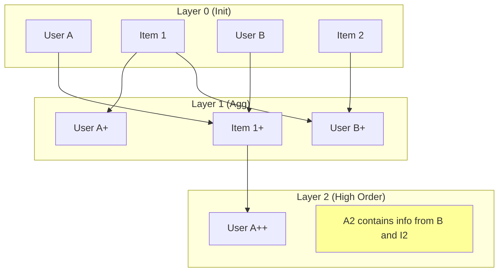

[< Up to Parent](README.md)

<strong>Global Navigation</strong>

- [Home](../../README.md)
- [01. Traditional Models](../../01_Traditional_Models/README.md)
    - [Collaborative Filtering](../../01_Traditional_Models/01_Collaborative_Filtering/README.md)
        - [Memory-based](../../01_Traditional_Models/01_Collaborative_Filtering/01_Memory_Based/README.md)
        - [Model-based](../../01_Traditional_Models/01_Collaborative_Filtering/02_Model_Based/README.md)
    - [Content-based Filtering](../../01_Traditional_Models/02_Content_Based_Filtering/README.md)
- [02. Machine Learning Era](../../02_Machine_Learning_Era/README.md)
- [03. Deep Learning Era](../../03_Deep_Learning_Era/README.md)
    - [MLP-based](../../03_Deep_Learning_Era/01_MLP_Based/README.md)
    - [Sequence/Session-based](../../03_Deep_Learning_Era/02_Sequence_Session_Based/README.md)
    - [Graph-based](../../03_Deep_Learning_Era/03_Graph_Based/README.md)
    - [AutoEncoder-based](../../03_Deep_Learning_Era/04_AutoEncoder_Based/README.md)
- [04. SOTA & GenAI](../../04_SOTA_GenAI/README.md)
    - [LLM-based](../../04_SOTA_GenAI/01_LLM_Based/README.md)
    - [Multimodal RS](../../04_SOTA_GenAI/02_Multimodal_RS.md)
    - [Generative RS](../../04_SOTA_GenAI/03_Generative_RS.md)

# Neural Graph Collaborative Filtering (NGCF)

## 1. Detailed Description

### Definition

**NGCF** (SIGIR 2019) is a Graph Neural Network (GNN) framework customized for collaborative filtering. It explicitly models the high-order connectivity in the user-item integration graph, embedding it into the representations of users and items.

### The Problem it Solves

- **Traditional MF** relies on the "interaction" ($u \cdot i$) only at the final prediction stage. It does not encode the collaborative signal _into_ the embedding itself.
- **NGCF** argues that the embedding $e_u$ should inherently contain information about the items $u$ liked, and the other users who liked those items.
- **Connectivity**: $User_1 \to Item_A \to User_2 \to Item_B$. This path suggests $User_1$ might be similar to $User_2$ and thus like $Item_B$. NGCF captures this $L$-hop signal.

### Key Characteristics

- **Embedding Propagation**: Refines embeddings by aggregating neighbor information recursively.
- **Pros**:
  - Significant improvement over MF by exploiting graph structure.
- **Cons**:
  - Heavy computation due to dense matrices and non-linearities in each layer.
  - Later proven (by LightGCN) that the non-linearities were actually unnecessary and harmful.

---

## 2. Operating Principle

### A. Graph Structure

Bipartite Graph: Users on one side, Items on the other. Edges represent latent interactions (likes, clicks).

### B. Embedding Propagation Layer

For a user $u$ and neighbor item $i$:

1.  **Message Construction**:
    $$ m\_{u \leftarrow i} = \frac{1}{\sqrt{|N_u||N_i|}} (W_1 e_i + W_2 (e_i \odot e_u)) $$

    - Traditional GCN only uses $W_1 e_i$.
    - NGCF adds $e_i \odot e_u$ to capture feature interactions strongly (like FM).

2.  **Aggregation**:
    $$ e*u^{(l)} = \text{LeakyReLU}(m*{u \leftarrow u} + \sum*{i \in N_u} m*{u \leftarrow i}) $$

    - Combines self-information and neighbor information.

3.  **High-order Propagation**:
    Stacking $L$ layers allows capturing $L$-hop neighbors.

### C. Prediction

Concatenate embeddings from all layers to form the final representation:
$$ e_u^* = [e_u^{(0)}, e_u^{(1)}, ..., e_u^{(L)}] $$
Then proceed with dot product.

---

## 3. Flow Example

### Scenario

**Graph**: User A --(linked)--> Item 1 --(linked)--> User B --(linked)--> Item 2.
**Goal**: Recommend for User A.

### Propagation Steps

1.  **Layer 1 (Direct Neighbors)**:

    - User A aggregates info from **Item 1**.
    - User A's vector now "knows" about Item 1.

2.  **Layer 2 (Neighbors of Neighbors)**:

    - User A aggregates info from its neighbors' new vectors.
    - Item 1's vector (from Layer 1) contains info about **User B**.
    - So, User A now indirectly absorbs info about **User B**.

3.  **Layer 3 (3-hop)**:
    - User B's vector (from Layer 2) contains info about **Item 2**.
    - User A effectively "sees" **Item 2** through the path $A \to 1 \to B \to 2$.
    - The model learns that Item 2 is relevant to User A.

### Visual Diagram

