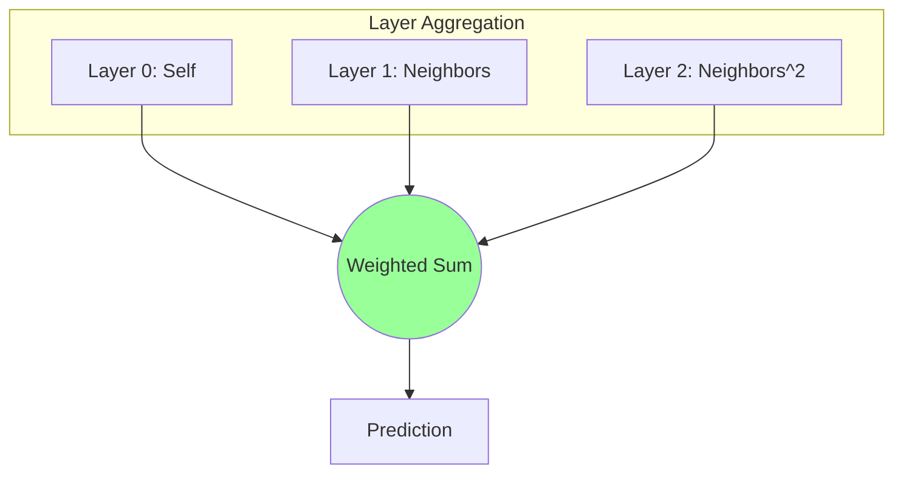

[< Up to Parent](README.md)

<strong>Global Navigation</strong>

- [Home](../../README.md)
- [01. Traditional Models](../../01_Traditional_Models/README.md)
    - [Collaborative Filtering](../../01_Traditional_Models/01_Collaborative_Filtering/README.md)
        - [Memory-based](../../01_Traditional_Models/01_Collaborative_Filtering/01_Memory_Based/README.md)
        - [Model-based](../../01_Traditional_Models/01_Collaborative_Filtering/02_Model_Based/README.md)
    - [Content-based Filtering](../../01_Traditional_Models/02_Content_Based_Filtering/README.md)
- [02. Machine Learning Era](../../02_Machine_Learning_Era/README.md)
- [03. Deep Learning Era](../../03_Deep_Learning_Era/README.md)
    - [MLP-based](../../03_Deep_Learning_Era/01_MLP_Based/README.md)
    - [Sequence/Session-based](../../03_Deep_Learning_Era/02_Sequence_Session_Based/README.md)
    - [Graph-based](../../03_Deep_Learning_Era/03_Graph_Based/README.md)
    - [AutoEncoder-based](../../03_Deep_Learning_Era/04_AutoEncoder_Based/README.md)
- [04. SOTA & GenAI](../../04_SOTA_GenAI/README.md)
    - [LLM-based](../../04_SOTA_GenAI/01_LLM_Based/README.md)
    - [Multimodal RS](../../04_SOTA_GenAI/02_Multimodal_RS.md)
    - [Generative RS](../../04_SOTA_GenAI/03_Generative_RS.md)

# LightGCN

## 1. Detailed Description

### Definition

**LightGCN** (SIGIR 2020) is a simplified version of NGCF that removed the non-linear activation functions and feature transformation matrices. The authors proved that these two components, standard in GNNs for classification, are actually **harmful** for collaborative filtering.

### Why "Light"?

- Removed: $W_1, W_2$ matrices (Trainable weights).
- Removed: $\sigma$ (ReLU/LeakyReLU).
- Kept: Only the **Graph Convolution** (Neighbor Aggregation).
- Result: Faster training, fewer parameters to tune, and significantly better performance. SOTA for Graph-based CF.

### Key Characteristics

- **Linear Propagation**: The only trainable parameters are the initial embeddings $e_u^{(0)}$ and $e_i^{(0)}$.
- **Pros**:
  - Extremely efficient.
  - Easy to implement.
  - Consistently outperforms NGCF.
- **Cons**:
  - Like all Graph models, inference on very large graphs can be memory intensive.

---

## 2. Operating Principle

### A. Simplified Propagation Rule

Since there are no weights or activations:
$$ e*u^{(k+1)} = \sum*{i \in N_u} \frac{1}{\sqrt{|N_u||N_i|}} e_i^{(k)} $$

- This basically says: "The vector of a user at layer $k+1$ is the weighted average of the items they liked at layer $k$."
- The normalization term $\frac{1}{\sqrt{|N_u||N_i|}}$ prevents high-degree nodes from exploding in magnitude.

### B. Layer Combination

Unlike NGCF which concatenates, LightGCN takes a weighted sum of embeddings at all layers to form the final representation.
$$ e*u = \sum*{k=0}^K \alpha_k e_u^{(k)} $$

- Usually $\alpha_k$ is uniform ($1/(K+1)$).
- Why sum? Layer 0 represents self. Layer 1 represents items. Layer 2 represents "users similar to me." We want a blend of all these signals.

### C. Prediction

$$ \hat{y}\_{ui} = e_u^T e_i $$

---

## 3. Flow Example

### Scenario

User A connected to Item 1. Item 1 connected to User B.
Initial Emb: A=[1,0], 1=[0,1], B=[-1,0].

### Process (Simplified, ignoring norm)

1.  **Layer 0**:

    - $A^{(0)} = [1, 0]$
    - $1^{(0)} = [0, 1]$

2.  **Layer 1 (1-hop Aggregation)**:

    - User A pulls from Item 1.
    - $A^{(1)} \approx 1^{(0)} = [0, 1]$. (A becomes like the item)
    - Item 1 pulls from A and B.
    - $1^{(1)} \approx A^{(0)} + B^{(0)} = [1, 0] + [-1, 0] = [0, 0]$.

3.  **Layer 2 (2-hop Aggregation)**:

    - User A pulls from Item 1's Layer 1 vector.
    - $A^{(2)} \approx 1^{(1)} = [0, 0]$. (Signal smoothing).

4.  **Final Vector for A**:
    - $A_{final} = \alpha_0 A^{(0)} + \alpha_1 A^{(1)} + ...$
    - $A_{final} = \frac{1}{2}([1,0] + [0,1]) = [0.5, 0.5]$.

### Visual Diagram

