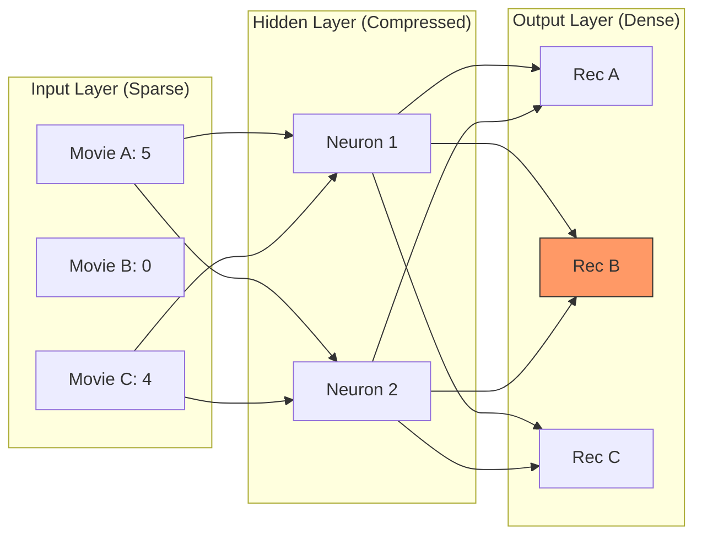

[< Up to Parent](README.md)

<strong>Global Navigation</strong>

- [Home](../../README.md)
- [01. Traditional Models](../../01_Traditional_Models/README.md)
    - [Collaborative Filtering](../../01_Traditional_Models/01_Collaborative_Filtering/README.md)
        - [Memory-based](../../01_Traditional_Models/01_Collaborative_Filtering/01_Memory_Based/README.md)
        - [Model-based](../../01_Traditional_Models/01_Collaborative_Filtering/02_Model_Based/README.md)
    - [Content-based Filtering](../../01_Traditional_Models/02_Content_Based_Filtering/README.md)
- [02. Machine Learning Era](../../02_Machine_Learning_Era/README.md)
- [03. Deep Learning Era](../../03_Deep_Learning_Era/README.md)
    - [MLP-based](../../03_Deep_Learning_Era/01_MLP_Based/README.md)
    - [Sequence/Session-based](../../03_Deep_Learning_Era/02_Sequence_Session_Based/README.md)
    - [Graph-based](../../03_Deep_Learning_Era/03_Graph_Based/README.md)
    - [AutoEncoder-based](../../03_Deep_Learning_Era/04_AutoEncoder_Based/README.md)
- [04. SOTA & GenAI](../../04_SOTA_GenAI/README.md)
    - [LLM-based](../../04_SOTA_GenAI/01_LLM_Based/README.md)
    - [Multimodal RS](../../04_SOTA_GenAI/02_Multimodal_RS.md)
    - [Generative RS](../../04_SOTA_GenAI/03_Generative_RS.md)

# AutoRec & CDAE

## 1. Detailed Description

### Definition

**AutoEncoders** are neural networks designed to copy their input to their output through a bottleneck.

- **AutoRec** (2015): Applies this to the user's rating vector. It takes a sparse vector $r^{(u)}$, compresses it into a latent code, and reconstructs a full dense vector $\hat{r}^{(u)}$.
- **CDAE (Collaborative Denoising AutoEncoder)** (2016): Designed for implicit feedback. It introduces "Denoising" (randomly dropping inputs) to force the model to learn robust features, and adds a user-specific node to capture bias.

### Key Characteristics

- **Reconstruction**: The core idea is "Filling in the blanks".
- **Non-linearity**: Unlike PCA/SVD, AutoEncoders use activation functions (Sigmoid, ReLU) to capture non-linear patterns.
- **Pros**:
  - Handles sparse data gracefully.
  - CDAE is very robust for "Top-N" ranking tasks.
- **Cons**:
  - AutoRec is essentially one-layer NCF; not as deep or powerful as sequence models.

---

## 2. Operating Principle

### AutoRec Architecture

1.  **Input**: User rating vector $r^{(u)} \in \mathbb{R}^N$ (Items). Most entries are 0 (unknown).
2.  **Encoder**:
    $$ h = f(V r^{(u)} + \mu) $$
    - Maps massive item space to a small latent space.
3.  **Decoder**:
    $$ \hat{r}^{(u)} = g(W h + b) $$
    - Reconstructs the full item space.
4.  **Training**: Only backpropagate error on **Observed** ratings.
    $$ \min \sum*{u} \sum*{i \in I*u} || r*{ui} - \hat{r}\_{ui} ||^2 + \lambda ... $$

### CDAE Improvement

- **Denoising**: Randomly overwrite some 1s in the input to 0s "Q: Can you still guess I like Star Wars even if I hide it?".
- **User Node**: Adds a unique trainable weight vector $v_u$ to the input of the hidden layer.
  $$ h = \sigma(W \cdot \text{corrupt}(r_u) + V_u + b) $$
    This $V_u$ acts like the User Bias/Vector in Matrix Factorization.

---

## 3. Flow Example

### Scenario

User has rated **Movie A** (5) and **Movie C** (4). **Movie B** is unknown (0).

### Process

1.  **Input Vector**: `[5, 0, 4]` (Normalized: `[1.0, 0, 0.8]`).
2.  **Encoder**:
    - Weights multiply with 1.0 (A) and 0.8 (C).
    - Hidden Code: `[0.9, 0.1]` (Latent content profile).
3.  **Decoder**:
    - Expands `[0.9, 0.1]` back to 3 dimensions.
    - Output: `[0.98, 0.7, 0.82]`.
4.  **Prediction**:
    - Movie A: 0.98 $\approx$ 1.0 (Good reconstruction).
    - Movie C: 0.82 $\approx$ 0.8 (Good reconstruction).
    - **Movie B**: **0.7**. (The model filled the blank!).
    - Recommend Movie B (High score).

### Visual Diagram

