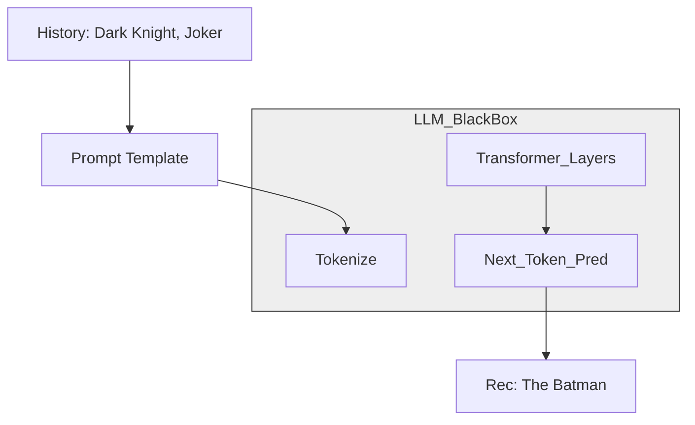

[< Up to Parent](README.md)

<details>
<summary><strong>Global Navigation</strong></summary>

- [Home](../../README.md)
- [01. Traditional Models](../../01_Traditional_Models/README.md)
    - [Collaborative Filtering](../../01_Traditional_Models/01_Collaborative_Filtering/README.md)
        - [Memory-based](../../01_Traditional_Models/01_Collaborative_Filtering/01_Memory_Based/README.md)
        - [Model-based](../../01_Traditional_Models/01_Collaborative_Filtering/02_Model_Based/README.md)
    - [Content-based Filtering](../../01_Traditional_Models/02_Content_Based_Filtering/README.md)
- [02. Machine Learning Era](../../02_Machine_Learning_Era/README.md)
- [03. Deep Learning Era](../../03_Deep_Learning_Era/README.md)
    - [MLP-based](../../03_Deep_Learning_Era/01_MLP_Based/README.md)
    - [Sequence/Session-based](../../03_Deep_Learning_Era/02_Sequence_Session_Based/README.md)
    - [Graph-based](../../03_Deep_Learning_Era/03_Graph_Based/README.md)
    - [AutoEncoder-based](../../03_Deep_Learning_Era/04_AutoEncoder_Based/README.md)
- [04. SOTA & GenAI](../../04_SOTA_GenAI/README.md)
    - [LLM-based](../../04_SOTA_GenAI/01_LLM_Based/README.md)
    - [Multimodal RS](../../04_SOTA_GenAI/02_Multimodal_RS.md)
    - [Generative RS](../../04_SOTA_GenAI/03_Generative_RS.md)
</details>

# LLM4Rec

## 1. Detailed Description

### Definition

**LLM4Rec** is the umbrella term for using Large Language Models (GPT-4, LLaMA, PaLM) to enhance or perform recommendation tasks. Unlike traditional models trained on ID-interaction matrices, LLMs are pre-trained on the vast semantic world knowledge of the internet.

### Paradigms

1.  **LLM as a Recommender (Direct)**: "Given user history A,B,C, what should they buy next?"
2.  **LLM as a Feature Encoder (Embedding)**: "Convert this movie plot into a vector, then feed it to a traditional model."
3.  **LLM as a Data Generator (Augmentation)**: "Simulate a user and generate artificial interaction data to solve Cold Start."

### Key Characteristics

- **Zero-Shot / Few-Shot**: Can recommend reasonably well without fine-tuning on the specific dataset.
- **Reasoning Capability**: Can explain _why_ it recommended something ("Because you like dystopian sci-fi...").
- **Pros**:
  - Unbeatable "Cold Start" performance.
  - Natural Language Interface (Chat-Rec).
- **Cons**:
  - **Hallucination**: Recommending fake movies.
  - **Latency**: Generating text is slow compared to a dot product.
  - **Position Bias**: LLMs tend to recommend items at the start/end of the prompt sequence.

---

## 2. Operating Principle

### A. Prompt Engineering

The core algorithm is designing the right prompt.

- **Instruction**: "You are a movie expert..."
- **Context**: "User History: [Matrix, Inception, Tenet]"
- **Candidate Set**: "Candidates: [Barbie, Oppenheimer, Interstellar]" (Optional - "Ranking Mode")
- **Task**: "Rank the candidates."

### B. In-Context Learning (ICL)

Providing examples in the prompt to teach the model the desired format and logic.

- Prompt: "User A liked X,Y -> Recommended Z. User B liked P,Q -> Recommended R. Now for User C..."

### C. Fine-Tuning (Instruction Tuning)

Taking a LLaMA model and forcing it to solve thousands of RecSys tasks (Rating prediction, Explanation) to align it with recommendation logic rather than just text completion.

---

## 3. Flow Example

### Scenario: Direct Recommendation via API

**User History**: "The Dark Knight", "Joker".

### Step 1: Prompt Construction

```text
System: Act as a movie recommender.
User: I have watched "The Dark Knight" (5/5) and "Joker" (4/5).
I like dark superhero movies with psychological depth.
Suggest 1 movie I haven't seen.
```

### Step 2: LLM Reasoning (Internal)

1.  **Analyze History**: Dark Knight & Joker -> DC Universe, Gotham, Gritty, Psychological thriller.
2.  **Search Knowledge Base**: What is similar? "The Batman (2022)", "Watchmen", "V for Vendetta".
3.  **Filter**: "The Batman" is the most recent and stylistically similar.

### Step 3: Generation

```text
Response: I recommend "The Batman- (2022).
Reason: Like your previous favorites, it features a gritty, noir-detective take on Gotham City and delves deep into the psychology of Bruce Wayne, similar to how 'Joker' explored Arthur Fleck.
```

### Visual Diagram

