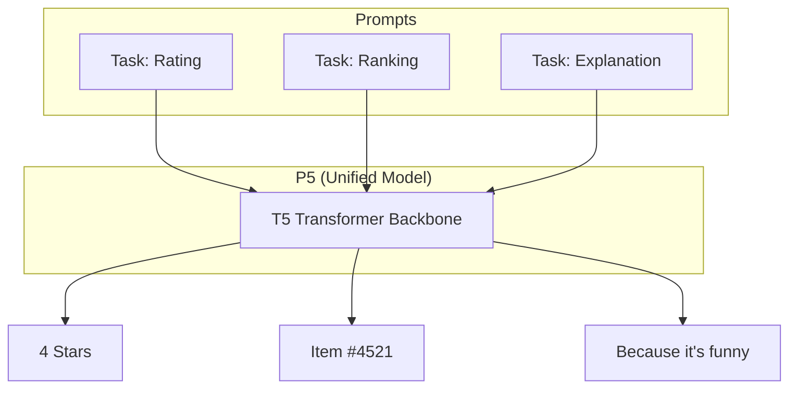

[< Up to Parent](README.md)

<strong>Global Navigation</strong>

- [Home](../../README.md)
- [01. Traditional Models](../../01_Traditional_Models/README.md)
    - [Collaborative Filtering](../../01_Traditional_Models/01_Collaborative_Filtering/README.md)
        - [Memory-based](../../01_Traditional_Models/01_Collaborative_Filtering/01_Memory_Based/README.md)
        - [Model-based](../../01_Traditional_Models/01_Collaborative_Filtering/02_Model_Based/README.md)
    - [Content-based Filtering](../../01_Traditional_Models/02_Content_Based_Filtering/README.md)
- [02. Machine Learning Era](../../02_Machine_Learning_Era/README.md)
- [03. Deep Learning Era](../../03_Deep_Learning_Era/README.md)
    - [MLP-based](../../03_Deep_Learning_Era/01_MLP_Based/README.md)
    - [Sequence/Session-based](../../03_Deep_Learning_Era/02_Sequence_Session_Based/README.md)
    - [Graph-based](../../03_Deep_Learning_Era/03_Graph_Based/README.md)
    - [AutoEncoder-based](../../03_Deep_Learning_Era/04_AutoEncoder_Based/README.md)
- [04. SOTA & GenAI](../../04_SOTA_GenAI/README.md)
    - [LLM-based](../../04_SOTA_GenAI/01_LLM_Based/README.md)
    - [Multimodal RS](../../04_SOTA_GenAI/02_Multimodal_RS.md)
    - [Generative RS](../../04_SOTA_GenAI/03_Generative_RS.md)

# P5 (Pretrain, Personalized, Prompt, Predict, Recommendation)

## 1. Detailed Description

### Definition

**P5** (Generic Foundation Model for Recommendation) is a unified framework that solves multiple recommendation tasks using a single Sequence-to-Sequence (Seq2Seq) model (specifically, a T5 Transformer). Instead of having separate models for Rating Prediction (Regression) and Top-N Recommendation (Ranking), P5 converts _all_ tasks into natural language prompts.

### The Problem it Solves

- **Fragmentation**: Traditional RS needs different architectures for different tasks (e.g., Explainability needs a separate NLG model).
- **Transfer**: It's hard to transfer knowledge from a rating task to an explanation task.
- **P5 Solution**: Treat everything as text generation.

### Key Characteristics

- **Personalized Prompt**: The prompt includes the User ID and Item ID (as tokens) to personalize the generation.
- **Foundational**: A step towards a "GPT for RecSys".
- **Pros**:
  - Unified architecture.
  - Excellent zero-shot/few-shot ability on new tasks.
- **Cons**:
  - Token ID collisons (User "123" might be confused with number "123").
  - Scalability: Generating IDs token-by-token is slower than retrieval.

---

## 2. Operating Principle

### 5 Families of Prompt Templates

P5 defines templates for 5 core tasks:

1.  **Direct Recommendation**: "Predict the next item for User A."
2.  **Rating Prediction**: "How many stars will User A give Item B?"
3.  **Explanation Generation**: "Explain why User A likes Item B."
4.  **Review Summarization**: "Summarize the review User A wrote for Item B."
5.  **Sequential Prediction**: "Given history [...], what comes next?"

### Training

- **Foundation Model**: T5 (Text-to-Text Transfer Transformer).
- **Prompt Tuning**: The model is fine-tuned on a massive dataset of (Prompt, Label) pairs.
- **Input**: `User_101 watched Movie_55. Will he like it?`
- **Target**: `yes`
- **Input**: `Why did User_101 like Movie_55?`
- **Target**: `Because it is a comedy.`

---

## 3. Flow Example

### Scenario

User 77 wants a recommendation and an explanation.

### Task 1: Recommendation

1.  **Prompt**: "I am User_77. I have seen Movie_1, Movie_2. What should I watch next?"
2.  **Model Gen**: "Movie_99" (The model learned the pattern that User_77's sequence leads to Movie_99).

### Task 2: Explanation

1.  **Prompt**: "Write a justification for recommending Movie_99 to User_77."
2.  **Model Gen**: "Since User_77 enjoyed the action sequences in Movie_1, Movie_99 offers a similar thrill."

### Visual Diagram

