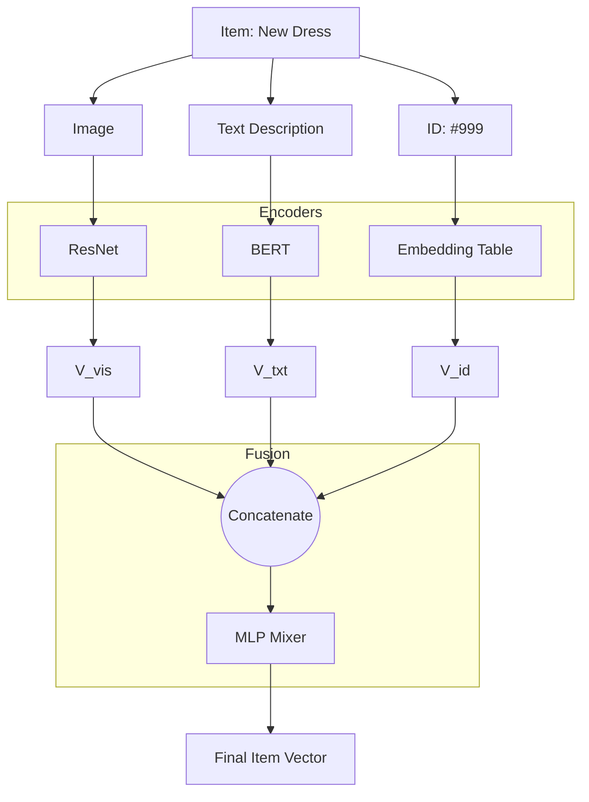

[< Up to Parent](README.md)

<strong>Global Navigation</strong>

- [Home](../README.md)
- [01. Traditional Models](../01_Traditional_Models/README.md)
    - [Collaborative Filtering](../01_Traditional_Models/01_Collaborative_Filtering/README.md)
        - [Memory-based](../01_Traditional_Models/01_Collaborative_Filtering/01_Memory_Based/README.md)
        - [Model-based](../01_Traditional_Models/01_Collaborative_Filtering/02_Model_Based/README.md)
    - [Content-based Filtering](../01_Traditional_Models/02_Content_Based_Filtering/README.md)
- [02. Machine Learning Era](../02_Machine_Learning_Era/README.md)
- [03. Deep Learning Era](../03_Deep_Learning_Era/README.md)
    - [MLP-based](../03_Deep_Learning_Era/01_MLP_Based/README.md)
    - [Sequence/Session-based](../03_Deep_Learning_Era/02_Sequence_Session_Based/README.md)
    - [Graph-based](../03_Deep_Learning_Era/03_Graph_Based/README.md)
    - [AutoEncoder-based](../03_Deep_Learning_Era/04_AutoEncoder_Based/README.md)
- [04. SOTA & GenAI](../04_SOTA_GenAI/README.md)
    - [LLM-based](../04_SOTA_GenAI/01_LLM_Based/README.md)
    - [Multimodal RS](../04_SOTA_GenAI/02_Multimodal_RS.md)
    - [Generative RS](../04_SOTA_GenAI/03_Generative_RS.md)

# Multimodal RS

## 1. Detailed Description

### Definition

**Multimodal Recommender Systems** leverage auxiliary data modalities (Images, Audio, Video, Text) alongside the standard User-Item interaction matrix. They argue that an item's content is as important as its ID, especially in visually or audibly rich domains.

### The Problem it Solves

- **Cold Start**: A new dress has no ratings (ID is useless), but it has an image (Visual Modality is rich). The model can recommend it to users who like "Visually similar" dresses.
- **Fine-grained Preference**: Users might like a movie not because of the genre (Text) but because of the cinematography (Visual).

### Key Characteristics

- **Encoders**: Powered by deep encoders (ResNet/ViT for Image, BERT for Text, VGGish for Audio).
- **Fusion**: The art of combining ID embeddings with Content embeddings.
- **Pros**:
  - Drastically improves performance for new items.
  - Essential for Fashion, Art, Music, and TikTok-like Short Video apps.
- **Cons**:
  - High computational cost (processing images/video).
  - Storage heavy (storing feature vectors).

---

## 2. Operating Principle

### Architecture

1.  **Feature Extraction (Offline/Online)**:

    - **Visual**: Pass item image $I_i$ through a pre-trained CNN (e.g., ResNet50) to get vector $v_i$.
    - **Textual**: Pass description $T_i$ through BERT to get vector $t_i$.
    - **ID**: Look up ID embedding $e_{id}$.

2.  **Fusion Strategies**:

    - **Concatenation (Early Fusion)**:
      $$ e*{final} = \text{MLP}([e*{id}, v_i, t_i]) $$
    - **Attention-based Fusion**: Let the model decide which modality is important for _this_ item.
      $$ e*{final} = \alpha_1 e*{id} + \alpha_2 v_i + \alpha_3 t_i $$
    - **Graph Fusion (MMGCN)**: Use Graph Neural Networks where each modality has its own graph, then aggregate.

3.  **Prediction**:
    - Standard dot product or MLP between User Vector and Item Final Vector.

---

## 3. Flow Example

### Scenario: Fashion App (User loves Red Floral Dresses)

**Candidate**: "New Summer Dress" (No ratings yet).
**Data**: Image (Red, Flower pattern), Text ("Breezy summer wear").

### Process

1.  **Visual Encoder**:
    - Input: Image.
    - Output: Vector $v_{img}$ (High signal for 'Red', 'Pattern').
2.  **User Representation**:
    - User history contains many items with similar $v_{img}$.
    - Model learns User Vector $P_u$ is close to the 'Red/Pattern' visual space.
3.  **Matching**:
    - Even though ID embedding is random (cold start), $P_u \cdot v_{img}$ is High.
    - **Prediction**: High Probability.

### Visual Diagram

