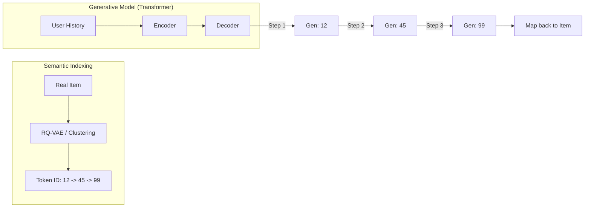

[< Up to Parent](README.md)

<strong>Global Navigation</strong>

- [Home](../README.md)
- [01. Traditional Models](../01_Traditional_Models/README.md)
    - [Collaborative Filtering](../01_Traditional_Models/01_Collaborative_Filtering/README.md)
        - [Memory-based](../01_Traditional_Models/01_Collaborative_Filtering/01_Memory_Based/README.md)
        - [Model-based](../01_Traditional_Models/01_Collaborative_Filtering/02_Model_Based/README.md)
    - [Content-based Filtering](../01_Traditional_Models/02_Content_Based_Filtering/README.md)
- [02. Machine Learning Era](../02_Machine_Learning_Era/README.md)
- [03. Deep Learning Era](../03_Deep_Learning_Era/README.md)
    - [MLP-based](../03_Deep_Learning_Era/01_MLP_Based/README.md)
    - [Sequence/Session-based](../03_Deep_Learning_Era/02_Sequence_Session_Based/README.md)
    - [Graph-based](../03_Deep_Learning_Era/03_Graph_Based/README.md)
    - [AutoEncoder-based](../03_Deep_Learning_Era/04_AutoEncoder_Based/README.md)
- [04. SOTA & GenAI](../04_SOTA_GenAI/README.md)
    - [LLM-based](../04_SOTA_GenAI/01_LLM_Based/README.md)
    - [Multimodal RS](../04_SOTA_GenAI/02_Multimodal_RS.md)
    - [Generative RS](../04_SOTA_GenAI/03_Generative_RS.md)

# Generative RS

## 1. Detailed Description

### Definition

**Generative Recommendation System (GenRec)** is a paradigm shift from "Ranking" to "Generation". Traditional models select the best item from a fixed pool of candidates (Classification/Retrieval). Generative models **generate** the target item's identifier (or content) directly from the context.

### The Problem it Solves

- **Massive Softmax**: In traditional Deep Learning, calculating softmax over 100 million items is computationally impossible. We use Approximate Nearest Neighbors (ANN) instead.
- **Generative Retrieval**: This approach removes the heavy index (FAISS, HNSW). The "Index" is stored implicitly in the model weights. You just ask "What next?" and it types out "Item_ID_123".

### Key Characteristics

- **Retrieval is Generation**: The model learns to map User Context $\to$ Item Token Sequence.
- **Semantic IDs**: Often requires clever indexing schemes (e.g., RQ-VAE) to turn boring Integer IDs into meaningful semantic codes that can be generated hierarchically.
- **Pros**:
  - Unified simple architecture (just a Transformer).
  - Potentially faster inference (no external ANN search).
- **Cons**:
  - **Hallucination**: Can generate IDs that don't exist.
  - **New Item**: Hard to add new items without retraining the tokenizer.

---

## 2. Operating Principle

### A. Semantic ID Creation (Indexing)

Before training, we must convert items into generate-able tokens.

1.  **Cluster-based**: Hierarchical clustering.
    - Item A $\to$ Cluster 1 $\to$ Sub-cluster 5 $\to$ Item A.
    - ID: "1-5-A".
2.  **Semantic-based**: Use the item title.
    - Item "Iron Man" $\to$ Tokens ["Iron", "Man"].

### B. Training (Seq2Seq)

- **Input**: "User History: [Item A, Item B]"
- **Target**: "Item C" (represented as tokens "3-2-C").
- **Loss**: Standard Language Modeling Loss (Cross Entropy on next token).

### C. Inference (Beam Search)

- The model generates the ID token by token.
- Beam Search allows it to explore multiple probable item IDs simultaneously.
- Constraint: Force the generation to only output valid Item IDs (Trie-based constrained decoding).

---

## 3. Flow Example

### Scenario: Hierarchical Indexing

Imagine a library.

- Level 1: Genre (Fiction, Non-fiction)
- Level 2: Author (K.Rowling, S.King)
- Level 3: Book

**Book "Harry Potter"** ID: `Fiction` -> `Rowling` -> `HP1`.

### Process

1.  **Context**: User just read "The Hobbit".
2.  **Generation Step 1**:
    - Input: "Context: The Hobbit".
    - Output: `Fiction` (High prob).
3.  **Generation Step 2**:
    - Input: "Context: The Hobbit, Fiction".
    - Output: `Rowling` (High prob - logically connected via Fantasy).
4.  **Generation Step 3**:
    - Input: "Context: The Hobbit, Fiction, Rowling".
    - Output: `HP1` (Harry Potter 1).
5.  **Result**: Recommend "Harry Potter 1".

_Note how similar this is to how a human librarian thinks: "Fantasy section... maybe Rowling... yes, Harry Potter."_

### Visual Diagram

