[< 상위 폴더로 이동](README.md)

<strong>전체 탐색 (RecSys 가이드)</strong>

- [홈](../../../README.md)
- [01. 전통적 모델](../../../01_Traditional_Models/README.md)
  - [협업 필터링](../../../01_Traditional_Models/01_Collaborative_Filtering/README.md)
    - [메모리 기반](../../../01_Traditional_Models/01_Collaborative_Filtering/01_Memory_Based/README.md)
    - [모델 기반](../../../01_Traditional_Models/01_Collaborative_Filtering/02_Model_Based/README.md)
  - [콘텐츠 기반 필터링](../../../01_Traditional_Models/02_Content_Based_Filtering/README.md)
- [02. 과도기 및 통계적 모델](../../../02_Machine_Learning_Era/README.md)
- [03. 딥러닝 기반 모델](../../../03_Deep_Learning_Era/README.md)
  - [MLP 기반](../../../03_Deep_Learning_Era/01_MLP_Based/README.md)
  - [순차/세션 기반](../../../03_Deep_Learning_Era/02_Sequence_Session_Based/README.md)
  - [그래프 기반](../../../03_Deep_Learning_Era/03_Graph_Based/README.md)
  - [오토인코더 기반](../../../03_Deep_Learning_Era/04_AutoEncoder_Based/README.md)
- [04. 최신 및 생성형 모델](../../../04_SOTA_GenAI/README.md) - [LLM 기반](../../../04_SOTA_GenAI/01_LLM_Based/README.md) - [멀티모달 추천](../../../04_SOTA_GenAI/02_Multimodal_RS.md) - [생성형 추천](../../../04_SOTA_GenAI/03_Generative_RS.md)

# 사용자 기반 협업 필터링 (User-based CF)

## 1. 상세 설명 (Detailed Description)

### 정의 (Definition)

**사용자 기반 협업 필터링 (User-based Collaborative Filtering)**은 유사한 평점 패턴을 가진 다른 사용자들의 선호도를 기반으로 타겟 사용자의 아이템에 대한 관심도를 예측하는 메모리 기반 추천 알고리즘입니다. 흔히 "과거에 비슷한 것을 좋아했던 사용자들은 미래에도 비슷한 것을 좋아할 것이다"라고 요약됩니다.

### 역사 및 배경 (History & Background)

- **기원**: 유즈넷 뉴스 기사를 추천하기 위해 만들어진 **GroupLens** 시스템(1994)에서 구현된 최초의 자동화된 추천 기술 중 하나입니다.
- **진화**: 이론적으로는 간단하지만 사용자 수가 증가함에 따라 확장성 문제($N \times N$ 유사도 계산)에 직면했고, 이는 아이템 기반 CF와 행렬 분해(Matrix Factorization)의 개발로 이어졌습니다.

### 주요 특징 (Key Characteristics)

- **우연한 발견 (Serendipity)**: 사용자가 이전에 본 것과는 전혀 다르더라도, "유사한 사용자"가 흥미로워했다면 추천될 수 있어 의외의 발견을 돕습니다.
- **사용자 중심 (User-Centric)**: 소셜 커뮤니티나 취향 그룹에 초점을 맞춥니다.
- **장점**:
  - 구현하고 설명하기 쉽습니다.
  - 콘텐츠 분석이 필요 없습니다 (영화, 농담, 노래 등 어떤 아이템에도 적용 가능).
  - 특징(feature)으로 설명하기 어려운 복잡한 패턴(예: 특정 "컬트" 영화 취향)을 포착할 수 있습니다.
- **단점**:
  - **희소성 (Sparsity)**: 평점 행렬이 너무 희소하면 이웃을 찾기 어렵습니다.
  - **확장성 (Scalability)**: 수백만 명의 사용자 간 유사도를 계산하는 것은 비용이 많이 듭니다.
  - **콜드 스타트 (Cold Start)**: 평점이 없는 신규 사용자는 추천을 받을 수 없습니다.

---

## 2. 작동 원리 (Operating Principle)

핵심 메커니즘은 **유사도 계산**, **이웃 선정**, **평점 예측**의 3단계로 구성됩니다.

### A. 유사도 계산 (Similarity Calculation)

"이웃"을 찾기 위해 타겟 사용자 $u$와 다른 모든 사용자 $v$ 사이의 유사도를 계산합니다. 가장 일반적인 지표는 다음과 같습니다:

1.  **피어슨 상관 계수 (Pearson Correlation Coefficient, PCC)**

    - 사용자마다 다른 평점 척도를 보정합니다 (어떤 사람은 1-5점, 어떤 사람은 3-5점만 사용).
    - $$ \text{sim}(u, v) = \frac{\sum*{i \in I*{uv}} (r*{u,i} - \bar{r}\_u)(r*{v,i} - \bar{r}_v)}{\sqrt{\sum_{i \in I*{uv}} (r*{u,i} - \bar{r}_u)^2} \sqrt{\sum_{i \in I*{uv}} (r*{v,i} - \bar{r}\_v)^2}} $$
    - 여기서 $I_{uv}$는 두 사용자가 모두 평가한 아이템 집합입니다.

2.  **코사인 유사도 (Cosine Similarity)**
    - 사용자를 아이템 공간상의 벡터로 취급합니다.
    - $$ \text{sim}(u, v) = \frac{\vec{u} \cdot \vec{v}}{||\vec{u}|| \cdot ||\vec{v}||} = \frac{\sum*{i} r*{u,i} r*{v,i}}{\sqrt{\sum*{i} r*{u,i}^2} \sqrt{\sum*{i} r\_{v,i}^2}} $$

### B. 이웃 선정 (Neighbor Selection)

유사도 점수가 가장 높은 상위 $k$명의 사용자를 선택합니다. $N_u$를 사용자 $u$의 이웃 집합이라고 합시다.

### C. 평점 예측 (Rating Prediction)

이웃들의 평점을 가중 평균하여 아이템 $i$에 대한 평점 $\hat{r}_{u,i}$를 예측합니다.
$$ \hat{r}_{u,i} = \bar{r}\_u + \frac{\sum_{v \in N*u} \text{sim}(u,v) \times (r*{v,i} - \bar{r}_v)}{\sum_{v \in N_u} |\text{sim}(u,v)|} $$
*(참고: $\bar{r}_u$를 다시 더해줌으로써 타겟 사용자의 평점 스케일에 맞게 예측값을 정규화합니다.)\*

---

## 3. 흐름 예시 (Flow Example)

### 시나리오

**Alice**가 **"The Matrix"**를 좋아할지 예측하고 싶습니다.

**데이터:**
| 사용자 | Titanic | Star Wars | The Matrix | Inception | 평균 평점 |
| :--- | :---: | :---: | :---: | :---: | :---: |
| **Alice** | 5 | 4 | **?** | ? | 4.5 |
| **Bob** | 5 | 5 | **5** | 4 | 4.75 |
| **Carol** | 2 | 1 | **2** | 1 | 1.5 |
| **Dave** | 4 | 5 | **?** | 5 | 4.6 |

### 단계별 프로세스

1.  **유사도 계산 (피어슨)**:

    - **Alice vs Bob**: 둘 다 타이타닉(5,5)과 스타워즈(4,5)를 좋아함. 높은 상관관계. (예: 0.95)
    - **Alice vs Carol**: Alice는 좋아함(5,4), Carol은 싫어함(2,1). 의견 불일치. 음의 상관관계 또는 낮음. (예: -0.8)
    - **Alice vs Dave**: 비슷한 취향. 높은 상관관계. (예: 0.90), 하지만 Dave는 "The Matrix"를 안 봤으므로 이 아이템에 대해선 도움이 안 됨.

2.  **이웃 선정**:

    - "The Matrix"에 대한 최고의 이웃은 **Bob** (Sim=0.95). Carol은 취향이 다르고, Dave는 데이터가 없음.

3.  **예측**:

    - Bob은 "The Matrix"에 5점을 줌. Bob의 평균은 4.75. Bob은 평균보다 +0.25 더 높게 평가함.
    - Alice의 평균은 4.5.
    - 예측값 $\approx 4.5 + (0.95 \times 0.25) = 4.73$.

4.  **결과**: Alice는 "The Matrix"에 4.73점을 줄 것으로 예측됨. **추천함!**

### 시각적 다이어그램 ('User-based'는 '행'을 봄)

```mermaid
graph TD
    subgraph "Process: User-Based Prediction"

        direction TB

        %% Data Input
        Target["👤 타겟 사용자: Alice"]
        SimCalc["📏 유사도 계산 (Pearson Correlation)"]

        %% Similarity Calculation
        Target --> SimCalc
        OtherUsers["👥 다른 사용자들 (Bob, Carol, Dave...)"] --> SimCalc

        %% Neighbor Selection
        SimCalc --> Neighbors["🔍 이웃 선정 (Top-K Similar Users)"]

        %% High Sim Example
        Neighbors -- "유사도 높음 (0.95)" --> N1["👤 Bob (평점: 5점)"]
        Neighbors -- "유사도 높음 (0.90)" --> N2["👤 Dave (평점: ??)"]
        Neighbors -. "유사도 낮음/음수" .-x Exclude["🚫 Carol (제외됨)"]

        %% Prediction Logic
        N1 --> WeightedSum["∑ 가중 합계 계산"]
        N2 -- "평가 데이터 없음 (무시)" --> WeightedSum

        %% Final Calc
        WeightedSum --> PredCalc["🧮 예측 평점 계산<br>(평균 + 가중치 편차)"]
        PredCalc --> Result["🎯 예측 결과: 4.73점 (추천!)"]

    end

    %% Styling
    style Target fill:#e1f5fe,stroke:#01579b,stroke-width:2px
    style Result fill:#e8f5e9,stroke:#2e7d32,stroke-width:2px,stroke-dasharray: 5 5
    style SimCalc fill:#fff9c4,stroke:#fbc02d
    style WeightedSum fill:#fff9c4,stroke:#fbc02d
```

