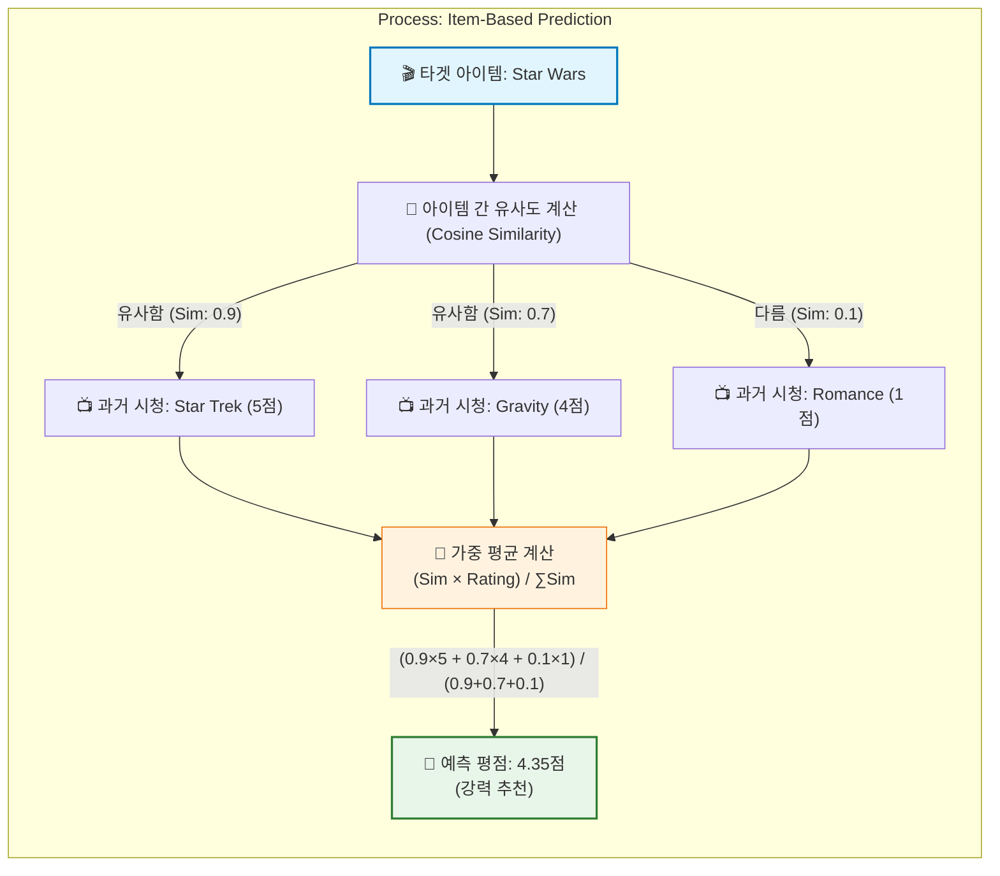

[< 상위 폴더로 이동](README.md)

<strong>전체 탐색 (RecSys 가이드)</strong>

- [홈](../../../README.md)
- [01. 전통적 모델](../../../01_Traditional_Models/README.md)
  - [협업 필터링](../../../01_Traditional_Models/01_Collaborative_Filtering/README.md)
    - [메모리 기반](../../../01_Traditional_Models/01_Collaborative_Filtering/01_Memory_Based/README.md)
    - [모델 기반](../../../01_Traditional_Models/01_Collaborative_Filtering/02_Model_Based/README.md)
  - [콘텐츠 기반 필터링](../../../01_Traditional_Models/02_Content_Based_Filtering/README.md)
- [02. 과도기 및 통계적 모델](../../../02_Machine_Learning_Era/README.md)
- [03. 딥러닝 기반 모델](../../../03_Deep_Learning_Era/README.md)
  - [MLP 기반](../../../03_Deep_Learning_Era/01_MLP_Based/README.md)
  - [순차/세션 기반](../../../03_Deep_Learning_Era/02_Sequence_Session_Based/README.md)
  - [그래프 기반](../../../03_Deep_Learning_Era/03_Graph_Based/README.md)
  - [오토인코더 기반](../../../03_Deep_Learning_Era/04_AutoEncoder_Based/README.md)
- [04. 최신 및 생성형 모델](../../../04_SOTA_GenAI/README.md) - [LLM 기반](../../../04_SOTA_GenAI/01_LLM_Based/README.md) - [멀티모달 추천](../../../04_SOTA_GenAI/02_Multimodal_RS.md) - [생성형 추천](../../../04_SOTA_GenAI/03_Generative_RS.md)

# 아이템 기반 협업 필터링 (Item-based CF)

## 1. 상세 설명 (Detailed Description)

### 정의 (Definition)

**아이템 기반 협업 필터링 (Item-based CF)**은 사용자 대신 **아이템 간의 유사성**을 계산하여 추천하는 알고리즘입니다. "이 아이템을 좋아한 사용자는 저 아이템도 좋아했다"라는 논리에 기반합니다. 아마존(Amazon)이 1998년 "Customers who bought this item also bought..." 기능을 통해 대중화시켰습니다.

### 특징 및 차별점 (vs 사용자 기반)

- **안정성 (Stability)**: 사용자의 취향은 자주 변하지만, 아이템 간의 관계(예: 반지의 제왕 1편과 2편의 관계)는 잘 변하지 않습니다. 따라서 유사도 행렬을 자주 업데이트할 필요가 없습니다.
- **확장성 (Scalability)**: 일반적으로 아이템의 수가 사용자 수보다 훨씬 적은 커머스 환경(Amazon, Netflix 등)에서는 $M \times M$ 행렬이 $N \times N$ 행렬보다 계산하기 쉽습니다.

### 장단점

- **장점**:
  - 대량의 데이터셋에서 사용자 기반 CF보다 성능과 속도가 좋은 경우가 많습니다.
  - 사용자에게 "당신이 '아이템 A'를 좋아해서 '아이템 B'를 추천합니다"라고 설명하기 쉽습니다 (설명 가능성).
- **단점**:
  - 다양성(Serendipity)이 다소 부족할 수 있습니다 (뻔한 추천이 나올 수 있음).
  - 콜드 스타트 문제는 여전히 존재합니다.

---

## 2. 작동 원리 (Operating Principle)

### A. 유사도 계산

타겟 아이템 $i$와 다른 모든 아이템 $j$ 사이의 코사인 유사도를 계산합니다. 이때 벡터는 **사용자들의 평점 벡터**입니다.
$$ \text{sim}(i, j) = \text{Cosine}(\vec{R_i}, \vec{R_j}) $$

- $\vec{R_i}$: 모든 사용자가 아이템 $i$에 매긴 평점 벡터.

### B. 평점 예측

사용자 $u$가 아직 평가하지 않은 아이템 $i$에 대한 평점을 예측할 때, 사용자 $u$가 **이미 평가한** 다른 아이템들($L$)과 아이템 $i$의 유사도를 활용합니다.
$$ \hat{r}_{u,i} = \frac{\sum_{j \in L} \text{sim}(i,j) \cdot r*{u,j}}{\sum*{j \in L} |\text{sim}(i,j)|} $$

- 즉, 내가 과거에 5점을 준 아이템과 아주 비슷한 아이템이라면, 이 아이템도 5점일 확률이 높습니다.

---

## 3. 흐름 예시 (Flow Example)

### 시나리오

사용자 **Alice**는 SF 영화를 좋아합니다. **Star Wars**를 좋아할지 예측해 봅니다.

**Alice의 과거 기록**:

1.  **Star Trek**: 5점
2.  **Gravity**: 4점
3.  **Romance Movie**: 1점

**아이템 간 유사도 (시스템이 미리 계산함)**:

- **Star Wars** <-> **Star Trek**: 0.9 (매우 비슷)
- **Star Wars** <-> **Gravity**: 0.7 (비슷)
- **Star Wars** <-> **Romance Movie**: 0.1 (안 비슷)

### 예측 계산

1.  **Star Trek 기여도**: $0.9 \times 5 = 4.5$
2.  **Gravity 기여도**: $0.7 \times 4 = 2.8$
3.  **Romance Movie 기여도**: $0.1 \times 1 = 0.1$
4.  **가중 평균**:
    $$ \frac{4.5 + 2.8 + 0.1}{0.9 + 0.7 + 0.1} = \frac{7.4}{1.7} \approx 4.35 $$

### 결과

예측 평점 4.35점. **강력 추천!** (이유: 당신이 재미있게 본 Star Trek, Gravity와 비슷하기 때문입니다).

### 시각적 다이어그램 ('Item-based'는 '열'을 봄)

