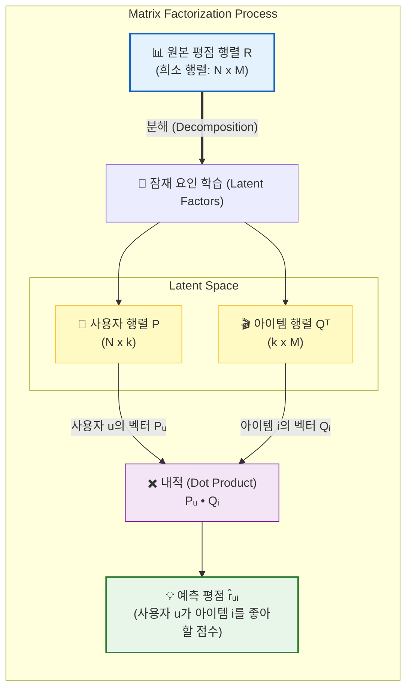

[< 상위 폴더로 이동](README.md)

<strong>전체 탐색 (RecSys 가이드)</strong>

- [홈](../../../README.md)
- [01. 전통적 모델](../../../01_Traditional_Models/README.md)
  - [협업 필터링](../../../01_Traditional_Models/01_Collaborative_Filtering/README.md)
    - [메모리 기반](../../../01_Traditional_Models/01_Collaborative_Filtering/01_Memory_Based/README.md)
    - [모델 기반](../../../01_Traditional_Models/01_Collaborative_Filtering/02_Model_Based/README.md)
  - [콘텐츠 기반 필터링](../../../01_Traditional_Models/02_Content_Based_Filtering/README.md)
- [02. 과도기 및 통계적 모델](../../../02_Machine_Learning_Era/README.md)
- [03. 딥러닝 기반 모델](../../../03_Deep_Learning_Era/README.md)
  - [MLP 기반](../../../03_Deep_Learning_Era/01_MLP_Based/README.md)
  - [순차/세션 기반](../../../03_Deep_Learning_Era/02_Sequence_Session_Based/README.md)
  - [그래프 기반](../../../03_Deep_Learning_Era/03_Graph_Based/README.md)
  - [오토인코더 기반](../../../03_Deep_Learning_Era/04_AutoEncoder_Based/README.md)
- [04. 최신 및 생성형 모델](../../../04_SOTA_GenAI/README.md) - [LLM 기반](../../../04_SOTA_GenAI/01_LLM_Based/README.md) - [멀티모달 추천](../../../04_SOTA_GenAI/02_Multimodal_RS.md) - [생성형 추천](../../../04_SOTA_GenAI/03_Generative_RS.md)

# 행렬 분해 (Matrix Factorization)

## 1. 상세 설명 (Detailed Description)

### 정의 (Definition)

**행렬 분해 (Matrix Factorization, MF)**는 추천 시스템의 가장 유명한 모델 클래스입니다. 거대한 사용자-아이템 평점 행렬 $R$을 두 개의 낮은 차원 행렬인 $P$ (사용자 잠재 행렬)와 $Q^T$ (아이템 잠재 행렬)의 곱으로 근사합니다.
$$ R \approx P \times Q^T $$

### 역사 (History)

- **Netflix Prize (2006-2009)**: Simon Funk가 자신의 블로그에 SVD(Singular Value Decomposition) 기반 접근 방식을 공개하면서 유명해졌습니다. "FunkSVD"로 알려진 이 방식은 엄청난 정확도 향상을 보여주며 대회의 표준이 되었습니다.

### 주요 개념 (Key Concepts)

- **잠재 공간 (Latent Space)**: 사용자와 아이템을 공통된 20~100차원의 공간에 매핑합니다. 이 공간의 축(Axis)들은 명시적이지는 않지만 의미를 가집니다 (예: 축 1은 '코미디 vs 호러', 축 2는 '진지함 vs 가벼움').
- **내적 (Dot Product)**: 사용자가 아이템을 얼마나 좋아할지는 사용자의 취향 벡터와 아이템의 특성 벡터가 얼마나 일치하는지(내적)로 계산됩니다.

---

## 2. 작동 원리 (Operating Principle)

### 수식

사용자 $u$가 아이템 $i$에 줄 평점 $\hat{r}_{ui}$는 다음과 같이 예측됩니다:
$$ \hat{r}_{ui} = p_u \cdot q_i = \sum_{f=1}^{k} p*{u,f} \times q*{i,f} $$
여기서 $k$는 잠재 요인의 개수입니다.

### 최적화 (학습 방법)

우리는 실제 평점 $r_{ui}$와 예측 평점 $\hat{r}_{ui}$의 차이를 최소화하는 $P$와 $Q$를 찾아야 합니다.
$$ \min*{P,Q} \sum*{(u,i) \in \text{Observed}} (r\_{ui} - p_u \cdot q_i)^2 + \lambda(||p_u||^2 + ||q_i||^2) $$

1.  **SGD (Stochastic Gradient Descent)**:
    - 에러를 계산하고 ($e_{ui} = r_{ui} - \hat{r}_{ui}$), 그래디언트의 반대 방향으로 $p_u$와 $q_i$를 조금씩 업데이트합니다.
2.  **ALS (Alternating Least Squares)**:
    - $P$를 고정하고 $Q$를 최적화, 그 다음 $Q$를 고정하고 $P$를 최적화... 이를 반복합니다. 병렬 처리에 유리합니다.

---

## 3. 흐름 예시 (Flow Example)

### 시나리오

$5 \times 5$ 평점 행렬을 차원 $k=2$로 분해합니다.

**사용자**: Alice (액션 영화 애호가)
**아이템**: 'Die Hard' (액션 영화)

### 과정

1.  **학습된 벡터 (가정)**:

    - Alice 벡터 $p_{Alice} = [1.2, -0.4]$ (축1: 액션성향 높음, 축2: 로맨스성향 낮음)
    - Die Hard 벡터 $q_{DieHard} = [1.5, -0.2]$ (축1: 강한 액션, 축2: 로맨스 없음)

2.  **예측 수행**:

    - 요인 1 기여도: $1.2 \times 1.5 = 1.8$
    - 요인 2 기여도: $-0.4 \times -0.2 = 0.08$
    - 합계: $1.8 + 0.08 = 1.88$

3.  **해석**:
    - Alice는 액션을 좋아하고 Die Hard는 액션 영화라 점수가 크게 오름.
    - Alice는 로맨스를 싫어하는데 Die Hard는 로맨스가 없어서(음수 $\times$ 음수 = 양수) 점수가 깎이지 않음.
    - 최종적으로 높은 평점(1.88)을 예측.

### 시각적 다이어그램

