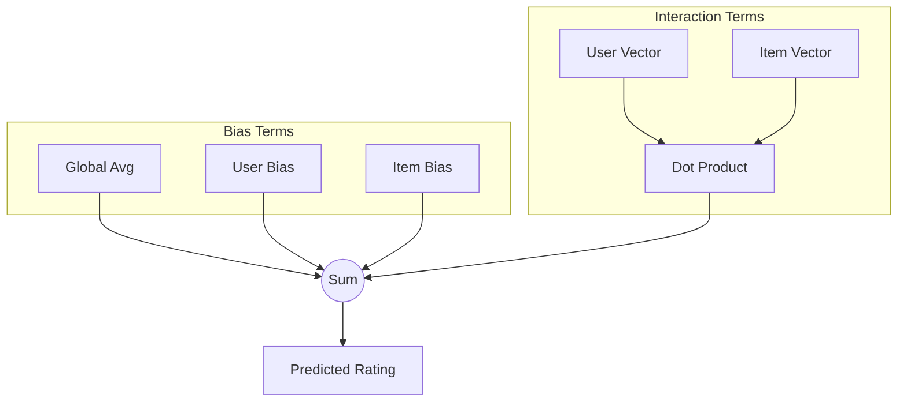

[< 상위 폴더로 이동](README.md)

<strong>전체 탐색 (RecSys 가이드)</strong>

- [홈](../../../README.md)
- [01. 전통적 모델](../../../01_Traditional_Models/README.md)
    - [협업 필터링](../../../01_Traditional_Models/01_Collaborative_Filtering/README.md)
        - [메모리 기반](../../../01_Traditional_Models/01_Collaborative_Filtering/01_Memory_Based/README.md)
        - [모델 기반](../../../01_Traditional_Models/01_Collaborative_Filtering/02_Model_Based/README.md)
    - [콘텐츠 기반 필터링](../../../01_Traditional_Models/02_Content_Based_Filtering/README.md)
- [02. 과도기 및 통계적 모델](../../../02_Machine_Learning_Era/README.md)
- [03. 딥러닝 기반 모델](../../../03_Deep_Learning_Era/README.md)
    - [MLP 기반](../../../03_Deep_Learning_Era/01_MLP_Based/README.md)
    - [순차/세션 기반](../../../03_Deep_Learning_Era/02_Sequence_Session_Based/README.md)
    - [그래프 기반](../../../03_Deep_Learning_Era/03_Graph_Based/README.md)
    - [오토인코더 기반](../../../03_Deep_Learning_Era/04_AutoEncoder_Based/README.md)
- [04. 최신 및 생성형 모델](../../../04_SOTA_GenAI/README.md)
    - [LLM 기반](../../../04_SOTA_GenAI/01_LLM_Based/README.md)
    - [멀티모달 추천](../../../04_SOTA_GenAI/02_Multimodal_RS.md)
    - [생성형 추천](../../../04_SOTA_GenAI/03_Generative_RS.md)

# 잠재 요인 모델 (Latent Factor Models)

## 1. 상세 설명 (Detailed Description)

### 정의 (Definition)

**잠재 요인 모델 (Latent Factor Models)**은 행렬 분해(Matrix Factorization)의 더 일반화된 개념입니다. 단순히 등급 행렬을 분해하는 것을 넘어, 평점 데이터의 변동을 설명하는 숨겨진 변수(잠재 요인)들을 추론하는 모든 통계적 모델링을 포함합니다. 영화 추천의 경우, 이러한 요인들은 '코미디 vs 드라마', '액션 양', '어린이 대상 여부' 등 의미론적 차원이 될 수 있습니다.

### 특징 (Characteristics)

- **편향(Bias) 통합**: 순수한 MF는 사용자의 내재적 성향(어떤 사람은 항상 점수를 후하게 줌)이나 아이템의 대중성(인기 영화는 누구나 점수를 높게 줌)을 무시합니다. 잠재 요인 모델은 이러한 **Bias term**을 명시적으로 추가하여 정확도를 높입니다.
- **차원 축소**: 수만 개의 아이템을 20~100개의 요인으로 압축하여 "정보의 저주"를 피하고 일반화 능력을 얻습니다.

---

## 2. 작동 원리 (Operating Principle)

### 기본 MF와의 차이점 (Adding Biases)

기본적인 $p_u \cdot q_i$ 대신, 편향(Bias)을 추가합니다:
$$ \hat{r}\_{ui} = \mu + b_u + b_i + p_u \cdot q_i $$

- $\mu$: 전체 평균 평점 (Global Average).
- $b_u$: 사용자 $u$의 편향 (평균보다 얼마나 점수를 더/덜 주는지).
- $b_i$: 아이템 $i$의 편향 (평균보다 얼마나 더/덜 인기가 있는지).
- $p_u \cdot q_i$: 사용자 $u$와 아이템 $i$의 상호작용 (취향 매칭).

### 해석 (Intuition)

Alice가 Titanic을 평가한다고 가정해 봅시다.

- 모든 영화의 평균은 3.5점 ($\mu = 3.5$).
- Titanic은 명작이라 보통 0.5점 더 받음 ($b_i = 0.5$).
- Alice는 비평가라 보통 0.3점 덜 줌 ($b_u = -0.3$).
- Alice는 로맨스를 좋아하고 Titanic은 로맨스 영화임 (매칭 점수 $1.0$).
- 예측: $3.5 + 0.5 - 0.3 + 1.0 = 4.7$.

---

## 3. 흐름 예시 (Flow Example)

### 시나리오

**아이템**: 영화 "Inception"
**사용자**: Bob

### 파라미터 학습된 상태

1.  **Global ($\mu$)**: 3.0
2.  **Item Bias ($b_{incep}$)**: +0.8 (매우 인기 있음)
3.  **User Bias ($b_{bob}$)**: -0.2 (약간 까다로움)
4.  **Interaction (Latent)**:
    - Bob의 취향 벡터: `[복잡한 스토리 선호: 0.9, SF 선호: 0.8]`
    - Inception 특성 벡터: `[복잡성: 0.9, SF: 0.9]`
    - 내적: $(0.9 \times 0.9) + (0.8 \times 0.9) = 0.81 + 0.72 = 1.53$

### 예측

1.  **Base Prediction**: $3.0 + 0.8 - 0.2 = 3.6$ (취향 고려 안 했을 때의 기본 점수).
2.  **Final Prediction**: $3.6 + 1.53 = 5.13$.
3.  **Clamping**: 평점은 최대 5점이므로, **5.0**으로 예측.

### 시각적 다이어그램

