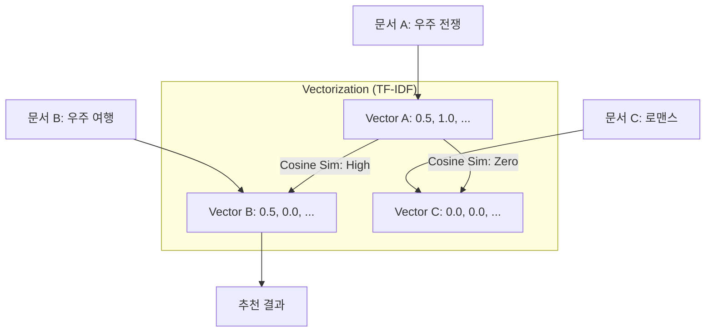

[< 상위 폴더로 이동](README.md)

<strong>전체 탐색 (RecSys 가이드)</strong>

- [홈](../../README.md)
- [01. 전통적 모델](../../01_Traditional_Models/README.md)
  - [협업 필터링](../../01_Traditional_Models/01_Collaborative_Filtering/README.md)
    - [메모리 기반](../../01_Traditional_Models/01_Collaborative_Filtering/01_Memory_Based/README.md)
    - [모델 기반](../../01_Traditional_Models/01_Collaborative_Filtering/02_Model_Based/README.md)
  - [콘텐츠 기반 필터링](../../01_Traditional_Models/02_Content_Based_Filtering/README.md)
- [02. 과도기 및 통계적 모델](../../02_Machine_Learning_Era/README.md)
- [03. 딥러닝 기반 모델](../../03_Deep_Learning_Era/README.md)
  - [MLP 기반](../../03_Deep_Learning_Era/01_MLP_Based/README.md)
  - [순차/세션 기반](../../03_Deep_Learning_Era/02_Sequence_Session_Based/README.md)
  - [그래프 기반](../../03_Deep_Learning_Era/03_Graph_Based/README.md)
  - [오토인코더 기반](../../03_Deep_Learning_Era/04_AutoEncoder_Based/README.md)
- [04. 최신 및 생성형 모델](../../04_SOTA_GenAI/README.md) - [LLM 기반](../../04_SOTA_GenAI/01_LLM_Based/README.md) - [멀티모달 추천](../../04_SOTA_GenAI/02_Multimodal_RS.md) - [생성형 추천](../../04_SOTA_GenAI/03_Generative_RS.md)

# TF-IDF & 코사인 유사도 (TF-IDF & Cosine Similarity)

## 1. 상세 설명 (Detailed Description)

### 정의 (Definition)

**TF-IDF (Term Frequency - Inverse Document Frequency)**는 문서를 벡터로 변환하는 통계적 기법입니다 (임베딩의 고전적인 형태). 추천 시스템에서는 아이템을 설명하는 텍스트(예: 줄거리, 태그)를 벡터로 변환한 후, **코사인 유사도**를 사용하여 아이템 간의 거리를 측정하는 데 사용됩니다.

### 사용 사례가 적합한 곳

- **뉴스 추천**: "정치", "선거"라는 단어가 포함된 기사를 읽은 사용자에게 비슷한 키워드의 기사를 추천.
- **블로그/논문 추천**: 텍스트 내용이 풍부한 도메인.

### 주요 특징

- **중요도 가중치**: 단순히 단어의 빈도만 세는 것이 아니라(TF), 모든 문서에 흔하게 등장하는 단어(예: "the", "a", "영화")의 가중치를 낮춥니다(IDF).
- **설명 가능성**: "이 영화는 '우주', '전쟁'이라는 키워드가 겹쳐서 추천되었습니다"라고 설명하기 쉽습니다.
- **장점**:
  - 구현이 매우 간단합니다.
  - 도메인 지식이 필요하지 않습니다 (텍스트만 있으면 됨).
- **단점**:
  - **동의어/다의어 문제**: 'Car'와 'Automobile'을 다른 단어로 인식합니다 (의미론적 이해 부족). 이는 나중에 Word2Vec이나 BERT로 해결됩니다.

---

## 2. 작동 원리 (Operating Principle)

### A. TF-IDF 계산

1.  **TF (Term Frequency)**: 특정 문서 $d$에 단어 $t$가 등장한 횟수. (이 문서에서 얼마나 중요한가?)
2.  **IDF (Inverse Document Frequency)**: 전체 문서군 $D$에서 단어 $t$가 등장한 비율의 역수. (얼마나 희귀한 단어인가?)
    $$ \text{IDF}(t) = \log \frac{|D|}{|\{d \in D : t \in d\}|} $$
3.  **TF-IDF**:
    $$ \text{Weight}\_{t,d} = \text{TF}(t,d) \times \text{IDF}(t) $$

### B. 코사인 유사도 (Cosine Similarity)

두 아이템 벡터 $\vec{A}$와 $\vec{B}$ 사이의 각도를 측정합니다.
$$ \text{Sim}(A, B) = \cos(\theta) = \frac{\vec{A} \cdot \vec{B}}{||\vec{A}|| \cdot ||\vec{B}||} $$

- 값이 1이면 완전히 똑같은 방향(매우 유사).
- 값이 0이면 직각(관련 없음).

---

## 3. 흐름 예시 (Flow Example)

### 시나리오: 영화 줄거리 기반 추천

**영화 A**: "우주 전쟁과 광선검"
**영화 B**: "우주 여행과 외계인"
**영화 C**: "달콤한 로맨스"

### 단계별 프로세스

1.  **단어 사전**: [우주, 전쟁, 광선검, 여행, 외계인, 로맨스]

2.  **TF 벡터 생성** (단순화):

    - A: [1, 1, 1, 0, 0, 0] ("우주", "전쟁", "광선검")
    - B: [1, 0, 0, 1, 1, 0] ("우주", "여행", "외계인")
    - C: [0, 0, 0, 0, 0, 1] ("로맨스")

3.  **IDF 가중치 반영**:

    - "우주"는 A와 B에 모두 나오므로 흔한 단어 -> 가중치 감소 (예: 0.5)
    - "광선검", "외계인", "로맨스"는 희귀 -> 가중치 높음 (예: 1.0)
    - 벡터 A': [0.5, 1.0, 1.0, 0, 0, 0]
    - 벡터 B': [0.5, 0, 0, 1.0, 1.0, 0]

4.  **유사도 계산 (A와 B)**:
    - 내적: $(0.5 \times 0.5) + (1 \times 0) ... = 0.25$
    - 비교: A와 C의 내적은 0.
    - 결과: 영화 A를 본 사람에게 영화 B를 추천합니다.

### 시각적 다이어그램

