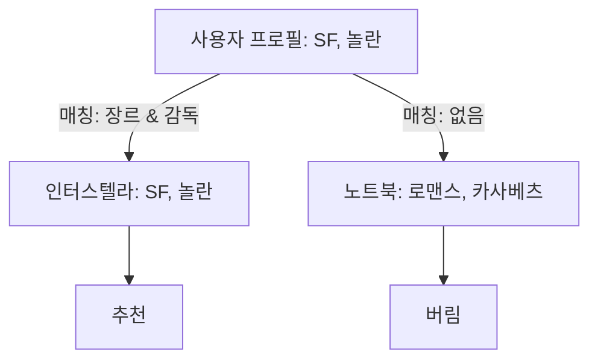

[< 상위 폴더로 이동](README.md)

<strong>전체 탐색 (RecSys 가이드)</strong>

- [홈](../../README.md)
- [01. 전통적 모델](../../01_Traditional_Models/README.md)
  - [협업 필터링](../../01_Traditional_Models/01_Collaborative_Filtering/README.md)
    - [메모리 기반](../../01_Traditional_Models/01_Collaborative_Filtering/01_Memory_Based/README.md)
    - [모델 기반](../../01_Traditional_Models/01_Collaborative_Filtering/02_Model_Based/README.md)
  - [콘텐츠 기반 필터링](../../01_Traditional_Models/02_Content_Based_Filtering/README.md)
- [02. 과도기 및 통계적 모델](../../02_Machine_Learning_Era/README.md)
- [03. 딥러닝 기반 모델](../../03_Deep_Learning_Era/README.md)
  - [MLP 기반](../../03_Deep_Learning_Era/01_MLP_Based/README.md)
  - [순차/세션 기반](../../03_Deep_Learning_Era/02_Sequence_Session_Based/README.md)
  - [그래프 기반](../../03_Deep_Learning_Era/03_Graph_Based/README.md)
  - [오토인코더 기반](../../03_Deep_Learning_Era/04_AutoEncoder_Based/README.md)
- [04. 최신 및 생성형 모델](../../04_SOTA_GenAI/README.md) - [LLM 기반](../../04_SOTA_GenAI/01_LLM_Based/README.md) - [멀티모달 추천](../../04_SOTA_GenAI/02_Multimodal_RS.md) - [생성형 추천](../../04_SOTA_GenAI/03_Generative_RS.md)

# 프로필 기반 매칭 (Profile-based Matching)

## 1. 상세 설명 (Detailed Description)

### 정의 (Definition)

**프로필 기반 매칭 (Profile-based Matching)**은 사용자와 아이템 모두에 대해 명시적인 "프로필"(구조화된 기록)을 생성하고, 특정 속성에 대한 규칙이나 유사도 메트릭을 기반으로 매칭하는 방식입니다. TF-IDF와 달리 비정형 텍스트보다는 **구조화된 데이터 (Structured Data)**(범주형, 수치형)를 주로 활용합니다.

### 사용 사례

- **데이팅 앱**: 사용자 {나이: 25, 위치: 서울}와 사용자 {나이: 24-26, 위치: 서울} 매칭.
- **구직 추천**: 이력서 {기술: Python, 경력: 3년}와 채용 공고 {요구: Python, 최소경력: 2년} 매칭.
- **콜드 스타트**: 상호작용 기록은 없지만 명시적인 사용자 데이터(예: 가입 설문조사)가 있을 때 매우 효과적입니다.

### 주요 특징

- **명시성 (Explicit)**: 데이터가 의미를 가진다고 가정합니다 (예: "장르=액션"은 확실한 사실).
- **필터 버블**: 너무 경직될 수 있습니다. 이상적으로는 CF와 결합하여 사용해야 합니다.
- **장점**:
  - 투명성: 매칭된 이유를 정확히 알 수 있습니다 ("둘 다 영어를 할 수 있어서").
  - "New Item" 문제 없음: 아이템이 속성과 함께 등록되자마자 추천 가능합니다.
- **단점**:
  - **피처 엔지니어링**: 고품질의 구조화된 메타데이터가 필요합니다.
  - **발견의 한계**: 숨겨진 패턴을 찾을 수 없습니다.

---

## 2. 작동 원리 (Operating Principle)

### A. 프로필 구축 (Profile Construction)

1.  **아이템 프로필**: {장르: [액션, SF], 연도: 2020, 배우: [Tom Cruise]}.
2.  **사용자 프로필**: {선호 장르: [액션], 선호 연도: >2000}.

### B. 매칭 알고리즘 (Matching Algorithms)

1.  **정확/규칙 기반 매칭 (Exact/Rule-based)**:
    - `IF (Item.Genre IN User.Preferred) AND (Item.Year > 2000) THEN Recommend`.
2.  **가중 속성 유사도 (Weighted Attribute Similarity)**:
    - 각 속성 필드별로 유사도를 계산하고 합산합니다.
      $$ \text{Score}(u, i) = w*1 \cdot \text{Sim}*{\text{genre}}(u, i) + w*2 \cdot \text{Sim}*{\text{year}}(u, i) + ... $$
    - **자카드 유사도 (Jaccard Similarity)** (집합 비교용):
      $$ J(A, B) = \frac{|A \cap B|}{|A \cup B|} $$
      (태그나 장르 집합을 비교할 때 사용).

---

## 3. 흐름 예시 (Flow Example)

### 시나리오: 영화 추천

**사용자 프로필**:

- **장르**: {SF, 스릴러}
- **감독**: {크리스토퍼 놀란}

**후보군**:

1.  **인터스텔라**: {SF, 모험}, {크리스토퍼 놀란}
2.  **노트북**: {로맨스, 드라마}, {닉 카사베츠}
3.  **인셉션**: {SF, 액션}, {크리스토퍼 놀란}

### 매칭 프로세스 (자카드 + 불리언)

1.  **후보 1 (인터스텔라) 확인**:

    - 장르 겹침 (자카드): {SF} / {SF, 스릴러, 모험} = 1/3 = 0.33
    - 감독 일치: 예 (1.0)
    - 점수: $0.33 + 1.0 = 1.33$

2.  **후보 2 (노트북) 확인**:

    - 장르 겹침: 0
    - 감독 일치: 아니오
    - 점수: 0

3.  **후보 3 (인셉션) 확인**:
    - 장르 겹침: {SF} / {SF, 스릴러, 액션} = 1/3 = 0.33
    - 감독 일치: 예 (1.0)
    - 점수: 1.33

### 결과

**인터스텔라**와 **인셉션**을 추천합니다.

### 시각적 다이어그램

