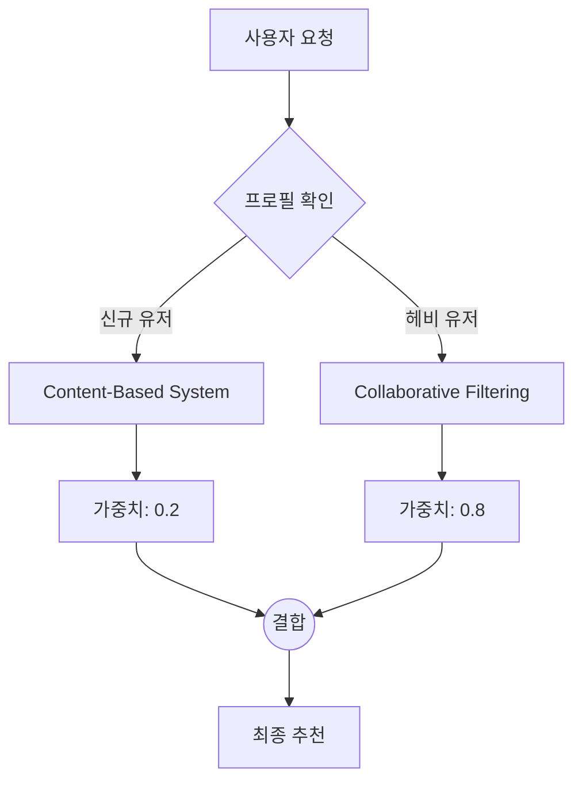

[< 상위 폴더로 이동](README.md)

<strong>전체 탐색 (RecSys 가이드)</strong>

- [홈](../README.md)
- [01. 전통적 모델](../01_Traditional_Models/README.md)
  - [협업 필터링](../01_Traditional_Models/01_Collaborative_Filtering/README.md)
    - [메모리 기반](../01_Traditional_Models/01_Collaborative_Filtering/01_Memory_Based/README.md)
    - [모델 기반](../01_Traditional_Models/01_Collaborative_Filtering/02_Model_Based/README.md)
  - [콘텐츠 기반 필터링](../01_Traditional_Models/02_Content_Based_Filtering/README.md)
- [02. 과도기 및 통계적 모델](../02_Machine_Learning_Era/README.md)
- [03. 딥러닝 기반 모델](../03_Deep_Learning_Era/README.md)
  - [MLP 기반](../03_Deep_Learning_Era/01_MLP_Based/README.md)
  - [순차/세션 기반](../03_Deep_Learning_Era/02_Sequence_Session_Based/README.md)
  - [그래프 기반](../03_Deep_Learning_Era/03_Graph_Based/README.md)
  - [오토인코더 기반](../03_Deep_Learning_Era/04_AutoEncoder_Based/README.md)
- [04. 최신 및 생성형 모델](../04_SOTA_GenAI/README.md) - [LLM 기반](../04_SOTA_GenAI/01_LLM_Based/README.md) - [멀티모달 추천](../04_SOTA_GenAI/02_Multimodal_RS.md) - [생성형 추천](../04_SOTA_GenAI/03_Generative_RS.md)

# 하이브리드 모델 (Hybrid Models)

## 1. 상세 설명 (Detailed Description)

### 정의 (Definition)

**하이브리드 모델 (Hybrid Models)**은 두 개 이상의 추천 기술(예: 협업 필터링 + 콘텐츠 기반 필터링)을 결합하여 각각의 강점을 살리고 약점을 상쇄하는 방식입니다.

### 왜 하이브리드인가? (Why Hybrid?)

- **협업 필터링 (CF)**은 뜻밖의 발견(Serendipity)에 좋지만, 새로운 사용자(**Cold Start**)나 희소성 문제에 취약합니다.
- **콘텐츠 기반 (CB)**은 새로운 아이템을 잘 다루지만, 다양성이 부족("지나친 전문화")할 수 있습니다.
- **하이브리드**: 신규 사용자/아이템에는 CB를 사용하다가, 데이터가 쌓이면 CF로 전환하는 등 유연하게 대처합니다.

### 역사 (History)

상업 시스템(Netflix, Amazon)이 성숙해짐에 따라 단일 알고리즘으로는 충분하지 않다는 것을 깨달았습니다. 넷플릭스 프라이즈(Netflix Prize)의 우승 알고리즘은 100개가 넘는 서로 다른 모델들의 거대한 앙상블(하이브리드)이었습니다.

---

## 2. 작동 원리 (Operating Principle)

Burke (2002)는 하이브리드 전략을 다음과 같이 분류했습니다:

### A. 가중 하이브리드 (Weighted Hybrid)

여러 추천 시스템의 점수를 계산한 뒤 가중 평균을 냅니다.
$$ \text{Score}_{\text{final}} = \alpha \cdot \text{Score}_{\text{CF}} + (1-\alpha) \cdot \text{Score}\_{\text{CB}} $$

- $\alpha$는 학습되거나 수동으로 조정될 수 있습니다.

### B. 스위칭 하이브리드 (Switching Hybrid)

상황에 따라 하나의 추천 시스템을 선택합니다.

- **규칙**: `IF user.ratings_count < 5 THEN use Content-Based ELSE use CF`.

### C. 계단식 하이브리드 (Cascade Hybrid - 정제)

한 추천 시스템이 다른 추천 시스템의 후보를 정제합니다.

- **1단계**: 콘텐츠 기반으로 100개의 "액션 영화"를 필터링(Coarse).
- **2단계**: CF를 사용하여 그 100개 영화 내에서 사용자에게 맞게 순위를 매김(Fine).

### D. 특징 결합 (Feature Augmentation)

- 한 모델의 출력을 다른 모델의 *특징(Feature)*으로 사용합니다.
- 예: 사용자 기반 CF로 평점을 예측한 뒤, 그 예측 평점을 콘텐츠 기반 모델의 입력 변수로 사용.

---

## 3. 흐름 예시 (Flow Example)

### 시나리오: "스위칭 + 가중" 전략을 사용하는 영화 사이트

- **사용자 A**: 완전 신규 가입자.
- **사용자 B**: 헤비 유저 (평점 500개).

### 프로세스

1.  **사용자 A 입장**:

    - 시스템이 프로필 확인: 평점 = 0개.
    - **동작 (스위칭)**: "인기 순위 / 콘텐츠 기반"으로 전환.
    - **결과**: "탑 10 블록버스터" 노출.

2.  **사용자 A가 영화 3개 평가**:

    - 이제 평점 = 3개. 여전히 CF 돌리기엔 부족.
    - **동작**: 가중 하이브리드 ($\alpha = 0.2$ for CF).
    - 점수 = $0.2 \times \text{CF}(x) + 0.8 \times \text{Content}(x)$.

3.  **사용자 B 입장**:
    - 시스템이 프로필 확인: 평점 = 500개.
    - **동작**: 가중 하이브리드 ($\alpha = 0.9$ for CF).
    - **결과**: 고도로 개인화되고 의외성 있는(Serendipitous) 추천 제공.

### 시각적 다이어그램

