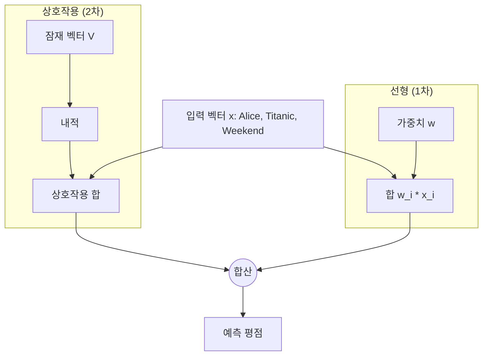

[< 상위 폴더로 이동](README.md)

<strong>전체 탐색 (RecSys 가이드)</strong>

- [홈](../../README.md)
- [01. 전통적 모델](../../01_Traditional_Models/README.md)
    - [협업 필터링](../../01_Traditional_Models/01_Collaborative_Filtering/README.md)
        - [메모리 기반](../../01_Traditional_Models/01_Collaborative_Filtering/01_Memory_Based/README.md)
        - [모델 기반](../../01_Traditional_Models/01_Collaborative_Filtering/02_Model_Based/README.md)
    - [콘텐츠 기반 필터링](../../01_Traditional_Models/02_Content_Based_Filtering/README.md)
- [02. 과도기 및 통계적 모델](../../02_Machine_Learning_Era/README.md)
- [03. 딥러닝 기반 모델](../../03_Deep_Learning_Era/README.md)
    - [MLP 기반](../../03_Deep_Learning_Era/01_MLP_Based/README.md)
    - [순차/세션 기반](../../03_Deep_Learning_Era/02_Sequence_Session_Based/README.md)
    - [그래프 기반](../../03_Deep_Learning_Era/03_Graph_Based/README.md)
    - [오토인코더 기반](../../03_Deep_Learning_Era/04_AutoEncoder_Based/README.md)
- [04. 최신 및 생성형 모델](../../04_SOTA_GenAI/README.md)
    - [LLM 기반](../../04_SOTA_GenAI/01_LLM_Based/README.md)
    - [멀티모달 추천](../../04_SOTA_GenAI/02_Multimodal_RS.md)
    - [생성형 추천](../../04_SOTA_GenAI/03_Generative_RS.md)

# 요인화 기계 (Factorization Machines, FM)

## 1. 상세 설명 (Detailed Description)

### 정의 (Definition)

**Factorization Machines (FM)**은 2010년 Steffen Rendle이 제안한 범용 지도 학습 알고리즘으로, 서포트 벡터 머신(SVM)의 장점과 요인화 모델(Factorization Models)의 장점을 결합했습니다. 행렬 분해(MF)와 유사하지만, 실수(Real-valued) 특징 벡터를 입력으로 받을 수 있어 "보조 정보"(맥락, 시간, 다양한 사용자 속성)를 통합하는 데 최적화되어 있습니다.

### 해결하고자 하는 문제 (The Problem it Solves)

- **SVM**: 희소 데이터에서 실패합니다. 특징 $x_i$와 $x_j$의 상호작용 가중치 $w_{ij}$를 직접 학습하려 $w_{ij} x_i x_j$ 항을 사용하는데, 학습 데이터에 $x_i$와 $x_j$가 동시에 등장한 적이 없으면 $w_{ij}$는 0이 되어버립니다.
- **MF**: 사용자와 아이템 ID만 처리할 수 있습니다.
- **FM**: 상호작용 가중치 $w_{ij}$를 두 벡터의 내적 $\langle v_i, v_j \rangle$로 모델링하여 희소성 문제를 해결합니다. $x_i$와 $x_j$가 같이 등장한 적이 없더라도, $x_i$가 $x_k$와 함께, $x_j$가 $x_k$와 함께 등장했다면, $v_i$와 $v_j$가 학습되어 $i-j$ 상호작용을 예측할 수 있습니다.

### 주요 특징 (Key Characteristics)

- **범용성**: 회귀(Regression), 분류(Classification), 랭킹(Ranking) 모두에 사용 가능합니다.
- **속도**: 학습 및 예측 시간이 선형적입니다 ($O(k \cdot n)$).
- **장점**:
  - 극도희 희소한 데이터(Extreme Sparsity)를 잘 다룹니다.
  - 어떤 보조 특징(Context-aware)이든 추가할 수 있습니다.
- **단점**:
  - 잠재 차원 $k$를 미리 정해야 합니다.

---

## 2. 작동 원리 (Operating Principle)

### 모델 수식 (Degree = 2)

특징 벡터 $x \in \mathbb{R}^n$에 대해, 예측값 $\hat{y}$는 다음과 같습니다:

$$ \hat{y}(x) = w*0 + \sum*{i=1}^n w*i x_i + \sum*{i=1}^n \sum\_{j=i+1}^n \langle v_i, v_j \rangle x_i x_j $$

- **글로벌 편향 ($w_0$)**: 전체 평균 베이스라인.
- **선형 항 ($\sum w_i x_i$)**: 각 특징의 독립적인 영향 (예: "이 사용자는 점수를 후하게 주는 편이다").
- **상호작용 항 ($\sum \langle v_i, v_j \rangle x_i x_j$)**: 쌍(Pairwise) 상호작용.
  - 거대한 $n \times n$ 행렬 $W$ 대신, $n \times k$ 행렬 $V$를 사용합니다.
  - $\langle v_i, v_j \rangle$가 $w_{ij}$를 대체합니다.

### 최적화 (Optimization)

- **SGD**, **ALS**, **MCMC** 등을 사용하여 최적화할 수 있습니다.
- 상호작용 항은 다음의 수식을 이용해 $O(kn)$ 선형 시간 내에 계산할 수 있습니다:
  $$ \sum*{i=1}^n \sum*{j=i+1}^n \langle v*i, v_j \rangle x_i x_j = \frac{1}{2} \sum*{f=1}^k \left( \left( \sum*{i=1}^n v*{i,f} x*i \right)^2 - \sum*{i=1}^n v\_{i,f}^2 x_i^2 \right) $$

---

## 3. 흐름 예시 (Flow Example)

### 시나리오: 맥락을 고려한 영화 평점

데이터: **User=Alice**, **Movie=Titanic**, **Time=Weekend**.
입력 벡터 (One-hot):
$x = [\underbrace{1}_{\text{Alice}}, 0, ..., \underbrace{1}_{\text{Titanic}}, 0, ..., \underbrace{1}_{\text{Weekend}}]$

### 계산 과정

1.  **선형 부분 (Linear Part)**:
    $w_{Alice} + w_{Titanic} + w_{Weekend}$
    (예: Alice는 관대함 +0.2, Titanic은 인기작 +0.5, 주말엔 기분 좋음 +0.1).

2.  **상호작용 부분 (Interaction Part)**:

    - **Alice-Titanic**: $\langle v_{Alice}, v_{Titanic} \rangle$. Alice가 이런 *유형*의 영화를 좋아하는가?
    - **Alice-Weekend**: $\langle v_{Alice}, v_{Weekend} \rangle$. Alice는 주말에 영화를 자주 보는가?
    - **Titanic-Weekend**: $\langle v_{Titanic}, v_{Weekend} \rangle$. Titanic은 주말용 영화인가?

3.  **합계 (Sum)**:
    총점 = 선형 합 + 상호작용 합.
    만약 Alice가 Titanic을 좋아하고(높은 상호작용), 주말에 영화 보는 것을 좋아한다면(높은 상호작용), 점수는 매우 높아집니다.

### 시각적 다이어그램

