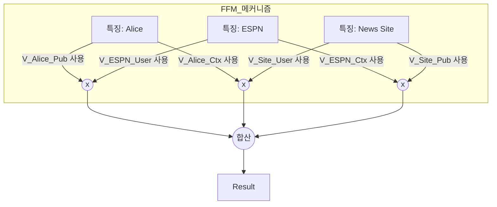

[< 상위 폴더로 이동](README.md)

<strong>전체 탐색 (RecSys 가이드)</strong>

- [홈](../../README.md)
- [01. 전통적 모델](../../01_Traditional_Models/README.md)
    - [협업 필터링](../../01_Traditional_Models/01_Collaborative_Filtering/README.md)
        - [메모리 기반](../../01_Traditional_Models/01_Collaborative_Filtering/01_Memory_Based/README.md)
        - [모델 기반](../../01_Traditional_Models/01_Collaborative_Filtering/02_Model_Based/README.md)
    - [콘텐츠 기반 필터링](../../01_Traditional_Models/02_Content_Based_Filtering/README.md)
- [02. 과도기 및 통계적 모델](../../02_Machine_Learning_Era/README.md)
- [03. 딥러닝 기반 모델](../../03_Deep_Learning_Era/README.md)
    - [MLP 기반](../../03_Deep_Learning_Era/01_MLP_Based/README.md)
    - [순차/세션 기반](../../03_Deep_Learning_Era/02_Sequence_Session_Based/README.md)
    - [그래프 기반](../../03_Deep_Learning_Era/03_Graph_Based/README.md)
    - [오토인코더 기반](../../03_Deep_Learning_Era/04_AutoEncoder_Based/README.md)
- [04. 최신 및 생성형 모델](../../04_SOTA_GenAI/README.md)
    - [LLM 기반](../../04_SOTA_GenAI/01_LLM_Based/README.md)
    - [멀티모달 추천](../../04_SOTA_GenAI/02_Multimodal_RS.md)
    - [생성형 추천](../../04_SOTA_GenAI/03_Generative_RS.md)

# 필드 인식 요인화 기계 (Field-aware Factorization Machines, FFM)

## 1. 상세 설명 (Detailed Description)

### 정의 (Definition)

**FFM (Field-aware Factorization Machines)**은 FM의 변형으로, 주로 클릭률(CTR) 예측에 사용됩니다. **필드(Field)**라는 개념을 도입했습니다. FM은 각 특징 $x_i$에 대해 하나의 잠재 벡터 $v_i$를 학습하지만, FFM은 $x_i$가 상호작용하는 상대 필드 $f_j$마다 서로 다른 잠재 벡터 $v_{i,f_j}$를 학습합니다.

### 역사 (History)

- **우승 솔루션**: Criteo, Avazu 등 Kaggle의 주요 CTR 예측 대회에서 우승하며 유명해졌습니다.
- **개선점**: FM에서는 사용자가 '영화'와 상호작용할 때나 '장르'와 상호작용할 때나 똑같은 사용자 벡터를 씁니다. FFM에서는 사용자가 '영화-상호작용용 페르소나'와 '장르-상호작용용 페르소나'를 따로 가집니다.

### 주요 특징 (Key Characteristics)

- **복잡도**: $O(kn^2)$ (FM의 선형 시간보다 비쌉니다).
- **정밀함**: 특징 간 상호작용의 미세한 뉘앙스를 더 잘 포착합니다.
- **장점**:
  - 딥러닝이 대중화되기 전까지 정형 데이터(Tabular Data)의 SOTA 모델이었습니다.
- **단점**:
  - 메모리 사용량이 높습니다 ($n \times f \times k$ 개의 파라미터 저장 필요).
  - 학습 속도가 느립니다.

---

## 2. 작동 원리 (Operating Principle)

### 필드 개념 (The Field Concept)

특징들은 필드로 그룹화됩니다.

- **사용자 필드**: {User=Alice, User=Bob}
- **영화 필드**: {Movie=Titanic, Movie=Avatar}
- **장르 필드**: {Genre=Drama, Genre=Action}

### 모델 수식

$$ \hat{y}(x) = w*0 + \sum*{i=1}^n w*i x_i + \sum*{i=1}^n \sum*{j=i+1}^n \langle v*{i, f*j}, v*{j, f_i} \rangle x_i x_j $$

- $f_i$: 특징 $i$가 속한 필드.
- $f_j$: 특징 $j$가 속한 필드.
- $v_{i, f_j}$: 특징 $i$가 필드 $f_j$와 상호작용하기 위해 학습된 잠재 벡터.

### FM과의 비교

- **FM**: $\langle v_i, v_j \rangle$. (Alice는 하나의 일반적인 벡터만 사용).
- **FFM**: $\langle v_{i, \text{Movie}}, v_{j, \text{User}} \rangle$. (Alice는 "영화-상호작용" 벡터를, Titanic은 "사용자-상호작용" 벡터를 사용).

---

## 3. 흐름 예시 (Flow Example)

### 시나리오

**Alice**가 **뉴스 사이트**에서 **ESPN** 광고를 클릭할지 예측합니다.

**필드 (Fields)**:

1.  **User**: Alice
2.  **Publisher**: ESPN
3.  **Context**: News Site

### 상호작용 (Interactions)

1.  **User x Publisher (Alice x ESPN)**:

    - Alice는 $v_{\text{Alice}, \text{Publisher}}$를 사용.
    - ESPN은 $v_{\text{ESPN}, \text{User}}$를 사용.
    - 의미: "Alice는 ESPN 같은 퍼블리셔를 얼마나 좋아하는가?"

2.  **User x Context (Alice x News Site)**:

    - Alice는 $v_{\text{Alice}, \text{Context}}$를 사용.
    - News Site는 $v_{\text{News}, \text{User}}$를 사용.
    - 의미: "Alice는 뉴스 사이트에서 광고를 클릭하는 편인가?" (다른 곳에선 클릭해도 뉴스에선 안 할 수 있음).
    - _참고: FM이라면 Alice는 위 두 경우에 똑같은 벡터를 써서 신호가 섞일 수 있음._

3.  **Publisher x Context (ESPN x News Site)**:
    - ESPN은 $v_{\text{ESPN}, \text{Context}}$를 사용.
    - News Site는 $v_{\text{News}, \text{Publisher}}$를 사용.
    - 의미: "ESPN 광고가 뉴스 사이트와 잘 어울리는가?"

### 시각적 다이어그램

