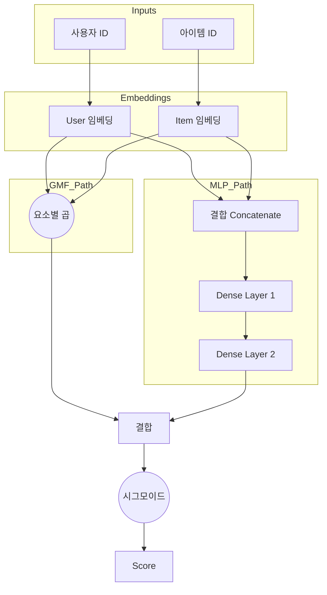

[< 상위 폴더로 이동](README.md)

<strong>전체 탐색 (RecSys 가이드)</strong>

- [홈](../../README.md)
- [01. 전통적 모델](../../01_Traditional_Models/README.md)
    - [협업 필터링](../../01_Traditional_Models/01_Collaborative_Filtering/README.md)
        - [메모리 기반](../../01_Traditional_Models/01_Collaborative_Filtering/01_Memory_Based/README.md)
        - [모델 기반](../../01_Traditional_Models/01_Collaborative_Filtering/02_Model_Based/README.md)
    - [콘텐츠 기반 필터링](../../01_Traditional_Models/02_Content_Based_Filtering/README.md)
- [02. 과도기 및 통계적 모델](../../02_Machine_Learning_Era/README.md)
- [03. 딥러닝 기반 모델](../../03_Deep_Learning_Era/README.md)
    - [MLP 기반](../../03_Deep_Learning_Era/01_MLP_Based/README.md)
    - [순차/세션 기반](../../03_Deep_Learning_Era/02_Sequence_Session_Based/README.md)
    - [그래프 기반](../../03_Deep_Learning_Era/03_Graph_Based/README.md)
    - [오토인코더 기반](../../03_Deep_Learning_Era/04_AutoEncoder_Based/README.md)
- [04. 최신 및 생성형 모델](../../04_SOTA_GenAI/README.md)
    - [LLM 기반](../../04_SOTA_GenAI/01_LLM_Based/README.md)
    - [멀티모달 추천](../../04_SOTA_GenAI/02_Multimodal_RS.md)
    - [생성형 추천](../../04_SOTA_GenAI/03_Generative_RS.md)

# 신경망 협업 필터링 (Neural Collaborative Filtering, NCF)

## 1. 상세 설명 (Detailed Description)

### 정의 (Definition)

**NCF**는 사용자-아이템 상호작용을 모델링하기 위해 신경망을 활용하는 프레임워크입니다. 행렬 분해(Matrix Factorization)의 고정된 '내적(Dot Product)' 연산을 학습 가능한 비선형 함수(다층 퍼셉트론, MLP)로 대체하여, 내적만으로는 포착하기 어려운 복잡한 관계를 모델링합니다.

### 역사 (History)

- **논문**: "Neural Collaborative Filtering" (He et al., WWW 2017).
- **영향**: 추천 시스템 연구의 흐름을 행렬 분해에서 딥러닝으로 확실하게 이동시킨 기념비적인 모델입니다.

### 주요 특징 (Key Characteristics)

- **비선형성 (Non-linearity)**: 복잡한 상호작용 함수를 모델링할 수 있습니다.
- **일반화 (Generalization)**: MF를 일반화한 형태입니다. 활성화 함수를 선형으로, 가중치를 특정 값으로 설정하면 NCF는 MF와 같아집니다.
- **장점**:
  - 표현력(Expression power)이 높습니다.
  - 구조가 유연하여 레이어를 추가하거나 Dropout 등을 적용하기 쉽습니다.
- **단점**:
  - 최적화 지형(Optimization landscape)이 Non-convex하여 MF보다 학습이 까다로울 수 있습니다.
  - 최근 연구("Are We Really Making Much Progress?")에서 잘 튜닝된 단순 MF가 복잡한 NCF보다 나을 수 있다는 논쟁이 제기되기도 했습니다.

---

## 2. 작동 원리 (Operating Principle)

NCF는 보통 두 개의 병렬 경로(Branch)를 가진 뒤 마지막에 합쳐지는 구조를 가집니다:

### A. GMF (Generalized Matrix Factorization)

- 표준적인 행렬 분해를 구현하지만, 고정된 내적 대신 신경망 레이어(요소별 곱 + 선형 레이어)를 사용합니다.
- $$ \phi^{GMF} = p_u \odot q_i $$

### B. MLP (Multi-Layer Perceptron)

- 사용자와 아이템 임베딩을 결합(Concatenate)하여 피드포워드 신경망에 통과시킵니다. 이를 통해 비선형적인 상호작용을 학습합니다.
- $$ \phi^{MLP} = \text{ReLU}(W_2(\text{ReLU}(W_1([p_u, q_i]) + b_1)) + b_2) ... $$

### C. NeuMF (Neural Matrix Factorization)

- 위 두 가지 경로(GMF + MLP)를 결합합니다.
- $$ \hat{y}\_{ui} = \sigma(h^T [\phi^{GMF} || \phi^{MLP}]) $$
- **최적화**: 추천을 분류 문제(상호작용 함 vs 안 함)로 취급하여 이진 교차 엔트로피(Binary Cross-Entropy / Log Loss)를 사용합니다.

---

## 3. 흐름 예시 (Flow Example)

### 시나리오

**사용자 ID 1**과 **아이템 ID 50**에 대한 예측 점수 계산.

### 아키텍처 흐름

1.  **입력 레이어**:

    - User One-hot 벡터 $\to$ 임베딩 조회 $\to$ 사용자 벡터 $P_u$.
    - Item One-hot 벡터 $\to$ 임베딩 조회 $\to$ 아이템 벡터 $Q_i$.

2.  **GMF 경로**:

    - $P_u$와 $Q_i$를 가져옴.
    - 요소별 곱(Element-wise Product): $[0.1, 0.5] \times [0.2, 0.4] = [0.02, 0.2]$.

3.  **MLP 경로**:

    - $P_u, Q_i$를 결합(Concatenate): $[0.1, 0.5, 0.2, 0.4]$.
    - Layer 1 (Dense): 매핑 $\to$ $[0.8, -0.1] \to \text{ReLU} \to [0.8, 0]$.
    - Layer 2 (Dense): 매핑 $\to$ $[0.5]$.

4.  **결합 (Fusion)**:

    - GMF 출력 $[0.02, 0.2]$와 MLP 출력 $[0.5]$를 연결.
    - 결과: $[0.02, 0.2, 0.5]$.
    - 최종 레이어 (Prediction): 스칼라 값 $0.9$로 매핑.

5.  **출력**:
    - Sigmoid(0.9) $\approx 0.71$. (상호작용 확률 71%).

### 시각적 다이어그램

